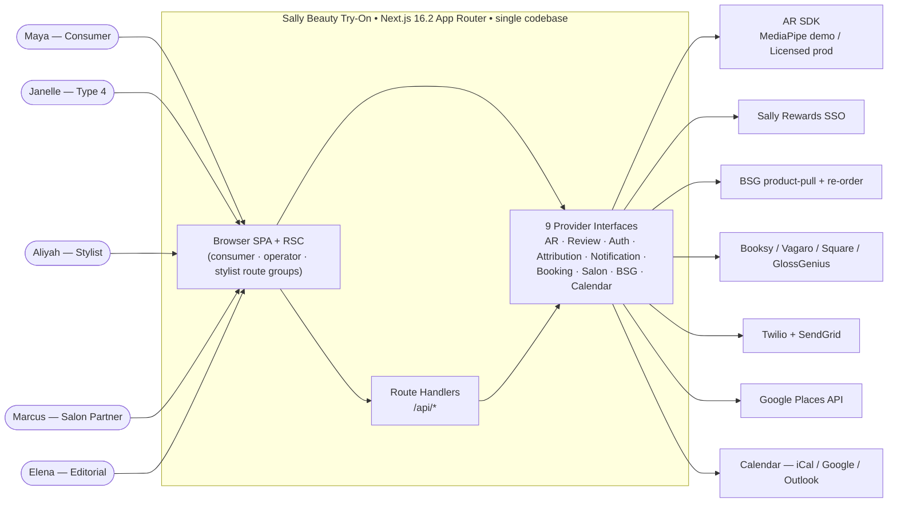
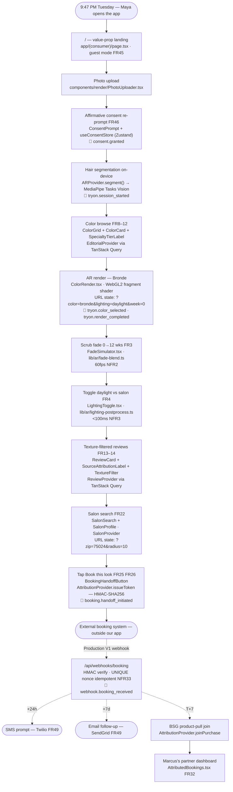
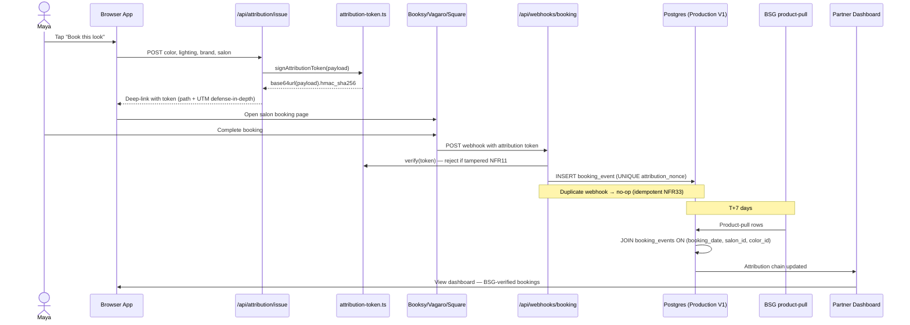
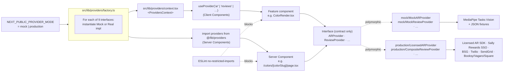

# Architecture Decision Document — SB_Project (Sally Beauty Hair Color Try-On)

**Author:** Yashdixit
**Date:** 2026-05-03

_This document builds collaboratively through step-by-step discovery. Sections are appended as we work through each architectural decision together._

## Project Context Analysis

### Requirements Overview

**Functional Requirements (50 across 8 capability areas, 5 actor types).**

The capability surface is identical across Demo V1 and Production V1; only the provider implementation differs. The 8 capability areas decompose cleanly:

| Capability area | FRs | Architectural surface |
|---|---|---|
| Photo Capture & Try-On Visualization | FR1-7 | Browser File API + on-device ML inference (MediaPipe Hair Segmentation) + Canvas/WebGL color compositing + slider/toggle interaction at 60fps |
| Color & Brand Discovery | FR8-12 | Static catalog (demo) → DB-backed catalog (production) behind one read interface; intersection-of-coverage rule enforced in data, not code |
| Outcome Reviews & Source Attribution | FR13-21 | Heterogeneous review provider (Google Places + brand feeds + native + stylist-assisted) with system-enforced invariants (no delete, no rank-by-request, persistence post-contract) |
| Salon Discovery & Booking Handoff | FR22-26 | Geographic search + signed deep-link with attribution token recoverable via webhook |
| Stylist Workflow & In-Chair Tools | FR27-31 | Calendar-link → web view of saved look; in-chair review submission with consent capture |
| Salon Partner Operations | FR32-38 | Desktop dashboard with attribution drilldown, BSG re-order surface, review-reply-no-delete |
| Editorial Administration | FR39-44 | Color taxonomy admin + LLM-classification audit queue + brand-reply moderation |
| User Identity, Consent & Notifications | FR45-50 | Guest mode + Sally Rewards SSO (production) + per-upload consent + 30-day deletion + post-booking trigger sequence |

**Non-Functional Requirements (43 across 8 categories).**

NFRs cluster into four architectural drivers:

1. **Performance budget envelope (NFR1-8).** ≤300KB initial JS (Demo V1) / ≤250KB (Production V1) excluding ML models; <500ms hair segmentation on demo laptop; 60fps fade-scrub; <100ms lighting toggle. These are *interaction design constraints* and shape every code-loading decision.

2. **Single-codebase / provider-pattern commitment (NFR35-37).** The architectural spine. Nine named provider interfaces (`ARProvider`, `ReviewProvider`, `AuthProvider`, `AttributionProvider`, `NotificationProvider`, `BookingHandoffProvider`, `SalonProvider`, `BSGProvider`, `CalendarProvider`) with mock and real implementations. Demo→production transition is config + procurement, not a fork.

3. **Privacy / compliance regime (NFR9, NFR13-16).** Biometric data under BIPA / TX CUBI / GDPR Article 9. Demo V1 has near-zero exposure (on-device only, no real users); Production V1 has full Pre-Production Compliance Gate (signed DPA, 30-day deletion, geographic gating, right-to-delete, consent re-prompt every upload, audit-logged consent records).

4. **Accessibility floor (NFR22-24).** WCAG 2.2 AA across all surfaces, all phases. Automated axe-core / Pa11y in CI; manual screen-reader walkthroughs of all 5 journeys before each demo and each production release. `prefers-reduced-motion` honored throughout. This is structural, not retrofitted.

Cross-cutting NFRs of architectural note: NFR11 (attribution tokens cryptographically signed); NFR17-21 (Production V1 horizontal scale-out + ≥200-color taxonomy expansion + 25% review submission throughput without queue backlogs); NFR27-28 (Production V1 webhook-as-partner-qualifier + Google Places hard cost cap with circuit-breaker); NFR31-34 (Production V1 reliability — uptime tiers, idempotent webhook receiver, at-most-once notification delivery semantics); NFR40-42 (Production V1 observability — #1 metric end-to-end visibility, kill-criteria alerting, privacy-aware texture metric).

### Scale & Complexity

- **Complexity level: high** (matches PRD self-classification in *Project Classification*).
- **Primary domain:** web app with in-browser ML inference + two-sided marketplace + biometric-privacy regime.
- **Scale targets:** 5,000 WAU at Week 4 of Production V1 in DFW (modest absolute scale); growth to multi-metro defined as deployment configuration only (NFR19), not codebase change.
- **Estimated architectural components:**
  - 1 Next.js App Router application
  - 9 provider interfaces (each with ≥2 implementations: mock + real)
  - 1 in-browser AR pipeline (segmentation → color-shift → fade → lighting compositing)
  - 6 distinct UI surfaces (consumer mobile-first · stylist iPad chair-side · partner desktop dashboard · editorial admin · per-color landing pages SSG · salon profile pages SSG)
  - 1 attribution-token signing/verification subsystem
  - 1 client-side persistence layer (IndexedDB demo + production cache)
  - 1 server-side persistence layer (Production V1 only — PostgreSQL or equivalent)
  - 1 webhook receiver (Production V1 only)
  - 1 post-booking trigger orchestrator (Production V1 only)
  - 1 LLM-classification pipeline (Production V1 only — review ingestion)

### Technical Constraints & Dependencies

**Pre-locked constraints (PRD + UX spec; not for relitigation in this document):**

- Web app, single codebase, Next.js App Router recommended (PRD *Web App-Specific Requirements*)
- TypeScript strict mode (NFR38)
- Radix UI Primitives + Tailwind CSS + shadcn/ui-pattern component ownership (UX spec §6 *Design System Foundation*)
- AR stack: MediaPipe Hair Segmentation (Google, MIT) + HSL/Lab color shift + TensorFlow.js / ONNX Runtime Web for in-browser inference (no server-side ML in either phase)
- Photo upload only V1 (no live camera; no `getUserMedia`)
- Browser feature requirements (both phases): WebGL 2, Canvas 2D, IndexedDB, File API, Web Crypto. WebGPU preferred where available.
- Hybrid SPA + SSR/SSG topology: SPA for interactive surfaces (try-on, dashboards, admin); SSR/SSG for SEO-critical routes (`/colors/*`, `/salons/*`, `/brands/*`) in Production V1
- Performance budgets per NFR1-8
- WCAG 2.2 AA per NFR22-24
- BIPA / TX CUBI / GDPR Pre-Production Compliance Gate before any real user touches Production V1

**Phasing constraint (binding for every architectural decision below):**

The same codebase serves Demo V1 (local runtime, mock providers, no cloud) and Production V1 (cloud-deployed, real providers, full compliance). Engineering does not fork. Adding a real vendor for production is the same architectural change shape as adding a mock vendor for the demo.

**External dependencies tracked behind provider interfaces (no direct imports in feature code):**

- AR SDK — MediaPipe (demo) → licensed AR SDK with signed DPA (production: Perfect Corp / ModiFace / Banuba)
- Reviews — local fixtures (demo) → Google Places + brand feeds + native review store (production)
- Auth — local mock state (demo) → Sally Rewards SSO (production)
- Attribution — sample data on Marcus's dashboard (demo) → deep-link + webhook + BSG product-pull join (production)
- Notifications — toast mockups (demo) → Twilio + SendGrid (production)
- Booking handoff — placeholder confirmation page (demo) → Booksy / Vagaro / Square / GlossGenius webhooks (production)
- Salons — curated mock DFW catalog (demo) → real signed-partner catalog (production)
- BSG — mocked one-tap re-order (demo) → real BSG product-pull + re-order endpoints (production)
- Calendar — mock invite link (demo) → real calendar integration (production)

**Compliance dependencies that gate Production V1 activation:**

- Signed DPA with AR SDK vendor before any real user photo
- Legal sign-off on consent flow language
- 30-day photo deletion automation
- Geographic gating (TX V1; IL requires BIPA-uplift)
- Right-to-delete surface in account settings
- Public Review Integrity Policy externally published

### Cross-Cutting Concerns Identified

These will recur across every architectural decision in this document; each is listed once here so subsequent sections can reference rather than re-state.

1. **Provider abstraction enforcement.** No feature-level code imports a concrete vendor SDK or fixture. Every external dependency is reached through its interface. The build will fail if a feature module imports `@mediapipe/...` directly outside the `MediaPipeARProvider` implementation file. This concern recurs in: AR pipeline, review surfacing, auth, attribution, notifications, booking handoff, salon catalog, BSG re-order, calendar integration.

2. **Biometric consent state machine.** Photo upload is gated by an affirmative-consent prompt re-shown on every upload (no implicit re-consent, FR46). Consent records are immutable, timestamped, audit-logged (NFR13). On opt-out, the photo never leaves the device. On opt-in to save, the photo's deletion deadline is bound to a per-user policy (30-day default unless explicitly saved, FR48). Recurs in: photo upload, save-look feature, account settings, deletion request flow, audit trail design.

3. **Attribution token chain.** A cryptographically signed, unforgeable token (NFR11) carries the user's pre-booking context (color, lighting, brand) into the deep-link, survives UTM-stripping booking platforms, returns via webhook, is joined with BSG product-pull data (T+7) for high-fidelity purchase attribution. The shape and signing scheme are identical demo→production; only the verification endpoint differs. Recurs in: booking handoff, webhook receiver, partner dashboard, BSG attribution join, observability for the #1 metric.

4. **Performance budget enforcement.** ≤300KB initial JS (Demo V1) / ≤250KB (Production V1) excluding ML models is a bundle-size invariant tested in CI on every PR. ML models (MediaPipe segmentation, ~3MB) are lazy-loaded after first paint and cached in IndexedDB. The fade-simulator scrub at 60fps and lighting toggle at <100ms drive a pre-computation strategy: per-color pre-rendered fade trajectory and per-lighting cached compositing. Recurs in: AR pipeline architecture, code-splitting strategy, asset loading strategy, CI performance gates.

5. **Accessibility enforcement at the component-library level.** WCAG 2.2 AA is structural — Radix primitives carry focus management, keyboard navigation, ARIA semantics; we wrap them, never replace them. axe-core runs at the component-test level (Vitest) and the page-test level (Playwright). The AR canvas has a descriptive `aria-label` that updates as state changes (UX spec). Recurs in: every component decision, motion-design tokens (`prefers-reduced-motion` honored), CI gate definitions.

6. **Density variants on a shared component library.** Same components serve consumer (mobile-first comfortable density) and operator (desktop-first compact density) surfaces. Density is declared once at the layout container (`DensityContainer`), not per component. No fork between consumer and pro component libraries. Recurs in: layout strategy, Tailwind config, component design.

7. **Demo / Production visual indistinguishability.** No demo-only UI elements — no banners, watermarks, "preview mode" indicators. Demo framing is established outside the product (verbal disclosure + executive one-pager). The product never apologizes for being a demo. This is enforced architecturally by the provider pattern: components depend on interfaces; the swap is invisible to the user. Recurs in: every provider design, mock data quality, copy/empty-state design.

8. **State ownership across URL, store, and persistence.** Selected color, lighting preset, and fade week are URL state (shareable, back-navigable). User identity and saved looks are store + persistence state (Zustand + IndexedDB demo / DB production). Photo (active session) is in-memory only by default. The boundaries between these state owners are an architectural decision recurring in: routing, share-this-look, save-look, post-booking flow, stylist saved-look access.

9. **SEO route segmentation without rewrite.** Demo V1 ships SPA-only. Production V1 enables SSR/SSG for `/colors/*`, `/salons/*`, `/brands/*`. Next.js App Router segmenting must accommodate this without code-level rewrite — the production swap is a route-segment configuration change. Recurs in: routing topology, data-fetching strategy, public-route metadata.

10. **Observability seam.** Demo V1 emits local logs only (NFR43). Production V1 emits end-to-end telemetry for the #1 metric (try-on → booking → product-pull, NFR40), kill-criteria alerts (NFR41), and privacy-aware texture metric (NFR42). The instrumentation hooks must exist in Demo V1 code so the production swap is a config change. Recurs in: every user-action instrumentation point, dashboard data sources, alerting topology.

These ten concerns are the architectural connective tissue. Subsequent sections (technology stack, decisions, patterns, structure) will reference them by number rather than re-state.

## Starter Template Evaluation

### Primary Technology Domain

Web application — single codebase, hybrid SPA + SSR/SSG (cross-cutting concern #9). Pre-recommended in PRD *Web App-Specific Requirements* and confirmed in UX spec §6.

### Starter Options Considered

| Option | What it provides | Verdict |
|---|---|---|
| **`create-next-app@latest` (Next.js 16.2)** | TypeScript strict, Tailwind v4, App Router, Turbopack, ESLint, `src/`, `@/*` alias, AGENTS.md/CLAUDE.md | ✅ Selected |
| Vite + React Router | Lighter, faster cold-start; no SSR | ❌ PRD calls for hybrid SPA + SSR/SSG; choosing Vite forces a Production V1 framework migration. Acceptable for demo-only, rejected because the demo→production single-codebase commitment (NFR35) explicitly forbids it. |
| Remix | Excellent loaders/actions model | ❌ Smaller ecosystem, less idiomatic for SSG (which we need for `/colors/*` `/salons/*` `/brands/*` routes); no compelling reason to deviate from PRD recommendation |
| Astro | Best static-page perf | ❌ Wrong shape — our interactive surfaces (try-on render, fade scrub, dashboards, admin) are the dominant code; static pages are the minority |
| T3 / RedwoodJS / Blitz | Opinionated full-stack | ❌ Bundle in Prisma + tRPC + auth opinions we don't need (we have Sally Rewards SSO target; we'd rip out NextAuth) |

### Selected Starter: `create-next-app@latest` + `shadcn@latest init --base radix`

**Rationale for Selection:**

The stack was pre-locked by PRD + UX spec; this section commits to specific commands at current versions. `create-next-app` (Next.js 16.2) with the `--app` flag handles the SPA + SSR/SSG hybrid topology natively — Demo V1 ships SPA-only (interactive surfaces as Client Components), Production V1 enables SSR/SSG for SEO routes by adding `export` configurations to those route segments without touching feature code. This is the architectural property that makes cross-cutting concern #9 (SEO route segmentation without rewrite) achievable.

`shadcn/cli v4`'s `--base radix` flag is a one-shot match for the UX spec's three-layer design system (Radix Primitives + Tailwind + source-owned components). The CLI pulls Radix wrappers into `/components/ui/*`; we own the source. No version-bump surprises.

**Initialization Commands:**

```bash
# 1. Scaffold the Next.js app
pnpm create next-app@latest sb-tryon \
  --typescript \
  --tailwind \
  --eslint \
  --app \
  --src-dir \
  --import-alias "@/*" \
  --use-pnpm \
  --turbopack

cd sb-tryon

# 2. Initialize shadcn with Radix primitives
pnpm dlx shadcn@latest init --base radix --template next-app --yes

# 3. Install foundational dev + runtime dependencies
pnpm add zustand
pnpm add -D vitest @vitest/ui jsdom @testing-library/react @testing-library/jest-dom
pnpm add -D @playwright/test
pnpm add -D axe-core @axe-core/playwright
pnpm add -D @storybook/nextjs @storybook/addon-a11y @storybook/addon-essentials @storybook/test
pnpm add -D @chromatic-com/storybook
pnpm add -D @types/node @types/react @types/react-dom

# 4. Initialize Playwright + Storybook
pnpm dlx playwright install --with-deps chromium webkit firefox
pnpm dlx storybook@latest init --type nextjs --yes
```

**Architectural Decisions Provided by the Starter:**

| Concern | Decision frozen by starter |
|---|---|
| **Language & runtime** | TypeScript strict mode; Node 20 LTS minimum (Next.js 16 requirement) |
| **Framework** | Next.js 16.2 App Router; React Server Components default; Client Components opt-in via `"use client"` |
| **Build tooling** | Turbopack (dev + prod); replaces Webpack |
| **Styling** | Tailwind CSS v4; OKLCH-friendly token system (UX spec §8); no runtime CSS-in-JS |
| **Linting** | `eslint-config-next` baseline + TypeScript rules |
| **Project structure** | `src/app/` for routes; `src/components/` for components; `src/lib/` for shared logic; `@/*` import alias rooted at `src/` |
| **Routing** | File-system routing in `src/app/`; layouts compose; route groups for auth/operator scoping |
| **Component library foundation** | shadcn/cli v4 with `--base radix` — Radix Primitives wrapped as source-owned components in `src/components/ui/` |
| **Package manager** | pnpm (strict node_modules; catches phantom deps; fastest reliable install) |
| **AI-assisted dev hooks** | AGENTS.md + CLAUDE.md scaffolded by Next 16 — single source of truth for coding-agent guidance |

**Architectural Decisions NOT Made by the Starter (deferred to step-04):**

- AR pipeline runtime: TensorFlow.js vs ONNX Runtime Web; WebGL2 vs WebGPU vs WASM fallback strategy
- State management ownership boundaries (URL state vs Zustand store vs IndexedDB vs in-memory)
- Provider DI mechanism (compile-time? React context? config-driven?)
- Data-fetching pattern (Route Handlers vs Server Actions vs client-side via providers)
- Persistence layer for Production V1 (PostgreSQL vs Postgres-compatible alternative)
- Cloud target for Production V1 (AWS vs GCP vs Azure vs Vercel; TX-resident region selection for CUBI)
- Attribution token signing scheme (HMAC vs Ed25519; key rotation)
- Webhook receiver topology (Production V1)
- Observability stack (Production V1)

**Note:** Project initialization using these commands should be the first implementation story. The Demo V1 timeline (PRD *Project Scoping*) Wks 1-2 — "Architecture scaffold: Next.js App Router, TypeScript strict, provider-pattern interfaces, Zustand state management, Tailwind design system, MediaPipe integration spike" — corresponds directly to executing the commands above plus step-04's decisions.

## Core Architectural Decisions

### Decision Priority Analysis

**Critical (block Demo V1 implementation):**
- Provider DI mechanism (cross-cutting concern #1 — every other decision wires through this)
- AR pipeline runtime (segmentation library + compositing strategy)
- State management ownership boundaries (cross-cutting concern #8)
- Provider interface shapes (the 9 contracts that mock and real implementations satisfy)

**Important (shape the architecture significantly, but Demo V1 can mock them):**
- Persistence layer (Production V1: PostgreSQL + Drizzle ORM; Demo V1: IndexedDB + JSON fixtures)
- Auth strategy (Production V1: Sally Rewards SSO via OAuth 2.0 PKCE; Demo V1: guest mode + local mock identity)
- Attribution token signing scheme (HMAC-SHA256; same shape both phases)
- API surface (Next.js Route Handlers, REST-shape, Zod-validated)
- CI/CD pipeline (lint, typecheck, vitest, Playwright, axe-core, Lighthouse, bundle-size, Chromatic)

**Deferred (post-funding):**
- Cloud target (AWS Fargate vs GCP Cloud Run vs Azure Container Apps; bias toward Sally's existing procurement)
- Production observability vendor (OTel-based; vendor swap behind the same instrumentation API)
- LLM classifier vendor for review ingestion (Production V1; not in Demo V1 scope)
- AR SDK vendor (Perfect Corp / ModiFace / Banuba — selected post-funding against Type-4 acceptance bar)

### Provider DI Mechanism

**Decision: hybrid factory + React Context.** Concrete provider instances are constructed once at app boot by env-var-driven factory functions in `src/lib/providers/index.ts`; a single `<ProvidersContext>` at the App Router root layout exposes them to descendant Client Components via `useProvider("ar" | "reviews" | ...)` hooks. Server Components import providers directly from `@/lib/providers`.

**Configuration:** `NEXT_PUBLIC_PROVIDER_MODE` env var (`mock` | `production`) selects the implementation set globally; per-provider override env vars (e.g. `NEXT_PUBLIC_AR_PROVIDER=mediapipe`) allow surgical mixing during development.

**Rationale:** the PRD's demo→production transition is "environment configuration and procurement" (NFR26), which is exactly an env-var swap at build time. Hybrid pattern (factory at module level + context for hook access) keeps Server Components and Client Components on the same provider abstraction without coupling either to React.

**Rejected alternatives:**
- React Context-only (no factory): forces every Server Component to receive providers as props; awkward
- Compile-time imports via barrel-file rewrite: works but every developer has to remember which barrel they're importing from
- A DI container (InversifyJS / tsyringe): overkill for 9 interfaces and adds runtime cost

**Affects:** every feature module; provider interface stubs scaffolded in Demo V1 Wks 1-2.

### Provider Interface Inventory

The nine provider interfaces, each with `Mock*Provider` (Demo V1) and a Production V1 implementation. Interfaces live in `src/lib/providers/contracts/`; mock implementations in `src/lib/providers/mock/`; production implementations in `src/lib/providers/production/`.

| Interface | Mock implementation | Production implementation |
|---|---|---|
| `ARProvider` | `MediaPipeARProvider` (in-browser MediaPipe Tasks Vision + WebGL color shift) | Licensed AR SDK (Perfect Corp / ModiFace / Banuba) post-DPA |
| `ReviewProvider` | `MockReviewProvider` (curated JSON fixtures with realistic distributions) | Composite: Google Places ingestion + brand feeds + native review store |
| `AuthProvider` | `MockAuthProvider` (in-memory guest + scripted "logged in" state for demo) | Sally Rewards SSO via OAuth 2.0 PKCE |
| `AttributionProvider` | `MockAttributionProvider` (sample data on Marcus's dashboard) | Deep-link + webhook + BSG product-pull join |
| `NotificationProvider` | `MockNotificationProvider` (in-app toast mockups for SMS/email steps) | Twilio SMS + SendGrid email |
| `BookingHandoffProvider` | `MockBookingHandoffProvider` (placeholder confirmation page) | Booksy / Vagaro / Square / GlossGenius webhooks |
| `SalonProvider` | `MockSalonProvider` (10 curated DFW salons with realistic profiles) | Real signed-partner catalog from DB |
| `BSGProvider` | `MockBSGProvider` (one-tap re-order confirmation toast) | Real BSG product-pull + re-order endpoints |
| `CalendarProvider` | `MockCalendarProvider` (mock invite link to web view) | Real iCalendar / Google Calendar / Outlook integration |

**Enforcement:** ESLint rule (`no-restricted-imports`) bars feature code from importing concrete vendor SDKs; the AR feature module can only import from `@/lib/providers`, never from `@mediapipe/tasks-vision` directly. Vendor imports are isolated to the provider implementation files. Cross-cutting concern #1.

### AR Pipeline — Segmentation + Compositing

**Decision: MediaPipe Tasks Vision (`@mediapipe/tasks-vision`) for hair segmentation; WebGL2 fragment shader for HSL/Lab color shift, fade blend, and lighting post-process; Canvas 2D fallback when WebGL2 unavailable.** No separate TF.js or ONNX Runtime Web installation — MediaPipe Tasks bundles its own TFLite-backed runtime (WebGPU → WebGL2 → WASM backend hierarchy).

**Pipeline stages:**
1. **Photo decode** — File API → `` element → `ImageBitmap` (off-thread)
2. **Hair segmentation** — `ImageSegmenter.segmentForVideo(imageBitmap)` from `@mediapipe/tasks-vision`; returns category mask (0=bg, 1=hair, 2=body-skin, 3=face-skin, 4=clothes, 5=other); we use category 1 as the alpha channel
3. **Color shift** — WebGL2 fragment shader: convert RGB → HSL/Lab on segmented region only, shift to target color vector (with porosity-aware adjustment for Type-4), convert back
4. **Fade blend** — pure-math interpolation between `colorVec(week=0)` and `colorVec(week=12)` parameterized by washes-per-week; computed on the CPU and uploaded as a uniform; re-rendered at 60fps during scrub (NFR2)
5. **Lighting post-process** — color-temperature shift + white-balance offset + gamma curve per preset; pre-computed per (color, lighting) pair and cached in WebGL textures; toggle response <100ms (NFR3)
6. **Composite output** — single `<canvas>` element with `aria-label` updated on every state change (cross-cutting concern #5)

**Pre-warm strategy:** MediaPipe Tasks model (~3MB) is fetched lazily after first paint, cached in IndexedDB after first session, and pre-instantiated as the user enters the upload flow (so segmentation latency on the first photo is dominated by model inference, not network/init).

**Fallback strategy:** if WebGL2 unavailable → Canvas 2D compositing with reduced color-shift fidelity (HSL only, no Lab); if MediaPipe Tasks fails to load → `DemoFallbackPath` (curated Type-4 reference photos per UX spec component `DemoFallbackPath`). If segmentation confidence below threshold on Type-4 hair → same fallback path (UX spec honesty pattern #2).

**Rationale:** picking MediaPipe Tasks over hand-rolling TF.js + raw `selfie_segmentation` model means we get Google's own packaging of the segmentation pipeline with explicit hair-category output, plus a single `tasks-vision` dependency instead of TF.js + model + glue code. WebGL2 fragment shader for compositing keeps the 60fps fade-scrub achievable without burning CPU.

**Rejected alternatives:**
- TF.js + raw segmentation model — more flexibility, more code; bias-to-ship picks Tasks
- ONNX Runtime Web — meaningful only if the production AR SDK ships ONNX-shaped models; defer until SDK selection forces our hand
- Server-side ML inference — explicitly forbidden by privacy posture (cross-cutting concern #2; PRD biometric requirement)

**Affects:** Epic A (Photo Capture & Try-On Visualization); ML model size budget; IndexedDB cache strategy; performance budget split (NFR8 bundle size excludes ML model).

### State Management — Ownership Boundaries

**Decision: a four-tier state model.** Each piece of UI state lives in exactly one tier. The boundaries are enforced by code review and naming convention (no library-level enforcement).

| Tier | Owner | What lives here | Examples |
|---|---|---|---|
| **URL state** | Next.js App Router + `useSearchParams` | Anything shareable, back-nav-able, or SEO-relevant | Selected color (`?color=auburn`), lighting preset (`?lighting=daylight`), fade week (`?week=8`), salon search filters (`?zip=75024&radius=10`), texture filter (`?texture=4a`) |
| **Server state** | TanStack Query v5 | Anything fetched from a provider | Reviews list, salon list, color taxonomy, partner attribution data, audit queue items |
| **Client UI state** | Zustand stores (per-domain, small) | Transient UI state, ephemeral selections | Modal open/closed, current dragging slider value (debounced), active dashboard tab, in-progress review form draft |
| **Persistence** | IndexedDB via `idb` | Saved looks, MediaPipe model cache, fixture cache | Saved-look entries (FR7), MediaPipe model bytes, color taxonomy snapshot |
| **In-memory only** | React refs + `Blob` URLs | The active photo (cross-cutting concern #2 — biometric privacy) | Uploaded photo `Blob`, rendered canvas pixels |

**Zustand store layout** (one store per domain, no monolithic store):
- `useTryOnStore` — photo state, segmentation result, current render parameters
- `useSavedLooksStore` — saved looks (synced to IndexedDB)
- `usePartnerDashboardStore` — Marcus's dashboard tab + drilldown state
- `useEditorialStore` — Elena's audit-queue keyboard navigation state
- `useConsentStore` — biometric consent state machine (cross-cutting concern #2)

**Rationale:** the PRD calls for Zustand or Jotai. Zustand + TanStack Query is the bias-to-ship combo: Zustand for client state (ephemeral, UI-local), TanStack Query for server state (cacheable, refetchable, mutation-aware). Mixing them avoids the antipattern of stuffing fetched data into a global store. URL state for everything shareable is forced by the UX spec's "preserve exploration state across navigation" principle.

**Rejected alternatives:**
- Jotai — equivalent capability; pick one; Zustand has more idiomatic dev tooling for this size of app
- Redux Toolkit + RTK Query — heavier; same shape; bias-to-ship picks the lighter option
- React Context for everything — re-render storms at our state-change frequency; not viable

**Affects:** every feature module; Epic A (try-on state) most heavily; URL routing strategy.

### Data-Fetching Pattern

**Decision:**
- **SEO-critical routes** (`/colors/*`, `/salons/*`, `/brands/*`) — Server Components in Production V1 (SSG with revalidation); call providers directly from the server. In Demo V1, these routes ship as Client Components reading from mock providers (no SSG pre-build needed for local-only demo).
- **Interactive surfaces** (try-on, dashboards, admin) — Client Components; call providers via TanStack Query hooks (`useQuery` for reads, `useMutation` for writes).
- **Provider methods are framework-agnostic async functions.** They don't know whether they're called from a Server Component or a Client Component. This makes the SSR/SSG enablement (cross-cutting concern #9) a route-segment configuration change in Production V1, not a feature-code rewrite.

**Affects:** routing topology; React Server Component / Client Component decisions per route.

### Persistence Layer (Production V1)

**Decision: PostgreSQL via Drizzle ORM.**

**PostgreSQL because:** standard, mature on every cloud, supports relational shapes (color taxonomy, brand-SKU mappings, salon profiles, stylist scorecards) plus JSONB for flexible color-vector storage and full-text search (`pg_trgm` / built-in tsvector) for native review search. No second database needed for V1.

**Drizzle ORM because:** TypeScript-native (no codegen step that fights with Turbopack), lightweight (~5KB runtime), supports edge runtime where needed, schema-as-code (lives in `src/lib/db/schema.ts`), generates SQL migrations via `drizzle-kit`. Plays cleanly with TanStack Query and Server Components.

**Demo V1 swap:** in Demo V1 there is no Postgres. The `*Provider` implementations return data from JSON fixtures in `src/lib/fixtures/`, shaped to the same TypeScript types Drizzle generates from the schema. Production V1 swaps the fixture-reading mock providers for Drizzle-querying real providers; the schema types are shared.

**Rejected alternatives:**
- Prisma — heavier; codegen step; runtime overhead
- Supabase / Firebase / PlanetScale — vendor lock-in; defer until cloud target chosen
- MongoDB — wrong shape for our largely-relational data
- Both Postgres + Redis — premature; add Redis only when caching pressure proves it

**Affects:** Production V1 deployment; schema-design work happens during Demo V1 (since the fixture shapes must match production schema for the swap to be config-only).

### Auth & Security

**Decision:**
- **Demo V1:** guest mode by default (FR45). `MockAuthProvider` exposes a `getCurrentUser()` returning either guest or a scripted "logged-in Maya" identity for the demo walkthrough. No actual auth flow.
- **Production V1:** Sally Rewards SSO via **OAuth 2.0 with PKCE**. Session via signed HTTP-only cookies (Next.js cookies API; HMAC-SHA256 signature with secret rotated quarterly). Refresh tokens stored server-side in Postgres.
- **Authorization:** role-based (`Consumer` / `Stylist` / `SalonPartner` / `EditorialCurator`). Enforced as middleware on every Route Handler — cross-actor data access rejected at the API boundary, not the UI layer (NFR10). `auth()` server-side helper returns the actor + role; Route Handlers call `requireRole("SalonPartner")` to gate.
- **CORS:** locked to the same-origin in Production V1; webhook receiver is the only cross-origin endpoint (validates HMAC instead of relying on origin).
- **Photo data:** in-memory by default; never sent to server unless user opts to save. Cross-cutting concern #2.

**Rejected alternatives:**
- NextAuth.js — heavyweight wrapper; we need direct OAuth control for Sally Rewards-specific endpoints
- Custom session tokens (no cookies) — fights Next.js conventions for no benefit
- Clerk / Auth0 / Stytch — vendor lock-in; Sally has its own identity system

**Affects:** Epic H (User Identity, Consent & Notifications); every Route Handler; Demo V1 mock-identity scripting.

### Attribution Token Signing

**Decision: HMAC-SHA256 signed compact attribution token.**

**Format:**
```
<base64url(payload_json)>.<base64url(hmac_sha256(payload_json))>
```

**Payload shape:**
```typescript
{
  v: 1,                    // version (allow future rotation)
  sid: string,             // user session id (opaque, non-PII)
  cid: string,             // color id
  lp:  "salon" | "daylight" | "warm",
  bid: string,             // brand id
  sln: string,             // salon id
  ts:  number,             // issue timestamp (epoch ms)
  nonce: string            // 16 random bytes base64url, idempotency key
}
```

**Issued:** by a Next.js Route Handler when the user taps "Book this look at [Salon]" (FR25, FR26). The token is appended to the deep-link URL path (not query string — UTM-strippable) and to the URL's UTM parameters (defense in depth across Booksy / Vagaro / Square strip behavior).

**Verified:** at the booking webhook receiver (`/api/webhooks/booking`) by re-computing the HMAC with the current secret. Tampered tokens fail verification and are rejected. Idempotency: the `nonce` is a UNIQUE constraint in Postgres, so duplicate webhooks no-op (NFR33).

**Demo V1:** mock signing with an in-memory random secret regenerated per `pnpm dev`. The token is shown verbatim on Marcus's mock dashboard so execs see the chain working narratively.

**Production V1:** secret stored in cloud secret manager (AWS Secrets Manager / GCP Secret Manager / Azure Key Vault — vendor-agnostic interface). Rotated quarterly. Old-key grace window of 30 days for in-flight bookings.

**Rejected alternatives:**
- JWT — RFC 7519 features (claims, exp/iat) we don't need; format is bulkier and URL-strippers truncate it more often
- Ed25519 (asymmetric) — overkill for single-issuer/single-verifier; HMAC with rotation is simpler and satisfies NFR11
- UUID-only token (no signature) — fails NFR11 unforgeability requirement

**Affects:** Epic D (Salon Discovery & Booking Handoff), Epic F (Salon Partner Operations), webhook receiver, observability for #1 metric.

### API & Communication

**Decision: Next.js Route Handlers as the API surface; REST-shape; Zod for request/response validation; OpenAPI generation deferred to V1.5.**

- **Route Handlers** in `src/app/api/*/route.ts` handle the HTTP surface for Production V1 (auth, webhooks, partner-dashboard mutations, editorial-admin mutations, native review submission). In Demo V1, they exist but are largely stubbed — providers don't go over the network for local-only runtime.
- **Zod schemas** in `src/lib/schemas/` validate every request body and parse every response shape. Same schemas used by mock providers for fixture validation.
- **No GraphQL.** Heterogeneous clients are a non-goal; REST-shape with TanStack Query gives us caching for free.
- **No tRPC.** Tempting, but tRPC's tight client-server type coupling fights the provider-pattern abstraction (cross-cutting concern #1). Providers should be the type seam, not the framework.
- **OpenAPI** generation from Zod schemas (via `zod-to-openapi`) deferred to V1.5 when public brand-side / salon-side APIs ship. Internal API docs live as TypeScript types until then.

**Affects:** every Route Handler; webhook receiver; provider implementations; Production V1 partner-side integrations.

### Frontend Architecture (Recap + Performance)

Most frontend decisions inherit from the starter (Next.js App Router, Tailwind, shadcn/Radix) and the state management decision above. New decisions in this section:

**Performance budget enforcement strategy:**
- **CI gate on bundle size** — every PR runs `next build` and asserts initial JS chunk ≤300KB gzipped (Demo V1) / ≤250KB (Production V1) excluding `@mediapipe/*` (lazy-loaded). Failing PR blocks merge. Cross-cutting concern #4.
- **Lighthouse CI** on every PR — LCP, CLS, INP, TTI thresholds enforce NFR5 + NFR8.
- **MediaPipe Tasks model**: lazy-loaded as the user enters the upload flow; cached in IndexedDB after first session via `caches.match()` shim or direct IndexedDB blob storage.
- **Code splitting**: route-level chunks via Next.js default; component-level chunks for the AR render surface (lazy-loaded only when consumer hits the try-on screen, not when they land on the home page).
- **Image strategy**: `next/image` everywhere with explicit `sizes`. WebP/AVIF from a single high-resolution master per asset.

**Routing topology:**
- `/` — home / value-prop landing (SSG in Production V1, SPA in Demo V1)
- `/(consumer)/colors/[colorSlug]` — per-color landing page (SSG)
- `/(consumer)/salons/[city]/[salonSlug]` — per-salon profile (SSG with on-demand revalidation)
- `/(consumer)/brands/[brandSlug]` — per-brand page (SSG)
- `/(consumer)/try-on` — the AR render surface (Client Component; SPA)
- `/(consumer)/saved` — saved looks (Client Component)
- `/(operator)/dashboard` — Marcus's partner dashboard (Client Component)
- `/(operator)/admin` — Elena's editorial admin (Client Component)
- `/(stylist)/look/[lookId]` — Aliyah's saved-look access (Client Component, calendar-link entry)
- `/api/webhooks/booking` — Production V1 webhook receiver
- `/api/{auth,reviews,attribution,bsg,...}/*` — Production V1 Route Handlers behind auth middleware

Route groups (`(consumer)`, `(operator)`, `(stylist)`) carry distinct layouts: consumer uses `density-comfortable` + Editorial Magazine direction; operator uses `density-compact` + Pro Tool direction (UX spec design directions).

### Infrastructure & Deployment

**Demo V1:**
- **Local-only.** `pnpm dev` for development; `pnpm build && pnpm start` for the dry-run hardening on actual demo hardware. No cloud required (NFR16, NFR30).
- **Optional preview deploys** to Vercel (free tier) for stakeholder review during the build, but not the demo runtime itself.

**Production V1 (deferred to post-funding for final cloud choice; architecture is portable):**
- **Containerized Next.js app** (Docker; standard Node runtime, not edge-only). Deployable to AWS Fargate, GCP Cloud Run, Azure Container Apps, or Vercel Hobby/Pro — Sally's existing cloud procurement drives the final choice.
- **PostgreSQL** as a managed service in the chosen cloud (AWS RDS / GCP Cloud SQL / Azure Database for PostgreSQL).
- **Region:** TX-resident or TX-adjacent for CUBI defensive posture (GCP us-south1 Dallas; Azure South Central US San Antonio; AWS us-east-2 Ohio with TX-scoped DPA as the AWS option).
- **No Vercel-only primitives** unless we have a portable fallback — keeps Sally able to swap vendors post-V1.
- **Secret management** via cloud-native secret manager; OTel-compatible exporter for observability.

**CI/CD (both phases):**

GitHub Actions workflow on every PR:
1. `pnpm install --frozen-lockfile`
2. `pnpm typecheck` (TS strict mode, no errors)
3. `pnpm lint` (ESLint + provider-import-restriction rule)
4. `pnpm vitest run --coverage` (unit + axe-core component tests; ≥70% coverage on business logic, NFR39)
5. `pnpm playwright test` (5-journey E2E smoke, including keyboard-only walkthrough; NFR23, NFR29, NFR39)
6. `pnpm build` + bundle-size assertion (≤300KB / ≤250KB)
7. `pnpm lighthouse-ci` (Web Vitals thresholds)
8. Chromatic visual regression (per-PR baseline)
9. Storybook a11y addon snapshot

A failing gate blocks merge. Demo V1 success criterion NFR29 ("100% of claimed-live journey steps without failure") is enforced by item 5 running on demo-target browser matrix (Chrome, Safari, iOS Safari emulation, Chrome Android emulation).

### Observability

**Decision: OpenTelemetry instrumentation API with vendor-agnostic exporters.**

- **Instrumentation hooks scaffolded in Demo V1** (cross-cutting concern #10): every user action that maps to NFR40-42 (try-on session start, color selection, render completion, booking handoff, webhook receipt, BSG join) emits OTel spans/metrics. In Demo V1 the exporter is `console`/local file (NFR43); in Production V1 the exporter is swapped via env var to the Sally-chosen vendor (Datadog / New Relic / Honeycomb / Grafana Cloud — final selection post-funding).
- **Privacy-aware texture metric** (NFR42): aggregate counters only (`texture_type=4a` count incremented per session). No per-user texture record retained beyond active session unless the consumer opts to save.
- **Kill-criteria alerting** (NFR41): alerts on `<6 salon LOIs by Wk6`, `<2K WAU by Wk4`, `bottom-4 partners <5/month at Wk6`, `Sally-side activation SLA not signed by Wk4` — emitted as OTel metrics scraped by the Sally-chosen alerting tool.

**Rationale:** OTel is the only vendor-agnostic instrumentation API with cross-cloud, cross-vendor support. Picking it means we don't have to commit to a vendor pre-funding. The instrumentation code is identical in both phases; the swap is one env-var change.

**Affects:** every user-action site in feature code (instrumented via a thin `track(event, payload)` helper that emits OTel under the hood); Production V1 deployment configuration.

### Decision Impact Analysis

**Cross-component dependencies:**

```
Provider DI (foundational)
   ├── AR pipeline  → photo upload → segmentation → render compositing
   ├── State management
   │      ├── URL state (Next.js routing)
   │      ├── TanStack Query (server state via providers)
   │      ├── Zustand (client UI state)
   │      ├── IndexedDB (saved looks, model cache)
   │      └── In-memory (active photo — biometric privacy)
   ├── Persistence (Production V1)
   │      └── PostgreSQL + Drizzle ORM (schema shared with Demo V1 fixture types)
   ├── Auth (Production V1)
   │      └── Sally Rewards OAuth 2.0 PKCE (mock identity in Demo V1)
   ├── Attribution token (HMAC-SHA256)
   │      ├── Issued by Route Handler at booking handoff
   │      ├── Verified at webhook receiver
   │      └── Joined with BSG product-pull (T+7) for purchase attribution
   ├── API surface (Route Handlers + Zod + REST-shape)
   └── Observability (OTel; vendor-deferred)

CI/CD (orthogonal)
   ├── Lint + typecheck + Vitest + Playwright + Lighthouse + bundle-size + Chromatic
   └── Same gates both phases; Production V1 adds deployment job
```

**Implementation sequence (Demo V1 Wks 1-2 architecture scaffold):**

1. Scaffold project per *Starter Template* commands; commit AGENTS.md/CLAUDE.md updates with this architecture's binding decisions
2. Define the 9 provider interfaces in `src/lib/providers/contracts/` with TypeScript types
3. Implement the factory + `<ProvidersContext>` per the Provider DI decision
4. Implement `MockARProvider` (MediaPipe Tasks Vision integration spike — first feasibility check; UX spec calls this out as the binary trust gate for Janelle's flow)
5. Implement `MockReviewProvider`, `MockSalonProvider`, `MockAuthProvider`, `MockBookingHandoffProvider`, `MockNotificationProvider`, `MockAttributionProvider`, `MockBSGProvider`, `MockCalendarProvider`, `MockEditorialProvider` against editorial-curated fixture data (parallel track)
6. Define Zustand stores per the State Management decision
7. Wire TanStack Query at the App Router root layout
8. Stand up the CI/CD pipeline with all gates green on an empty app
9. Then begin Epic A feature work (Wks 3-4 per PRD timeline)

**Cascading implications captured by these decisions:**
- The provider DI choice means Sally Rewards SSO can be developed against a `MockAuthProvider` that returns a synthesized user object — no Sally team handoff required to start Production V1 auth UX
- The state-tier model means the share-this-look feature (FR6) is a simple URL stringify of the current state — no separate share-encoding system needed
- The HMAC attribution token + idempotent webhook receiver means deduplication is structural (Postgres UNIQUE constraint), not a defensive code path
- The OTel instrumentation hooks means switching observability vendors post-funding is a config change, not an instrumentation rewrite

These decisions are the architectural skeleton. Step 5 will define the **patterns** that AI agents and engineers follow when implementing against this skeleton.

## Implementation Patterns & Consistency Rules

These are the rules AI coding agents and engineers follow when implementing against the architectural skeleton (steps 2-4). They will be mirrored into `AGENTS.md` and `CLAUDE.md` at the repo root so coding agents read them on every task.

### Pattern Categories Defined

**Conflict points identified:** 10 areas where AI agents would otherwise diverge — provider-vendor coupling, DB/TS case styles, mock realism, state tier leakage, empty-state copy drift, consent shortcuts, source-attribution omissions, feedback-primitive misuse, density-variant drift, test colocation.

### Naming Patterns

**Database (Postgres + Drizzle ORM):**

| Element | Pattern | Example |
|---|---|---|
| Table name | `snake_case`, plural | `reviews`, `salon_partners`, `color_taxonomy_entries` |
| Column name | `snake_case` | `created_at`, `salon_id`, `outcome_dimensions` |
| Primary key | `id` (UUID v7 default) | `id uuid primary key default gen_random_uuid()` |
| Foreign key | `{referenced_table_singular}_id` | `salon_id`, `color_id`, `stylist_id` |
| Index | `idx_{table}_{columns}` | `idx_reviews_color_id`, `idx_attribution_nonce` |
| Timestamp | `created_at`, `updated_at`, `deleted_at` (soft delete only where needed) | always `timestamptz` |
| Boolean | positive phrasing | `is_published`, `has_brand_reply`, NOT `is_not_archived` |
| JSONB column | snake_case payload keys | `outcome_dimensions: { fade_weeks, accuracy_1_to_5, ... }` |

**Drizzle schema convention:** schema definitions live in `src/lib/db/schema.ts`. Column-level type inference uses `$inferSelect` and `$inferInsert`. The TypeScript types are **camelCase**; Drizzle's column mapping converts at the ORM boundary so feature code never sees snake_case.

```typescript
// src/lib/db/schema.ts
export const reviews = pgTable("reviews", {
  id: uuid("id").primaryKey().defaultRandom(),
  colorId: uuid("color_id").notNull().references(() => colors.id),
  fadeWeeks: integer("fade_weeks"),
  createdAt: timestamp("created_at", { withTimezone: true }).defaultNow(),
});
export type Review = typeof reviews.$inferSelect; // camelCase TS
```

**API surface:**

| Element | Pattern | Example |
|---|---|---|
| Route path | `kebab-case`, plural for collections | `/api/reviews`, `/api/booking-handoff`, `/api/webhooks/booking` |
| Route param | `[paramName]` (camelCase inside brackets) | `/api/reviews/[reviewId]`, `/api/colors/[colorSlug]` |
| Query param | `camelCase` | `?textureFilter=4a&colorId=auburn-1` |
| HTTP method | semantic — GET read, POST create, PATCH update, DELETE remove | always-idempotent webhooks use POST + idempotency key |
| Status codes | 200 success, 201 created, 400 validation, 401 unauth, 403 forbidden, 404 not found, 409 conflict, 422 zod fail, 500 server | no 200-with-error-body pattern |
| Headers | `kebab-case` per HTTP convention | `X-Attribution-Token`, `Idempotency-Key` |

**Code (TypeScript):**

| Element | Pattern | Example |
|---|---|---|
| Component | `PascalCase`, file matches | `ColorRender.tsx`, `FadeSimulator.tsx`, `SourceAttributionLabel.tsx` |
| Non-component file | `kebab-case` | `color-shift.ts`, `attribution-token.ts`, `consent-state.ts` |
| Hook | `use{Noun}` for stores, `use{Noun}` for query | `useTryOnStore()`, `useReviews()`, `useSubmitReview()` |
| Function | `camelCase`, verb-first | `signAttributionToken`, `revokeConsent`, `loadColorTaxonomy` |
| Type / Interface | `PascalCase`, no `I` prefix | `Review`, `ARProvider`, `ConsentRecord` |
| Provider impl | `{Vendor}{Interface}` or `Mock{Interface}` | `MediaPipeARProvider`, `MockReviewProvider`, `TwilioNotificationProvider` |
| Const | `UPPER_SNAKE_CASE` for module-level immutables; `camelCase` for inferred consts | `MAX_PHOTO_SIZE_BYTES`, `DEFAULT_LIGHTING_PRESET` |
| Env var | `UPPER_SNAKE_CASE`; `NEXT_PUBLIC_` prefix only when client-bundled | `NEXT_PUBLIC_PROVIDER_MODE`, `ATTRIBUTION_TOKEN_SECRET` |
| Test file | colocated, `.test.ts(x)` suffix | `ColorRender.tsx` ↔ `ColorRender.test.tsx` |
| Storybook story | colocated, `.stories.tsx` suffix | `ColorRender.tsx` ↔ `ColorRender.stories.tsx` |

**ID conventions:**
- Database PK: UUID v7 (`gen_random_uuid()` for now; v7 once Postgres support stabilizes)
- API-exposed ID: opaque string; never integers exposed to clients
- Slug: `kebab-case`, e.g. `auburn`, `crown-and-coil`, `wella`. Slugs are stable; UUIDs are internal.

### Structure Patterns

**Project organization (`src/` rooted, `@/*` import alias):**

```
src/
├── app/                              # Next.js App Router — ROUTES ONLY
│   ├── (consumer)/                   # Route group: density-comfortable + Editorial Magazine
│   │   ├── colors/[colorSlug]/page.tsx   # SSG in Production V1
│   │   ├── salons/[city]/[salonSlug]/page.tsx
│   │   ├── brands/[brandSlug]/page.tsx
│   │   ├── try-on/page.tsx
│   │   └── saved/page.tsx
│   ├── (operator)/                   # Route group: density-compact + Pro Tool
│   │   ├── dashboard/page.tsx        # Marcus
│   │   └── admin/page.tsx            # Elena
│   ├── (stylist)/                    # Route group: chair-side device context
│   │   └── look/[lookId]/page.tsx    # Aliyah
│   ├── api/
│   │   ├── webhooks/booking/route.ts
│   │   ├── reviews/route.ts
│   │   ├── attribution/[nonce]/route.ts
│   │   └── ...
│   ├── layout.tsx                    # Root layout: ProvidersContext, QueryClient, OTel
│   └── page.tsx                      # Home / value-prop landing
├── components/
│   ├── ui/                           # shadcn/Radix wrappers (Button, Dialog, Slider, ...)
│   ├── render/                       # AR render surface (PhotoUploader, ColorRender, FadeSimulator, LightingToggle, ShareLook, DemoFallbackPath)
│   ├── reviews/                      # ReviewCard, OutcomeMetrics, SourceAttributionLabel, TextureFilter, ReviewSubmissionForm, BrandReplyAffordance
│   ├── discovery/                    # ColorGrid, ColorCard, SpecialtyTierLabel, SalonSearch, SalonProfile, StylistScorecard
│   ├── dashboard/                    # AttributedBookings, BSGReorderCard, AuditQueue, TaxonomyAdmin, BrandReplyModeration
│   └── layout/                       # PageShell, AppHeader, DensityContainer, HonestEmptyState, ToastWithProvenance, BookingHandoff
├── lib/
│   ├── providers/
│   │   ├── contracts/                # ARProvider.ts, ReviewProvider.ts, ... (interfaces only)
│   │   ├── mock/                     # MockARProvider.ts, MockReviewProvider.ts, ...
│   │   ├── production/               # MediaPipeARProvider.ts, ... (post-funding implementations)
│   │   ├── factory.ts                # Env-var-driven factory
│   │   └── index.ts                  # Public re-export + ProvidersContext
│   ├── db/
│   │   ├── schema.ts                 # Drizzle schema
│   │   ├── migrations/               # drizzle-kit output
│   │   └── client.ts                 # Drizzle client (Production V1 only)
│   ├── schemas/                      # Zod schemas (one per resource: review.ts, color.ts, salon.ts, ...)
│   ├── stores/                       # Zustand stores (one per domain: try-on.ts, saved-looks.ts, partner-dashboard.ts, editorial.ts, consent.ts)
│   ├── fixtures/                     # Demo V1 mock data (colors.json, salons.json, reviews.json, stylists.json, ...)
│   ├── observability/                # OTel instrumentation helpers (track.ts, exporters.ts)
│   ├── security/                     # attribution-token.ts, consent-state.ts
│   ├── ar/                           # color-shift.ts, fade-blend.ts, lighting-postprocess.ts, segmentation.ts (uses ARProvider)
│   └── utils/                        # Pure utility functions
└── styles/                           # Tailwind v4 globals.css (tokens declared here)
```

**Test colocation:** every `Foo.tsx` has `Foo.test.tsx` next to it; every `bar.ts` has `bar.test.ts` next to it. **No `__tests__/` directories.** E2E tests live in `e2e/` at repo root (Playwright convention).

**Storybook stories:** every component in `src/components/**` has a colocated `.stories.tsx` file. CI grep asserts coverage. Components without stories block merge.

**Rationale for colocation:** when an AI agent edits a component, the test and story are right there. Fewer split-attention misses. Matches Next.js + Vitest defaults.

### Format Patterns

**API responses:**

- **Success (2xx):** bare data, no envelope.
  ```typescript
  // GET /api/reviews/[reviewId]
  { id, colorId, fadeWeeks, accuracy, ... }
  // GET /api/reviews?colorId=auburn-1
  [{ id, ... }, { id, ... }]
  ```
- **Error (4xx/5xx):** `{ error: { code, message, details? } }`.
  ```typescript
  { error: { code: "VALIDATION_FAILED", message: "fadeWeeks must be a positive integer", details: { field: "fadeWeeks" } } }
  ```
- **No `{ data, error }` wrapper.** Bare data on success keeps client code clean; error envelope is unambiguous on failure status codes.

**Data exchange:**
- **Casing:** `camelCase` in API JSON (matches TS); Drizzle does the conversion at the DB boundary. **No mixed-case wire formats.**
- **Dates:** ISO-8601 strings (`"2026-05-03T17:24:00.000Z"`). Never epoch numbers in JSON. `new Date(string)` parses cleanly client-side.
- **Money:** never floats. Integer cents (`priceCents: 35000` for $350.00).
- **Booleans:** `true` / `false`. Never `0`/`1` or `"yes"`/`"no"`.
- **Nullable fields:** explicit `null`. Never `undefined` in API JSON (Zod parsers strip undefined; null is the explicit absence).
- **Arrays vs object for single items:** if cardinality is "0 or 1", use nullable. If cardinality is "0 or N", use array (empty array for none, never `null`).

**File naming for fixtures:** `colors.json`, `salons.dfw.json`, `reviews.{colorSlug}.json`, etc. Each fixture file is validated against the corresponding Zod schema at module load. A failing fixture fails `pnpm dev`.

### Communication Patterns

**OTel event naming:**

`{domain}.{verb_past_tense_or_state_change}` — concise, namespaced, past-tense.

| Event | Emitted from | Payload |
|---|---|---|
| `tryon.session_started` | `useTryOnStore.startSession()` | `{ session_id, photo_id_hash }` |
| `tryon.color_selected` | `useTryOnStore.selectColor()` | `{ session_id, color_id, lighting_preset, fade_week }` |
| `tryon.render_completed` | `MediaPipeARProvider.render()` | `{ session_id, latency_ms, confidence }` |
| `booking.handoff_initiated` | `BookingHandoffProvider.handoff()` | `{ session_id, attribution_nonce, salon_id, color_id }` |
| `webhook.booking_received` | `/api/webhooks/booking/route.ts` | `{ attribution_nonce, salon_id, ... }` |
| `consent.granted` | `useConsentStore.grant()` | `{ session_id, scope }` |
| `consent.declined` | `useConsentStore.decline()` | `{ session_id }` |

Event names are **stable contracts**. Adding a field is non-breaking; renaming an event requires a deprecation window. Never use event names that contain user-identifying or biometric data.

**Zustand action naming:**

Imperative verb, `camelCase`, action-shape on the store:

```typescript
// src/lib/stores/try-on.ts
export const useTryOnStore = create<TryOnStore>((set) => ({
  // state
  selectedColorId: null,
  lightingPreset: "daylight",
  fadeWeek: 0,
  // actions (imperative verbs)
  selectColor: (colorId) => set({ selectedColorId: colorId }),
  setLightingPreset: (preset) => set({ lightingPreset: preset }),
  scrubFade: (week) => set({ fadeWeek: week }),
  reset: () => set({ selectedColorId: null, lightingPreset: "daylight", fadeWeek: 0 }),
}));
```

Selectors are direct field access (`useTryOnStore((s) => s.selectedColorId)`) — no `selectFoo` getter functions. Keep stores small; if a store grows past ~10 actions or fields, split it.

**TanStack Query keys:** array form, hierarchical, immutable.

```typescript
// query keys live in src/lib/queries/keys.ts
export const queryKeys = {
  reviews: {
    all: ["reviews"] as const,
    byColor: (colorId: string) => ["reviews", "byColor", colorId] as const,
    byColorAndTexture: (colorId: string, texture: string) =>
      ["reviews", "byColor", colorId, "byTexture", texture] as const,
  },
  // ...
} as const;
```

Invalidation cascades from least-specific to most-specific. Never inline a query key.

**State update patterns:**
- **Immutable updates** in Zustand (the library enforces this; `set` replaces partials, doesn't mutate).
- **Server state mutations** through TanStack `useMutation` with `onSuccess: () => queryClient.invalidateQueries({ queryKey: ... })`.
- **No direct `state.foo = bar` mutations** anywhere.

### Process Patterns

**Error handling:**

- **Boundary at the provider call.** Provider methods may throw `ProviderError` (a typed error class with `code`, `cause`, `userMessage`). TanStack Query catches and exposes via `error` state.
- **No silent catches.** Every `catch` either logs via OTel `error` span, surfaces to UI via banner/toast, or rethrows.
- **User-facing copy comes from a copy module**, not from `error.message`. The provider error has a `userMessage` field; banner/toast renders that.
- **Network failures retry via TanStack Query default (3 retries, exponential backoff)**; mutation failures do NOT retry by default (user can re-tap).
- **Validation failures** (Zod) return `{ error: { code: "VALIDATION_FAILED", message, details: { field } } }` from Route Handlers; client surfaces inline below the offending field.
- **Server errors** (5xx) surface as a banner ("We couldn't load your render. [Retry]") at the surface level; never as a modal that blocks the user from leaving.

```typescript
// src/lib/providers/mock/MockReviewProvider.ts
export class ProviderError extends Error {
  constructor(
    public code: string,           // e.g. "REVIEWS_FETCH_FAILED"
    public userMessage: string,    // copy module key or string
    public cause?: unknown,
  ) { super(userMessage); }
}
```

**Loading state:**

- **Skeleton placeholders** for content surfaces matching the eventual content shape. Never a centered spinner that blocks the surface.
- **Spinner inside the action affordance** for buttons during mutation. Width preserved to prevent layout shift.
- **Progress bar with explicit estimate** for long ops (photo upload, MediaPipe model first-load): "Loading the renderer · ~5 seconds, only on first use."
- **First-load AR model banner** is one-time; cached afterward.

**Empty states:**

- Always actionable, always honest. Use the `<HonestEmptyState>` component which **requires a copy prop** (no default fallback).
- Forbidden defaults: "Coming soon!", "Loading...", "No data", "Nothing here yet."
- Approved patterns from UX spec §13:
  - Color browse with active filters returning zero: *"No colors match these filters yet — try removing the texture or family filter."*
  - Reviews on a Specialty Tier color: *"No reviews yet for this color in this texture. As coverage grows, you'll see fade weeks, accuracy, damage, and recommend rates here."*
  - Marcus dashboard, no attributed bookings: *"No attributed bookings in this range. Attribution starts when a salon partner's QR code is scanned in your salon — see [Setup guide]."*

**Authentication / authorization:**

- Route Handlers guard with `requireRole("SalonPartner")` at the top. Throws 401 (no session) or 403 (wrong role).
- `requireRole` is implemented in `src/lib/auth/require-role.ts`; uses the `auth()` helper which calls `AuthProvider.getCurrentUser()`.
- Consumer-facing FRs (FR1-26) work in guest mode. No auth wall on the try-on flow.

**Consent / biometric privacy (cross-cutting concern #2):**

- Photo upload **must** route through `useConsentStore.requestConsent()`. Direct `<input type="file">` outside `PhotoUploader` is a lint violation.
- Consent is re-prompted on every upload. The store does not cache "previously granted."
- Consent records are written to OTel (with `session_id` only, no biometric data) and to the audit log table in Production V1.
- Photo Blobs live in React refs; never put them in Zustand or IndexedDB unless the user has explicitly chosen "Save to my account."

**Provider call pattern:**

Always async, always typed. Mock providers introduce realistic latency (50-200ms) so demo feels real.

```typescript
// CORRECT
const review = await providers.reviews.getById(reviewId);

// WRONG (synchronous; mock has no latency; broken when production swaps in)
const review = providers.reviews.getByIdSync(reviewId);

// WRONG (vendor import in feature module)
import { ImageSegmenter } from "@mediapipe/tasks-vision";
```

### Enforcement Guidelines

**ESLint rules (mandatory, block merge):**

```javascript
// eslint.config.mjs (excerpts)
{
  rules: {
    // Block vendor imports from feature code
    "no-restricted-imports": ["error", {
      patterns: [
        { group: ["@mediapipe/*"], message: "Import from @/lib/providers, not @mediapipe directly. Vendor SDKs are isolated to provider implementations." },
        { group: ["twilio", "@sendgrid/*"], message: "Use providers.notifications, not vendor SDKs directly." },
        { group: ["@/lib/providers/mock/*", "@/lib/providers/production/*"], message: "Import from @/lib/providers (the factory), not implementations directly." },
      ],
    }],
    // Block direct File API outside PhotoUploader
    "no-restricted-syntax": ["error", {
      selector: "Identifier[name='input'][type='file']",
      message: "Use <PhotoUploader> — consent flow must wrap photo upload.",
    }],
    // TypeScript strict
    "@typescript-eslint/no-explicit-any": "error",
    "@typescript-eslint/no-non-null-assertion": "error",
  }
}
```

**CI gates (mandatory, block merge):**

1. `pnpm typecheck` — TS strict, zero errors
2. `pnpm lint` — including the rules above
3. `pnpm vitest run --coverage` — ≥70% on `src/lib/**` (business logic; NFR39)
4. `pnpm playwright test` — 5-journey smoke + keyboard-only walkthrough (NFR23, NFR29)
5. `pnpm build` + bundle-size assertion (≤300KB / ≤250KB excluding `@mediapipe/*`)
6. `pnpm lighthouse-ci` — Web Vitals thresholds (NFR5, NFR8)
7. axe-core component test on every component story (NFR23)
8. Chromatic visual regression — designer reviews any change before merge
9. Storybook story coverage check — every `src/components/**` file has a `.stories.tsx`

**Required imports / wrappers per surface:**

| Surface | Must include | Reason |
|---|---|---|
| Photo upload | `<PhotoUploader>` (which renders `<ConsentPrompt>` internally) | FR46 + cross-cutting concern #2 |
| Any review display | `<SourceAttributionLabel>` per review | FR13 + UX spec honesty pattern #1 |
| Color browse | `<SpecialtyTierLabel>` for <3-brand colors | FR11 + UX spec honesty pattern #4 |
| Render surface | `<HonestFallback>` / `<DemoFallbackPath>` for low-confidence render | UX spec honesty pattern #2 |
| Empty states | `<HonestEmptyState>` with explicit copy prop | UX spec §13 + Tone & Voice |
| Toast confirms touching identity data | `<ToastWithProvenance>` (privacy hint) | UX spec honesty pattern #3 |

**AGENTS.md / CLAUDE.md content:**

These two files at the repo root mirror the rules in this section. They include:
- The 10 cross-cutting concerns from step 2 (verbatim, numbered)
- The naming, structure, format, communication, and process patterns above
- A "How to add a new feature" recipe (interface in `contracts/` → Mock impl → Production impl stub → Zustand/Query wiring → Component → Story → Test)
- A "How to add a new external dependency" recipe (always behind a Provider)

### Pattern Examples

**Good:**

```typescript
// src/components/render/ColorRender.tsx
"use client";

import { useProvider } from "@/lib/providers";
import { useTryOnStore } from "@/lib/stores/try-on";
import { track } from "@/lib/observability/track";

export function ColorRender() {
  const ar = useProvider("ar");
  const { selectedColorId, lightingPreset, fadeWeek } = useTryOnStore();
  // ... uses ar.render({ colorId, lighting, fadeWeek }) ...
  // emits track("tryon.render_completed", { ... }) on success
}
```

```typescript
// src/lib/providers/mock/MockReviewProvider.ts (vendor SDK CAN be imported here)
import type { ReviewProvider } from "@/lib/providers/contracts";
import reviewsFixture from "@/lib/fixtures/reviews.auburn.json";
import { ReviewSchema } from "@/lib/schemas/review";

const sleep = (ms: number) => new Promise((r) => setTimeout(r, ms));

export class MockReviewProvider implements ReviewProvider {
  async getByColorId(colorId: string) {
    await sleep(120 + Math.random() * 80); // realistic latency
    return reviewsFixture
      .filter((r) => r.colorId === colorId)
      .map((r) => ReviewSchema.parse(r)); // validate fixture matches schema
  }
}
```

**Anti-patterns (block merge):**

```typescript
// ❌ WRONG: vendor SDK imported in feature code
// src/components/render/ColorRender.tsx
import { ImageSegmenter } from "@mediapipe/tasks-vision";  // ESLint blocks this

// ❌ WRONG: synchronous mock; demo will look fake; breaks when prod swaps in
async getByColorId(colorId: string) {
  return reviewsFixture.filter((r) => r.colorId === colorId);  // no latency, no validation
}

// ❌ WRONG: server data in Zustand
const useReviewsStore = create((set) => ({
  reviews: [],
  fetchReviews: async () => {
    const reviews = await fetch("/api/reviews").then((r) => r.json());
    set({ reviews });  // server state belongs in TanStack Query, not Zustand
  },
}));

// ❌ WRONG: photo blob in IndexedDB without consent path
function uploadPhoto(file: File) {
  idb.set("activePhoto", file);  // bypasses consent state machine
}

// ❌ WRONG: empty-state placeholder
<EmptyState>Reviews coming soon!</EmptyState>  // betrayed honest empty state tenet

// ❌ WRONG: review without source attribution
<div>{review.body}</div>  // missing <SourceAttributionLabel source={review.source} />

// ❌ WRONG: any cast
const data = response as any;  // TS strict mode blocks; fix with Zod parse
```

**The single most important rule:** if a coding agent is unsure which pattern applies, the answer is in `AGENTS.md` / `CLAUDE.md` first, then this architecture document. If neither documents it, surface the question rather than invent a convention.

## Project Structure & Boundaries

This is the complete file/directory tree the team builds against. Every directory is named, every load-bearing file is enumerated, every epic and FR maps to specific files. Engineers and AI coding agents use this as the canonical layout — not a sketch.

### Complete Project Directory Structure

```
sb-tryon/
├── README.md                              # Quickstart + run book
├── AGENTS.md                              # AI coding-agent rules (mirrors arch §5)
├── CLAUDE.md                              # → references AGENTS.md (Next 16 default)
├── package.json
├── pnpm-lock.yaml
├── tsconfig.json
├── next.config.ts                         # Turbopack, image domains, headers, redirects
├── tailwind.config.ts                     # OKLCH tokens, density variants, motion tokens
├── eslint.config.mjs                      # Includes provider-import-restriction rule
├── postcss.config.mjs
├── vitest.config.ts                       # jsdom env, coverage thresholds, axe-core setup
├── playwright.config.ts                   # 5-journey E2E config, multi-browser matrix
├── lighthouserc.cjs                       # Web Vitals budgets per route
├── drizzle.config.ts                      # Production V1 only; migration paths
├── components.json                        # shadcn/cli v4 config (--base radix)
├── .env.example                           # Documents every NEXT_PUBLIC_* and server var
├── .env.local                             # Demo V1: NEXT_PUBLIC_PROVIDER_MODE=mock
├── .gitignore
├── .nvmrc                                 # Node 20 LTS
├── Dockerfile                             # Production V1 containerization
├── docker-compose.yml                     # Local Postgres for Production V1 dev
│
├── .github/
│   └── workflows/
│       ├── ci.yml                         # lint, typecheck, vitest, playwright, lighthouse, bundle-size
│       ├── chromatic.yml                  # Visual regression on PRs
│       └── deploy.yml                     # Production V1 only (post-funding)
│
├── .storybook/
│   ├── main.ts                            # Stories glob, addons (a11y, essentials, test)
│   └── preview.ts                         # Tailwind import, ProvidersContext decorator
│
├── public/
│   ├── favicon.ico
│   ├── og-default.png                     # Open Graph fallback
│   ├── data/                              # Demo V1 fixtures served as static (option B)
│   │   └── …                              # (we use src/lib/fixtures instead — keep this empty)
│   └── models/                            # Lazy-loaded MediaPipe model cache fallback
│       └── README.md                      # Model is fetched from CDN; this is fallback
│
├── e2e/                                   # Playwright tests (5 journeys)
│   ├── maya.spec.ts                       # Consumer happy path (Epic A+B+C+D+H)
│   ├── janelle.spec.ts                    # Texture edge case + DemoFallbackPath
│   ├── aliyah.spec.ts                     # Stylist saved-look + in-chair review
│   ├── marcus.spec.ts                     # Partner dashboard + BSG re-order + review-reply
│   ├── elena.spec.ts                      # Editorial admin + audit queue + brand reply
│   ├── keyboard-only.spec.ts              # NFR23 — full keyboard walkthrough
│   ├── consent-flow.spec.ts               # FR46 — re-prompt every upload
│   ├── attribution-token.spec.ts          # NFR11 — signing + idempotent webhook
│   └── fixtures/
│       └── photos/                        # Curated test photos (Type 1-4 mix)
│
└── src/
    ├── app/
    │   ├── globals.css                    # Tailwind base, OKLCH tokens
    │   ├── layout.tsx                     # Root layout — ProvidersContext, QueryClient, OTel
    │   ├── page.tsx                       # Home / value-prop landing
    │   ├── icon.tsx                       # Favicon
    │   ├── opengraph-image.tsx            # OG image generator
    │   ├── error.tsx                      # Global error boundary
    │   ├── not-found.tsx                  # 404
    │   │
    │   ├── (consumer)/                    # density-comfortable + Editorial Magazine
    │   │   ├── layout.tsx                 # AppHeader (consumer variant), DensityContainer
    │   │   ├── colors/
    │   │   │   ├── page.tsx               # /colors — color browse landing
    │   │   │   └── [colorSlug]/
    │   │   │       ├── page.tsx           # /colors/auburn — SSG in Production V1
    │   │   │       └── opengraph-image.tsx
    │   │   ├── salons/
    │   │   │   └── [city]/
    │   │   │       └── [salonSlug]/
    │   │   │           ├── page.tsx       # /salons/dallas/crown-and-coil
    │   │   │           └── opengraph-image.tsx
    │   │   ├── brands/
    │   │   │   └── [brandSlug]/
    │   │   │       └── page.tsx           # /brands/wella
    │   │   ├── try-on/
    │   │   │   └── page.tsx               # AR render surface (Maya, Janelle)
    │   │   ├── saved/
    │   │   │   └── page.tsx               # Saved looks (FR7)
    │   │   ├── account/
    │   │   │   ├── page.tsx               # Account settings + right-to-delete (FR47)
    │   │   │   └── consent/page.tsx       # Consent history (audit-log surface)
    │   │   └── share/
    │   │       └── [lookId]/page.tsx      # Public share-link landing (FR6)
    │   │
    │   ├── (operator)/                    # density-compact + Pro Tool
    │   │   ├── layout.tsx                 # AppHeader (operator variant), persistent sidebar, requireRole guard
    │   │   ├── dashboard/                 # Marcus
    │   │   │   ├── page.tsx               # Attributed bookings overview (FR32)
    │   │   │   ├── stylists/page.tsx      # Per-stylist scorecards (FR33)
    │   │   │   ├── pull-through/page.tsx  # Brand pull-through analytics (FR34)
    │   │   │   ├── reorder/page.tsx       # BSG re-order surface (FR35)
    │   │   │   ├── certifications/page.tsx # Color/texture certs (FR36)
    │   │   │   └── reviews/page.tsx       # Review-reply queue (FR37, FR38)
    │   │   └── admin/                     # Elena
    │   │       ├── page.tsx               # Admin home
    │   │       ├── taxonomy/page.tsx      # Color taxonomy admin (FR39, FR40, FR41)
    │   │       ├── audit-queue/page.tsx   # LLM-classification audit queue (FR42, FR44)
    │   │       └── brand-replies/page.tsx # Brand-reply moderation (FR43)
    │   │
    │   ├── (stylist)/                     # iPad chair-side
    │   │   ├── layout.tsx                 # Tablet-optimized layout
    │   │   └── look/
    │   │       └── [lookId]/
    │   │           ├── page.tsx           # Aliyah saved-look access (FR27, FR28)
    │   │           └── submit/page.tsx    # In-chair review submission (FR29)
    │   │
    │   └── api/                           # Next.js Route Handlers (Production V1 surface)
    │       ├── auth/
    │       │   ├── login/route.ts         # Sally Rewards OAuth 2.0 PKCE start
    │       │   ├── callback/route.ts      # OAuth callback
    │       │   └── logout/route.ts
    │       ├── consent/
    │       │   ├── grant/route.ts         # POST consent grant (audit-logged)
    │       │   ├── revoke/route.ts        # FR47
    │       │   └── history/route.ts       # GET user's consent history
    │       ├── reviews/
    │       │   ├── route.ts               # GET (filtered) / POST (submit, FR15)
    │       │   ├── [reviewId]/route.ts    # GET single review
    │       │   └── ingest/route.ts        # Production V1 — Google Places ingestion trigger
    │       ├── colors/
    │       │   ├── route.ts               # GET color taxonomy
    │       │   └── [colorSlug]/route.ts
    │       ├── salons/
    │       │   ├── route.ts               # GET (search) / FR22
    │       │   └── [salonSlug]/route.ts
    │       ├── attribution/
    │       │   ├── issue/route.ts         # POST: issue attribution token (FR26)
    │       │   └── [nonce]/route.ts       # GET: lookup attribution chain (Marcus dashboard)
    │       ├── webhooks/
    │       │   └── booking/route.ts       # Production V1 booking webhook receiver (NFR33)
    │       ├── partners/
    │       │   ├── attribution/route.ts   # Marcus dashboard data
    │       │   ├── stylists/route.ts      # FR30, FR33
    │       │   ├── reorder/route.ts       # FR35
    │       │   ├── certifications/route.ts # FR36
    │       │   └── reviews/[reviewId]/reply/route.ts # FR37
    │       ├── admin/
    │       │   ├── taxonomy/route.ts      # FR39-41
    │       │   ├── audit-queue/route.ts   # FR42
    │       │   └── brand-replies/[replyId]/route.ts # FR43
    │       ├── notifications/
    │       │   └── trigger/route.ts       # Production V1 SMS/email trigger orchestrator (FR49)
    │       ├── share/
    │       │   └── [lookId]/route.ts      # FR6
    │       └── health/route.ts            # Cloud health check
    │
    ├── components/
    │   ├── ui/                            # shadcn/Radix primitives (source-owned)
    │   │   ├── button.tsx
    │   │   ├── dialog.tsx
    │   │   ├── alert-dialog.tsx
    │   │   ├── popover.tsx
    │   │   ├── select.tsx
    │   │   ├── slider.tsx
    │   │   ├── toast.tsx
    │   │   ├── tabs.tsx
    │   │   ├── toggle-group.tsx
    │   │   ├── tooltip.tsx
    │   │   ├── form.tsx
    │   │   ├── input.tsx
    │   │   ├── textarea.tsx
    │   │   ├── checkbox.tsx
    │   │   ├── radio-group.tsx
    │   │   ├── switch.tsx
    │   │   ├── separator.tsx
    │   │   ├── scroll-area.tsx
    │   │   └── avatar.tsx
    │   │
    │   ├── render/                        # AR render surface (Epic A — FR1-7)
    │   │   ├── PhotoUploader.tsx
    │   │   ├── ConsentPrompt.tsx          # FR46 — re-prompted every upload
    │   │   ├── ColorRender.tsx            # The canvas + WebGL composite
    │   │   ├── FadeSimulator.tsx          # FR3, NFR2 60fps
    │   │   ├── LightingToggle.tsx         # FR4, NFR3 <100ms
    │   │   ├── ShareLook.tsx              # FR6
    │   │   ├── DemoFallbackPath.tsx       # Type-4 honest fallback (UX honesty pattern #2)
    │   │   ├── RenderConfidenceBanner.tsx
    │   │   └── *.test.tsx + *.stories.tsx (one per component)
    │   │
    │   ├── reviews/                       # Outcome reviews (Epic C — FR13-21)
    │   │   ├── ReviewCard.tsx
    │   │   ├── OutcomeMetrics.tsx
    │   │   ├── SourceAttributionLabel.tsx # FR13 — chip
    │   │   ├── TextureFilter.tsx          # FR14
    │   │   ├── ReviewSubmissionForm.tsx   # FR15 — multi-step weighty form
    │   │   ├── BrandReplyAffordance.tsx   # FR37 display side
    │   │   └── *.test.tsx + *.stories.tsx
    │   │
    │   ├── discovery/                     # Color + salon discovery (Epics B, D — FR8-12, FR22-26)
    │   │   ├── ColorGrid.tsx
    │   │   ├── ColorCard.tsx
    │   │   ├── SpecialtyTierLabel.tsx     # FR11
    │   │   ├── SalonSearch.tsx
    │   │   ├── SalonProfile.tsx
    │   │   ├── StylistScorecard.tsx       # Consumer + operator variants
    │   │   ├── BookingHandoffButton.tsx   # FR25, FR26
    │   │   └── *.test.tsx + *.stories.tsx
    │   │
    │   ├── dashboard/                     # Operator surfaces (Epics F, G — FR32-44)
    │   │   ├── AttributedBookings.tsx     # FR32
    │   │   ├── BSGReorderCard.tsx         # FR35 — moat-made-legible moment
    │   │   ├── BrandPullThrough.tsx       # FR34
    │   │   ├── CertificationManager.tsx   # FR36
    │   │   ├── ReviewReplyQueue.tsx       # FR37 (no delete affordance)
    │   │   ├── AuditQueue.tsx             # FR42 — keyboard-driven, virtualized
    │   │   ├── TaxonomyAdmin.tsx          # FR39, FR40, FR41
    │   │   ├── BrandReplyModeration.tsx   # FR43
    │   │   ├── ClassificationQualityMeter.tsx # FR44
    │   │   └── *.test.tsx + *.stories.tsx
    │   │
    │   ├── stylist/                       # Aliyah surfaces (Epic E — FR27-31)
    │   │   ├── SavedLookView.tsx          # FR27, FR28
    │   │   ├── InChairReviewSubmission.tsx # FR29 — consent capture
    │   │   ├── ConsentCaptureModal.tsx
    │   │   ├── StylistStats.tsx           # FR30, FR31
    │   │   └── *.test.tsx + *.stories.tsx
    │   │
    │   └── layout/                        # Cross-cutting layout primitives
    │       ├── PageShell.tsx
    │       ├── AppHeader.tsx              # Consumer + operator variants
    │       ├── DensityContainer.tsx       # density-comfortable | density-compact
    │       ├── HonestEmptyState.tsx       # Required copy prop
    │       ├── ToastWithProvenance.tsx    # Privacy-hint extension
    │       ├── BookingHandoff.tsx
    │       ├── SkipToContent.tsx          # NFR22
    │       ├── ErrorBanner.tsx
    │       └── *.test.tsx + *.stories.tsx
    │
    ├── lib/
    │   ├── providers/
    │   │   ├── contracts/                 # Pure interfaces (no impl)
    │   │   │   ├── ar-provider.ts
    │   │   │   ├── review-provider.ts
    │   │   │   ├── auth-provider.ts
    │   │   │   ├── attribution-provider.ts
    │   │   │   ├── notification-provider.ts
    │   │   │   ├── booking-handoff-provider.ts
    │   │   │   ├── salon-provider.ts
    │   │   │   ├── bsg-provider.ts
    │   │   │   ├── calendar-provider.ts
    │   │   │   └── editorial-provider.ts  # Color taxonomy + audit queue
    │   │   ├── mock/                      # Demo V1 implementations
    │   │   │   ├── MockARProvider.ts      # MediaPipe Tasks Vision (used as "mock" since vendor-free)
    │   │   │   ├── MockReviewProvider.ts
    │   │   │   ├── MockAuthProvider.ts
    │   │   │   ├── MockAttributionProvider.ts
    │   │   │   ├── MockNotificationProvider.ts
    │   │   │   ├── MockBookingHandoffProvider.ts
    │   │   │   ├── MockSalonProvider.ts
    │   │   │   ├── MockBSGProvider.ts
    │   │   │   ├── MockCalendarProvider.ts
    │   │   │   └── MockEditorialProvider.ts
    │   │   ├── production/                # Production V1 implementations (post-funding)
    │   │   │   ├── LicensedARProvider.ts  # Perfect Corp / ModiFace / Banuba
    │   │   │   ├── CompositeReviewProvider.ts # Google Places + brand feeds + native
    │   │   │   ├── SallyRewardsAuthProvider.ts
    │   │   │   ├── BSGProductPullAttributionProvider.ts
    │   │   │   ├── TwilioSendgridNotificationProvider.ts
    │   │   │   ├── BooksyVagaroSquareBookingHandoffProvider.ts
    │   │   │   ├── DBSalonProvider.ts
    │   │   │   ├── BSGAPIBSGProvider.ts
    │   │   │   ├── ICalCalendarProvider.ts
    │   │   │   └── DBEditorialProvider.ts
    │   │   ├── factory.ts                 # Env-var-driven provider selection
    │   │   ├── context.tsx                # <ProvidersContext> + useProvider hook
    │   │   └── index.ts                   # Public re-export
    │   │
    │   ├── db/                            # Production V1 only
    │   │   ├── schema.ts                  # Drizzle schema (all tables)
    │   │   ├── client.ts                  # Drizzle client factory
    │   │   ├── migrations/                # drizzle-kit output
    │   │   └── seed.ts                    # Demo V1 → Production V1 fixture seeding helper
    │   │
    │   ├── schemas/                       # Zod schemas (validate API + fixtures)
    │   │   ├── color.ts
    │   │   ├── review.ts                  # FR15 outcome dimensions
    │   │   ├── salon.ts
    │   │   ├── stylist.ts
    │   │   ├── attribution.ts             # Token payload shape
    │   │   ├── consent.ts                 # FR46
    │   │   ├── booking.ts
    │   │   ├── webhook.ts                 # NFR33 receiver
    │   │   └── index.ts
    │   │
    │   ├── stores/                        # Zustand (one per domain)
    │   │   ├── try-on.ts
    │   │   ├── saved-looks.ts
    │   │   ├── partner-dashboard.ts
    │   │   ├── editorial.ts
    │   │   └── consent.ts                 # State machine, cross-cutting concern #2
    │   │
    │   ├── queries/                       # TanStack Query
    │   │   ├── keys.ts                    # Centralized query-key registry
    │   │   ├── client.ts                  # QueryClient factory + defaults
    │   │   └── hooks/                     # Per-domain query hooks
    │   │       ├── use-reviews.ts
    │   │       ├── use-colors.ts
    │   │       ├── use-salons.ts
    │   │       ├── use-attribution.ts
    │   │       ├── use-audit-queue.ts
    │   │       └── …
    │   │
    │   ├── fixtures/                      # Demo V1 mock data (Editorial-curated)
    │   │   ├── colors.json                # 30 V1 colors per intersection rule
    │   │   ├── brands.json                # Wella, Schwarzkopf, Pravana, Redken (BSG)
    │   │   ├── color-brand-mappings.json  # 5×30 normalization table (FR12)
    │   │   ├── salons.dfw.json            # 10 mocked DFW salons
    │   │   ├── stylists.json              # Per-salon stylist roster
    │   │   ├── reviews/                   # One file per (color, brand) cell
    │   │   │   ├── auburn.wella.json
    │   │   │   ├── auburn.schwarzkopf.json
    │   │   │   └── …
    │   │   ├── audit-queue.json           # Pre-classified mock items for Elena
    │   │   ├── attribution-samples.json   # Sample data for Marcus dashboard
    │   │   └── photos/                    # Curated demo photos (verified Type-4 handling)
    │   │       └── README.md
    │   │
    │   ├── ar/                            # Pure AR pipeline logic (no vendor SDK imports)
    │   │   ├── color-shift.ts             # HSL/Lab math
    │   │   ├── color-shift.glsl.ts        # WebGL fragment shader source
    │   │   ├── fade-blend.ts              # 90-day fade math
    │   │   ├── lighting-postprocess.ts    # 3-preset post-process
    │   │   ├── canvas-2d-fallback.ts      # Fallback compositor
    │   │   └── webgl-context.ts           # Context creation, capability detection
    │   │
    │   ├── security/
    │   │   ├── attribution-token.ts       # HMAC-SHA256 sign + verify
    │   │   ├── attribution-token.test.ts  # NFR11 tamper tests
    │   │   ├── consent-state.ts           # State machine
    │   │   ├── require-role.ts            # Server-side authz helper (NFR10)
    │   │   └── secret-manager.ts          # Vendor-agnostic interface
    │   │
    │   ├── observability/
    │   │   ├── track.ts                   # OTel emit helper
    │   │   ├── exporters.ts               # Demo (console) | Production (vendor)
    │   │   ├── metrics.ts                 # Custom metrics for #1 metric, kill criteria
    │   │   └── README.md                  # Event taxonomy reference
    │   │
    │   ├── auth/
    │   │   ├── session.ts                 # Server-side session lookup
    │   │   ├── oauth-pkce.ts              # Sally Rewards OAuth flow
    │   │   ├── cookies.ts                 # Signed-cookie helpers
    │   │   └── roles.ts                   # Role hierarchy
    │   │
    │   ├── notifications/                 # Trigger orchestration (Production V1)
    │   │   ├── post-booking-trigger.ts    # FR49: SMS +24h, email +7d, in-app banner
    │   │   ├── retry.ts                   # NFR34 — at-most-once with retry
    │   │   └── templates/                 # SMS + email templates
    │   │
    │   ├── reviews/
    │   │   ├── classifier.ts              # LLM color-classifier interface (Production V1)
    │   │   ├── source-segregation.ts      # FR17 — never blend brand-published into rankings
    │   │   ├── ranking.ts                 # FR16 — color-outcome dimension only public
    │   │   └── ingestion.ts               # Production V1 Google Places + brand feed pull
    │   │
    │   ├── color-science/
    │   │   ├── canonicalization.ts        # Brand SKU → canonical color vector
    │   │   ├── delta-e.ts                 # ΔE-2000 tolerance (≤2.0 per PRD)
    │   │   ├── lab-conversion.ts          # CIE L*a*b* helpers
    │   │   └── intersection-rule.ts       # FR12 — ≥3 brands per standard color
    │   │
    │   ├── copy/                          # User-facing strings (i18n-ready)
    │   │   ├── consumer.ts
    │   │   ├── operator.ts
    │   │   ├── stylist.ts
    │   │   ├── editorial.ts
    │   │   ├── empty-states.ts            # All HonestEmptyState approved copy
    │   │   ├── errors.ts
    │   │   └── consent.ts                 # BIPA/CUBI/GDPR approved language
    │   │
    │   ├── persistence/
    │   │   ├── idb.ts                     # IndexedDB wrapper (saved looks, model cache, fixture cache)
    │   │   ├── saved-looks.ts             # FR7 persistence
    │   │   └── model-cache.ts             # MediaPipe model cache
    │   │
    │   ├── url-state/                     # URL state helpers (cross-cutting concern #8)
    │   │   ├── try-on-params.ts           # ?color, ?lighting, ?week
    │   │   ├── salon-search-params.ts
    │   │   └── share-link.ts              # FR6 generation
    │   │
    │   └── utils/                         # Pure utility functions
    │       ├── slugify.ts
    │       ├── format-date.ts
    │       ├── format-money.ts
    │       └── invariant.ts
    │
    ├── styles/                            # Tailwind CSS v4
    │   └── globals.css                    # @theme tokens, OKLCH variables
    │
    └── types/                             # Cross-cutting type aliases (avoid where possible — prefer Zod inference)
        └── env.d.ts                       # Process env type augmentation
```

### Architectural Boundaries

#### API boundaries

- **Public-indexed routes** (Production V1 SSG): `/`, `/colors/[colorSlug]`, `/salons/[city]/[salonSlug]`, `/brands/[brandSlug]`. Crawled by search engines; no auth wall.
- **Authenticated routes**: everything under `(operator)/` and `(stylist)/`. Layout-level `requireRole()` guard.
- **Guest-accessible interactive routes**: `/try-on`, `/saved`, `/share/[lookId]`. Work without auth (FR45).
- **Webhook receiver** (`/api/webhooks/booking`): cross-origin by definition; verified by HMAC, not origin.
- **Admin routes** (`/admin/*` + `/api/admin/*`): role `EditorialCurator` only.
- **Cross-actor data access**: rejected at the API boundary, not the UI layer (NFR10). Every Route Handler that reads partner-scoped data calls `requireRole("SalonPartner")` AND filters by `salon_id = currentUser.salonId`.

#### Component boundaries

- **`/components/ui/*`** — pure presentation, no business logic, no provider calls. Highly reusable.
- **`/components/{render,reviews,discovery,dashboard,stylist,layout}/*`** — domain components. May call providers via `useProvider()` hook. Compose `ui/*`. Contain domain-specific copy + behavior.
- **`/app/**/page.tsx`** — composes domain components into surfaces. Reads URL state, wires Server Components to Client Components, delegates feature work to components.
- **No component imports from another domain folder** without going through `layout/*` cross-cutting primitives. Preserves the rule that `/dashboard/*` is operator-only and never accidentally pulled into a consumer surface.

#### Service / data boundaries

- **Provider boundary** (cross-cutting concern #1) — feature code talks to providers; providers talk to vendors/DB. No bypass.
- **DB boundary** (Production V1) — `src/lib/db/client.ts` is the only file that constructs the Drizzle client. Repository-style access through provider implementations (`DBSalonProvider`, `DBEditorialProvider`).
- **Schema boundary** — Zod schemas in `src/lib/schemas/*` are the single source of truth for API and fixture validation. Drizzle-inferred types for DB; Zod-validated types for API. Where they overlap (e.g., a `Review`), the Zod schema is derived from the Drizzle type and re-asserted at the wire boundary.
- **Secrets boundary** — `src/lib/security/secret-manager.ts` is the only module that reads from cloud secret managers. Other code asks `getSecret("attribution.signing_key")` and gets back an opaque string.

### Requirements to Structure Mapping

The 8 capability areas (PRD readiness report's suggested epic decomposition) map to specific directories:

| Epic | FRs | Routes | Components | Provider | Tests |
|---|---|---|---|---|---|
| **A** Photo Capture & Try-On Visualization | FR1-7 | `/try-on`, `/share/[lookId]` | `components/render/*` | `ARProvider` | `e2e/maya.spec.ts`, `e2e/janelle.spec.ts` |
| **B** Color & Brand Discovery | FR8-12 | `/colors`, `/colors/[slug]`, `/brands/[slug]` | `components/discovery/{ColorGrid,ColorCard,SpecialtyTierLabel}` | `EditorialProvider` (taxonomy read) | `e2e/maya.spec.ts` |
| **C** Outcome Reviews & Source Attribution | FR13-21 | nested in `/colors/[slug]`, `/salons/[…]`, native review submission flow | `components/reviews/*` | `ReviewProvider` | `e2e/maya.spec.ts`, review surfaces |
| **D** Salon Discovery & Booking Handoff | FR22-26 | `/salons/[city]/[salonSlug]`, `/api/attribution/issue` | `components/discovery/{SalonSearch,SalonProfile,BookingHandoffButton}` | `SalonProvider`, `BookingHandoffProvider`, `AttributionProvider` | `e2e/maya.spec.ts`, `e2e/attribution-token.spec.ts` |
| **E** Stylist Workflow & In-Chair Tools | FR27-31 | `/stylist/look/[lookId]`, submit | `components/stylist/*` | `CalendarProvider`, `ReviewProvider` (submit-on-behalf), `AuthProvider` | `e2e/aliyah.spec.ts` |
| **F** Salon Partner Operations | FR32-38 | `/operator/dashboard/*` | `components/dashboard/{AttributedBookings,BSGReorderCard,BrandPullThrough,CertificationManager,ReviewReplyQueue}` | `AttributionProvider`, `BSGProvider`, `ReviewProvider` (reply) | `e2e/marcus.spec.ts` |
| **G** Editorial Administration | FR39-44 | `/operator/admin/*` | `components/dashboard/{TaxonomyAdmin,AuditQueue,BrandReplyModeration,ClassificationQualityMeter}` | `EditorialProvider` (write) | `e2e/elena.spec.ts` |
| **H** User Identity, Consent & Notifications | FR45-50 | `/account/*`, `/api/auth/*`, `/api/consent/*`, `/api/notifications/*` | `components/render/ConsentPrompt`, `components/layout/ToastWithProvenance` | `AuthProvider`, `NotificationProvider` | `e2e/consent-flow.spec.ts` |

**Cross-cutting concerns mapped to specific files:**

| Concern | Files |
|---|---|
| #1 Provider abstraction enforcement | `eslint.config.mjs` (no-restricted-imports), `src/lib/providers/*` |
| #2 Biometric consent state machine | `src/lib/stores/consent.ts`, `src/lib/security/consent-state.ts`, `src/components/render/ConsentPrompt.tsx`, `src/lib/copy/consent.ts`, `src/app/api/consent/*/route.ts` |
| #3 Attribution token chain | `src/lib/security/attribution-token.ts`, `src/lib/schemas/attribution.ts`, `src/app/api/attribution/issue/route.ts`, `src/app/api/webhooks/booking/route.ts` |
| #4 Performance budget enforcement | `lighthouserc.cjs`, `.github/workflows/ci.yml` (bundle-size step), `next.config.ts` (chunk strategy) |
| #5 Accessibility enforcement | `src/components/ui/*` (Radix-wrapped), `vitest.config.ts` (axe setup), `e2e/keyboard-only.spec.ts`, `.storybook/main.ts` (a11y addon) |
| #6 Density variants | `src/components/layout/DensityContainer.tsx`, `tailwind.config.ts` (density Tailwind variants) |
| #7 Demo/Production visual indistinguishability | provider abstraction (cross-cutting #1) — no demo-only UI elements anywhere in `src/components/*` |
| #8 State ownership | `src/lib/stores/*`, `src/lib/queries/hooks/*`, `src/lib/url-state/*`, `src/lib/persistence/*` |
| #9 SEO route segmentation | `src/app/(consumer)/colors/*`, `src/app/(consumer)/salons/*`, `src/app/(consumer)/brands/*` (Server Components by default; Client where interactivity demands) |
| #10 Observability seam | `src/lib/observability/track.ts`, `src/lib/observability/exporters.ts`, `src/lib/observability/metrics.ts` |

### Integration Points

#### Internal communication

- **Component → Provider** via `useProvider("ar")` hook (Client Component) or direct `import { providers } from "@/lib/providers"` (Server Component)
- **Component → URL state** via `useSearchParams()` + helpers in `src/lib/url-state/*`
- **Component → Zustand store** via store hook (`useTryOnStore`)
- **Component → Server state** via TanStack Query hook (`useReviews()`)
- **Component → IndexedDB** via persistence wrapper (`saved-looks.ts`, `model-cache.ts`) — never direct
- **Component → Telemetry** via `track(event, payload)` helper
- **Route Handler → Provider** via direct import
- **Route Handler → DB** via `db` client (provider implementations only)

#### External integrations (all behind providers)

| Vendor | Integration point | Provider implementation |
|---|---|---|
| MediaPipe Tasks Vision | `MockARProvider` (Demo V1) | `src/lib/providers/mock/MockARProvider.ts` |
| Licensed AR SDK (Perfect Corp / ModiFace / Banuba) | `LicensedARProvider` (Production V1) | `src/lib/providers/production/LicensedARProvider.ts` |
| Google Places API | `CompositeReviewProvider` ingestion path (Production V1) | `src/lib/providers/production/CompositeReviewProvider.ts`, `src/lib/reviews/ingestion.ts` |
| Twilio | `TwilioSendgridNotificationProvider` (Production V1) | `src/lib/providers/production/TwilioSendgridNotificationProvider.ts` |
| SendGrid | same as above | same |
| Sally Rewards SSO | `SallyRewardsAuthProvider` (Production V1) | `src/lib/providers/production/SallyRewardsAuthProvider.ts`, `src/lib/auth/oauth-pkce.ts` |
| BSG product-pull API | `BSGProductPullAttributionProvider` + `BSGAPIBSGProvider` (Production V1) | `src/lib/providers/production/BSG*Provider.ts` |
| Booksy / Vagaro / Square / GlossGenius | `BooksyVagaroSquareBookingHandoffProvider` (Production V1) | `src/lib/providers/production/BooksyVagaroSquareBookingHandoffProvider.ts`, webhook receiver `src/app/api/webhooks/booking/route.ts` |
| Calendar (iCal / Google / Outlook) | `ICalCalendarProvider` (Production V1) | `src/lib/providers/production/ICalCalendarProvider.ts` |

#### Data flow

```
Consumer flow (Maya):
  Photo upload → ConsentPrompt → ARProvider.segment() → WebGL color-shift/fade/lighting compositing
    → URL state updated (?color, ?lighting, ?week)
    → useTryOnStore reflects current selection
    → Telemetry: tryon.color_selected, tryon.render_completed
    → "Find a salon" → SalonProvider.search() → SalonProfile → BookingHandoff
    → AttributionProvider.issueToken() (signs HMAC) → Deep-link with token in path + UTM
    → Telemetry: booking.handoff_initiated

Production V1 booking webhook:
  Salon platform fires webhook → /api/webhooks/booking → verify HMAC
    → INSERT booking_event (UNIQUE attribution_nonce, idempotent)
    → Telemetry: webhook.booking_received
    → Schedule SMS @ +24h, email @ +7d (NotificationProvider)

Production V1 BSG join (T+7):
  Cron job → BSGProvider.fetchProductPulls(since=7d) → JOIN booking_events ON (booking_date, salon_id, color_id)
    → Update attribution_chain table with verified purchase
    → Marcus dashboard reflects via AttributionProvider read

Editorial flow (Elena):
  /admin/audit-queue → useAuditQueue() (TanStack Query) → EditorialProvider.getAuditQueue()
    → Keyboard A/R/E → useMutation → /api/admin/audit-queue (Route Handler)
    → EditorialProvider.classify(reviewId, decision) → DB write
    → Invalidate ["audit-queue"] → next item
```

### File Organization Patterns

**Configuration files** live at the repo root. Tooling configs (`vitest.config.ts`, `playwright.config.ts`, `lighthouserc.cjs`, `drizzle.config.ts`, `components.json`, `.storybook/`) are colocated with their tools. Environment files use `.env.example` as the template; `.env.local` is gitignored.

**Source files** are exclusively under `src/`. Three top-level concerns: `app/` (routes only, no business logic), `components/` (presentation), `lib/` (business logic, state, providers, utilities). No file in `app/` exceeds ~150 lines — anything larger means logic should move to `components/` or `lib/`.

**Test files** are colocated. `src/components/render/ColorRender.tsx` ↔ `src/components/render/ColorRender.test.tsx` ↔ `src/components/render/ColorRender.stories.tsx`. E2E tests in `e2e/` at the repo root (Playwright convention).

**Asset organization:** static assets in `public/` (favicons, OG fallback). Editorial-curated demo photos in `src/lib/fixtures/photos/` (because they're Demo V1 data, not production assets).

### Development Workflow Integration

**Development server:**
- `pnpm dev` runs Next.js dev server with Turbopack at `http://localhost:3000`
- `pnpm storybook` runs Storybook at `http://localhost:6006`
- Demo V1: `NEXT_PUBLIC_PROVIDER_MODE=mock` → all data from fixtures, no network
- Production V1 dev: `docker compose up postgres` → local Postgres, then `pnpm dev` with `NEXT_PUBLIC_PROVIDER_MODE=production`

**Build process:**
- `pnpm build` produces an optimized Next.js build
- Bundle-size assertion runs as a build-time step (CI gate)
- Lighthouse CI runs against the production build on a preview deploy
- `pnpm playwright test` runs against the production build

**Deployment (Production V1, post-funding):**
- Docker image built from repo root `Dockerfile`
- Deployed to chosen cloud (AWS Fargate / GCP Cloud Run / Azure Container Apps)
- Drizzle migrations run as a job pre-deploy
- Secret manager populates env vars at container start
- OTel exporter targets the Sally-chosen observability vendor

## Visual Architecture

The four diagrams below depict the system from progressively closer perspectives — starting with who-talks-to-what, zooming into the consumer's path through the product with technical components labelled at each step, then into the most architecturally consequential data flow (booking attribution), and finally into the provider DI wiring that underwrites the demo→production single-codebase claim.

**How to read the annotations on Diagram 2 (Maya's journey):**
- File paths in `monospace` point to the specific component or module the step lives in (cross-reference with *Project Structure*)
- `FR##` / `NFR##` references point to the requirements satisfied at that step
- 📡 prefixes mark OTel telemetry events (cross-reference with *Implementation Patterns → Communication Patterns*)
- "URL state" / "Zustand" / "TanStack Query" tags identify which state tier owns the data at that step (cross-reference with *Core Architectural Decisions → State Management*)

### Diagram 1 — System Context

The 5 actors, the single-codebase Next.js application, and the 9 provider boundary that isolates external dependencies. Demo V1 wires the right-hand vendors to mocks; Production V1 swaps them in.



### Diagram 2 — Maya's Annotated Journey

The consumer happy path with technical components, providers, state tiers, telemetry events, and FR/NFR references at every step. Dashed edges below the booking handoff are Production V1 only (Demo V1 narrates these via mock dashboard data).



### Diagram 3 — Booking Attribution Chain (sequence)

The "moat made legible" data path — try-on context becomes a signed, idempotent, BSG-joined record. This is the chain Marcus's BSG re-order surface (FR35) reads from. Demo V1 demonstrates this narratively via mock dashboard data; Production V1 wires it end-to-end.



### Diagram 4 — Provider DI Wiring

How the same feature code reaches mock implementations in Demo V1 and real implementations in Production V1 with no rewrite. The ESLint `no-restricted-imports` rule is what makes the abstraction *enforced* rather than aspirational.



## Architecture Validation Results

### Coherence Validation ✅

**Decision compatibility:**

The chosen stack is internally consistent with current versions (verified via web search May 2026):
- **Next.js 16.2 + Tailwind CSS v4 + Turbopack** — canonical defaults from `create-next-app` itself; designed together
- **shadcn/cli v4 with `--base radix`** — explicit first-class flag for Radix primitives; CLI v4 added Next.js as a first-class template (March 2026)
- **TanStack Query v5 + Server Components** — officially documented Next.js example in TanStack docs
- **Drizzle ORM + PostgreSQL** — TypeScript-native ORM with no codegen step that fights Turbopack; idiomatic Next.js pairing
- **MediaPipe Tasks Vision + WebGL2 fragment shader** — MediaPipe's WebGL/WebGPU/WASM backend hierarchy is *internal* to the model inference; our compositor uses a separate WebGL2 context for color shifting. No GPU-context contention.
- **HMAC-SHA256 via Web Crypto / Node crypto** — same algorithm, same output, both runtimes; no cross-runtime hash drift
- **Zustand + TanStack Query + URL state + IndexedDB** — four-tier state model is the standard idiom for this combination of concerns; no library-level conflict
- **pnpm + Turbopack + Storybook** — fully supported combination

No contradictory decisions identified.

**Pattern consistency:**

- Naming patterns (snake_case DB / camelCase TS) align with Drizzle's column-mapping primitive — ORM does the conversion automatically; feature code never sees mixed casing
- Empty-state honesty enforced at the component level (`HonestEmptyState` requires copy prop) aligns with the UX spec's Tone & Voice tenets and prevents AI-agent drift toward "Coming soon!"
- Provider-vendor coupling banned via `no-restricted-imports` ESLint rule — pattern is enforceable, not just aspirational
- Source-attribution chip required on every review surface — enforced via component composition (`ReviewCard` always renders `SourceAttributionLabel`)
- Density variant declared once at layout container level — same component library serves both consumer and operator surfaces with no fork

**Structure alignment:**

- Project tree (step 6) maps every FR to a specific file or component
- Cross-cutting concerns (10, from step 2) map to specific files (table in step 6)
- Provider interfaces and implementations have a clear directory home (`src/lib/providers/{contracts,mock,production}/*`)
- Test colocation is consistent across all `src/components/**` and `src/lib/**`
- Route groups (`(consumer)`, `(operator)`, `(stylist)`) carry distinct layouts and density variants without component duplication

### Requirements Coverage Validation ✅

**Functional Requirements (50/50 architecturally supported):**

All 50 FRs map to specific files via the step-6 *Requirements to Structure Mapping* table. Spot-check verification:

| Capability area | FR range | Verified mapping |
|---|---|---|
| Photo Capture & Try-On | FR1-7 | `components/render/*` + `lib/ar/*` + `MockARProvider` (MediaPipe Tasks Vision) |
| Color & Brand Discovery | FR8-12 | `components/discovery/{ColorGrid, ColorCard, SpecialtyTierLabel}` + `lib/color-science/intersection-rule.ts` + `EditorialProvider` |
| Outcome Reviews & Source Attribution | FR13-21 | `components/reviews/*` + `lib/reviews/{ranking, source-segregation}.ts` + `ReviewProvider` (Mock/Composite) |
| Salon Discovery & Booking Handoff | FR22-26 | `components/discovery/{SalonSearch, SalonProfile, BookingHandoffButton}` + `lib/security/attribution-token.ts` + `SalonProvider`, `BookingHandoffProvider`, `AttributionProvider` |
| Stylist Workflow & In-Chair Tools | FR27-31 | `components/stylist/*` + `(stylist)/look/[lookId]/*` routes + `CalendarProvider` + `ReviewProvider` (submit-on-behalf) |
| Salon Partner Operations | FR32-38 | `components/dashboard/{AttributedBookings, BSGReorderCard, BrandPullThrough, CertificationManager, ReviewReplyQueue}` + `(operator)/dashboard/*` + `AttributionProvider`, `BSGProvider`, `ReviewProvider` (reply) |
| Editorial Administration | FR39-44 | `components/dashboard/{TaxonomyAdmin, AuditQueue, BrandReplyModeration, ClassificationQualityMeter}` + `EditorialProvider` (write) |
| User Identity, Consent & Notifications | FR45-50 | `components/render/ConsentPrompt` + `lib/stores/consent.ts` + `lib/security/consent-state.ts` + `(consumer)/account/*` + `AuthProvider`, `NotificationProvider` |

**System invariants (FR16-21, FR37-38) verified architectural support:**
- FR16 (color-outcome dimension only public): enforced in `lib/reviews/ranking.ts`
- FR17 (brand-published segregation): enforced in `lib/reviews/source-segregation.ts`
- FR18 (no native review delete): structural — no DELETE endpoint exposed in `app/api/reviews/*`
- FR19 (no rank-by-request): structural — no rank-modification endpoint exists at all
- FR20 (review retention post-contract-termination): DB schema has no contract-coupled deletion path
- FR21 (third-party reviews verbatim): `CompositeReviewProvider` returns verbatim content; UI has no edit affordance
- FR37 (reply not delete): `ReviewReplyQueue.tsx` has no delete affordance
- FR38 (no rank by request): structural — no API endpoint

**Non-Functional Requirements (43/43 architecturally addressed):**

| NFR category | Coverage mechanism |
|---|---|
| Performance NFR1-8 | AR pipeline pre-warm + WebGL2 fragment shader + cached compositing + CI bundle-size gate + Lighthouse CI |
| Security NFR9-16 | In-memory photo default, TLS 1.3 (Production V1), HMAC-SHA256 attribution tokens, RBAC middleware, audit-logged consent records, signed DPA gate (procurement) |
| Scalability NFR17-21 | Containerized Next.js, horizontal scale-out, deployment-config-only geographic expansion, data-driven color taxonomy (no rearch) |
| Accessibility NFR22-24 | Radix primitives (structural a11y), axe-core in Vitest + Playwright, `prefers-reduced-motion` honored at Tailwind motion-token level |
| Integration NFR25-28 | 9 provider interfaces with mock + production impls; factory pattern for env-driven swap; webhook-capability-as-partner-qualifier (BD enforcement); Google Places circuit-breaker in `CompositeReviewProvider` |
| Reliability NFR29-34 | Demo runtime no-network (mock providers); CI Playwright on demo browser matrix; Production V1 cloud SLA; UNIQUE-nonce idempotency on webhook receiver; at-most-once retry semantics in `lib/notifications/retry.ts` |
| Maintainability NFR35-39 | Single codebase commitment; 9 provider interfaces in `contracts/`; AGENTS.md "new integration" recipe; TS strict mode; ≥70% coverage CI gate + 5-journey E2E smoke |
| Observability NFR40-43 | OTel instrumentation in `lib/observability/track.ts`; vendor-agnostic exporter swap; aggregate-only texture-diversity counter; demo console exporter / production vendor exporter |

**Cross-cutting concerns (10/10 with named files):**

The cross-cutting concerns table in step 6 maps each of the 10 concerns from step 2 to specific files in the project structure. No concern is unaddressed.

### Implementation Readiness Validation ✅

**Decision completeness:**
- All critical decisions documented with versions verified via web search (Next.js 16.2, shadcn/cli v4, TanStack Query v5.100.6, MediaPipe Tasks Vision current)
- Rejected alternatives recorded for every major decision (auth strategy, AR runtime, persistence, attribution token format, etc.) so future re-litigation has the prior reasoning
- Deferred decisions explicitly tagged "post-funding" with rationale (cloud target, AR SDK vendor, observability vendor, LLM classifier vendor)

**Structure completeness:**
- Complete project tree enumerated with every load-bearing file (step 6)
- Every component named in the UX spec's Component Strategy (§11) has a corresponding file in `src/components/**`
- Every provider has both a contract file (`contracts/*`) and a mock implementation (`mock/*`); production implementations are stubbed with clear "post-funding" markers
- Every Route Handler endpoint exists in `app/api/**/route.ts`

**Pattern completeness:**
- 10 conflict points (step 5) addressed with explicit patterns + concrete code examples
- Anti-patterns documented with `❌ WRONG` markers and the lint rule / CI gate that catches them
- ESLint configuration excerpt shows the actual rule that bans vendor imports outside provider impls
- AGENTS.md / CLAUDE.md content outlined; will be authored as the first implementation story

### Gap Analysis Results

**Critical gaps (block implementation):** none.

**Important gaps (explicitly deferred decisions; not blocking):**

| Gap | Why deferred | When resolved |
|---|---|---|
| Cloud target (AWS / GCP / Azure / Vercel) | Architecture is portable; final choice driven by Sally's procurement | Post-funding, before Production V1 deployment |
| Production AR SDK vendor (Perfect Corp / ModiFace / Banuba) | Selection driven by Type-4 acceptance bar evaluation | Post-funding, Wks 0-2 of Production V1 |
| Production observability vendor (Datadog / New Relic / Honeycomb / Grafana Cloud) | Deferred to Sally's existing observability vendor | Post-funding |
| Demo V1 fixture content (30 colors, 10 DFW salons, mock review distributions) | Editorial deliverables — Editorial track operates Wks 1-4 in parallel with engineering | Wks 1-4 of Demo V1 build (parallel with eng) |

These are not architecture-document gaps — the architecture explicitly designs for the deferral (factory pattern + OTel-agnostic instrumentation + portable runtime + provider abstraction with stub production implementations).

**Nice-to-have gaps (post-Demo / post-launch):**

- Schema.org markup for SEO routes (Production V1 SEO enablement; not blocking demo)
- Storybook MDX docs per component (Storybook stories alone are sufficient for demo and CI)
- Synthetic monitoring + disaster-recovery runbook (Production V1 ops work; post-funding)
- Google Places API cost-monitoring alerts (Production V1 ops work; circuit-breaker behavior is in scope, alerting is ops)
- Inclusive user testing with assistive-tech users (Production V1 only — covered by readiness report)

### Validation Issues Addressed

No critical or important issues required resolution during validation. All architectural decisions are coherent, all requirements are covered, all explicitly deferred decisions have a documented resolution path.

### Architecture Completeness Checklist

**✅ Requirements Analysis**
- [x] Project context analyzed against PRD + UX spec + brief distillate + readiness report
- [x] Scale and complexity assessed (high; web app + in-browser ML + two-sided marketplace + biometric privacy)
- [x] Technical constraints identified (pre-locked decisions captured in frontmatter; honored throughout)
- [x] 10 cross-cutting concerns mapped to specific files

**✅ Architectural Decisions**
- [x] Critical decisions documented with current versions (Next.js 16.2, shadcn v4, TanStack Query v5.100.6, MediaPipe Tasks Vision)
- [x] Technology stack fully specified
- [x] Integration patterns defined (provider DI factory + React Context + ESLint enforcement)
- [x] Performance considerations addressed (CI gates, pre-computation strategy, lazy ML model load)
- [x] Deferred decisions explicitly tagged with resolution path

**✅ Implementation Patterns**
- [x] Naming conventions established (DB / API / code / IDs)
- [x] Structure patterns defined (`src/` layout, test colocation, story colocation)
- [x] Communication patterns specified (OTel events, Zustand actions, TanStack query keys)
- [x] Process patterns documented (error handling, loading, empty states, consent flow)
- [x] Anti-patterns documented with concrete `❌ WRONG` examples and ESLint enforcement

**✅ Project Structure**
- [x] Complete directory structure defined (every leaf file enumerated)
- [x] Component boundaries established (`ui/` vs domain components vs `app/`)
- [x] Integration points mapped (provider boundary, DB boundary, schema boundary, secrets boundary)
- [x] Requirements-to-structure mapping complete (FR → Epic → routes/components/providers/tests)

**✅ Visual Architecture**
- [x] System context, journey, attribution-chain sequence, and provider DI diagrams
- [x] Renderable in any standard markdown viewer (Mermaid, no extra tooling)

**✅ Validation**
- [x] Coherence verified (no contradictory decisions; all chosen technologies are designed-together compatible)
- [x] FR coverage 50/50; NFR coverage 43/43
- [x] Cross-cutting concerns 10/10 with named files
- [x] Gap analysis complete; 0 critical, 4 important deferrals (all with resolution paths), N nice-to-haves

### Architecture Readiness Assessment

**Overall Status: READY FOR IMPLEMENTATION.**

**Confidence Level: high.** The architecture is grounded in PRD/UX-spec pre-locked decisions; the remaining decisions are decisive, version-verified, and pattern-enforced. No critical gaps. The 8-week Demo V1 timeline is achievable against this skeleton.

**Key Strengths:**

1. **Provider abstraction is structurally enforced**, not aspirational — ESLint blocks vendor imports outside the implementation files. The single-codebase / no-fork commitment (NFR35) is mechanically defensible.
2. **Performance budgets are CI gates**, not hopes. Bundle size and Lighthouse thresholds block merges. The 60fps fade-scrub is encoded in the WebGL2-fragment-shader + pre-computed-uniforms pipeline.
3. **Accessibility is structural** — Radix primitives carry the WCAG load; axe-core runs at component and page level; keyboard-only journey walkthrough is a CI test. Not a retrofit.
4. **Demo / Production visual indistinguishability** is enforced architecturally — no demo-only UI elements anywhere in the codebase. The provider pattern makes the swap invisible.
5. **AI coding-agent ergonomics** are first-class — AGENTS.md / CLAUDE.md will codify the patterns; ESLint catches violations; CI fails them. The Next.js 16 starter scaffolds the AGENTS.md/CLAUDE.md baseline and we extend it.
6. **State ownership is explicit** — four-tier model (URL / TanStack Query / Zustand / IndexedDB / in-memory) prevents the canonical antipattern of stuffing server data into stores.
7. **Cross-cutting concerns are first-class artifacts** — 10 concerns named in step 2, traced to specific files in step 6. Each has a clear home.

**Areas for Future Enhancement (Post-Demo, Post-Launch, or V1.5):**

- **Production V1**: cloud target chosen; AR SDK selected against Type-4 bar; observability vendor wired to OTel exporter; LLM classifier wired to provider interface; schema.org markup for SEO routes; synthetic monitoring + DR runbook; Google Places cost alerts.
- **V1.5**: OpenAPI generation from Zod schemas (when public APIs ship); color-correction wedge surfaces; men's color taxonomy expansion; BNPL handoff at booking; beauty-school partner surfaces; brand-side analytics dashboards.
- **V2+**: stylist-side product (full app; portfolio mode; in-chair consultation); live camera mode (after considered-decision mental model is established); native iOS/Android apps; data-layer endgame (queryable outcome dataset, brand benchmarking, manufacturer batch-level fade data).

### Implementation Handoff

**AI agent guidelines:**
- Follow the architectural decisions exactly as documented in steps 2-6
- Use the implementation patterns (step 5) consistently across all components
- Respect project structure boundaries (step 6) and provider abstraction enforcement
- AGENTS.md / CLAUDE.md at the repo root mirror these rules — read them first on every task
- For uncertain cases, the answer is in this document. If neither answers the question, surface it rather than invent a convention.

**First implementation priority (Demo V1 Wk 1):**
1. Run the starter commands (step 3 *Initialization Commands*) to scaffold the project
2. Author AGENTS.md and CLAUDE.md from the patterns in step 5
3. Define the 9 provider contracts in `src/lib/providers/contracts/` (TypeScript interfaces only)
4. Implement the factory + `<ProvidersContext>` per step 4 *Provider DI Mechanism*
5. Begin the MediaPipe Tasks Vision spike for `MockARProvider` — this is the binary trust gate for Janelle's flow and feasibility-blocks the rest of Epic A

**Demo V1 success criterion alignment:**
The architecture is engineered to make Demo V1 success criteria (PRD *Success Criteria → Demo V1 Success → Same-codebase claim defensible*) demonstrable on demand. Engineering can show, on request, the provider interfaces where mocks swap to real vendors — these are the 9 files in `src/lib/providers/contracts/` and the corresponding `mock/` and `production/` directories.
