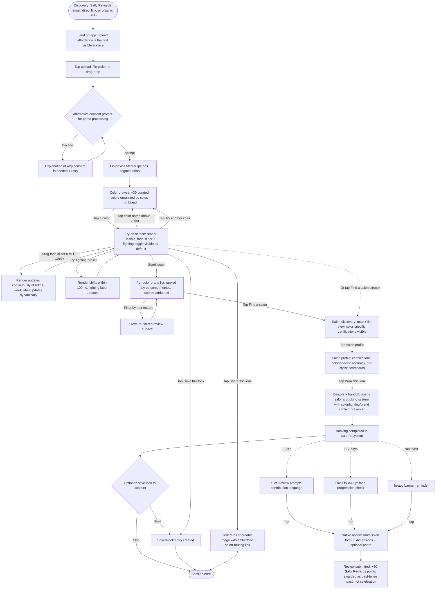
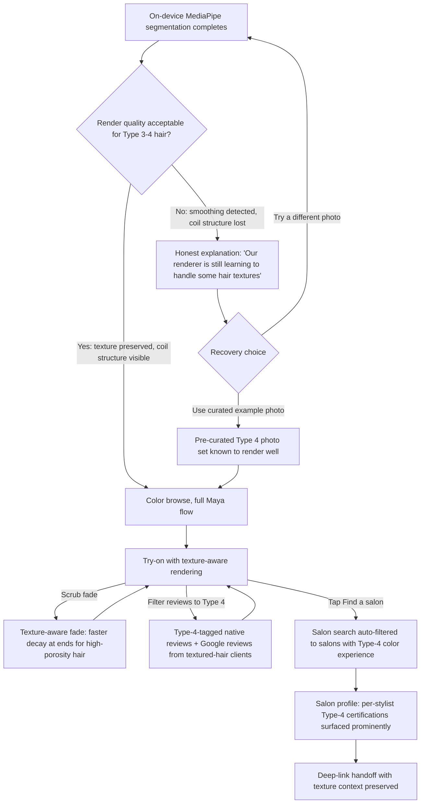
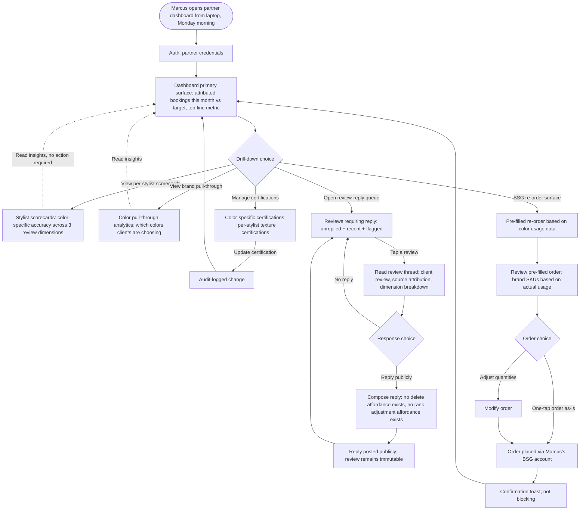
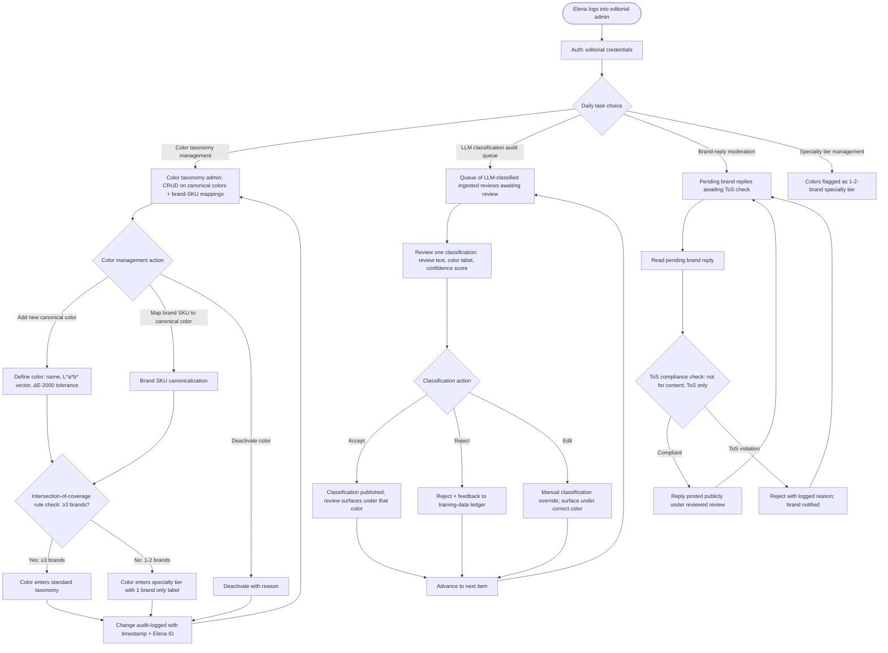

# UX Design Specification SB_Project (Sally Beauty Hair Color Try-On)

**Author:** Yashdixit
**Date:** 2026-05-03

---

<!-- UX design content will be appended sequentially through collaborative workflow steps -->

## Executive Summary

### Project Vision

**Sally Beauty Hair Color Try-On** is a brand-neutral, outcome-tracked, salon-routed web app. Spine sentence (from PRD): *"She is about to do something she cannot undo for six months. We are the last honest mirror before she does."*

The product ships in two phases sharing one codebase:

- **Demo V1 (now, 8 weeks):** production-quality build that runs locally on laptop and mobile browsers; walked through to Sally Beauty executives in a 2-hour meeting-room session covering all 5 personas. Open-source AR (MediaPipe + HSL/Lab + TensorFlow.js). Real BSG brand names; mock review data attributed to fictional users. Mocked vendors throughout. Demo framing (no signed contracts, illustrative review data) is established outside the product surface — verbal disclosure at session start + one-pager handed to executives. Success bar: binary exec funding decision.
- **Production V1 (post-funding, 16 weeks):** same codebase, real vendors (licensed AR SDK + DPA, Twilio, SendGrid, Sally Rewards SSO, BSG product-pull join), cloud-deployed in DFW. Success bar: 5K WAU @ Wk 4, ≥10 attributed bookings/partner/month, 25% native review submission rate.

UX work serves both phases simultaneously — Demo V1 and Production V1 are visually indistinguishable. There is no demo-only UI element: no banners, no overlays, no watermarks, no "preview mode" indicators. The only difference between phases lives under the hood (mock providers vs. real providers).

### Target Users

Five personas from the PRD, each with a fully-narrated user journey:

1. **Maya — The Considered Color-Changer (primary, consumer happy path).** Age 34. Two years post-divorce, six months post-promotion, in a deliberate-decision moment over a $300 irreversible color change. Plano marketing director. Type 2B wavy hair. Researches before deciding; mistrusts brand filters and TikTok colorists. **The funnel target.** Demoed first — sets the spine.
2. **Janelle — The Type 4 User (primary, texture edge case).** Age 29. Type 4A coily hair. Has stopped trying AR try-ons because every previous one rendered her hair as a smooth Eurocentric helmet. Demoed second — the binary trust check; if her flow doesn't preserve texture, the differentiator collapses.
3. **Aliyah — The Stylist (secondary, in-chair amplifier).** Age 41. Master colorist at Crown & Coil, 16 years in the chair. Pulls saved-look context from calendar invite link on her chair-side iPad. Submits in-chair reviews on consumer behalf with consent capture. Demoed third — exec moment where they switch from "consumer app" to "two-sided marketplace" thinking.
4. **Marcus — The Salon Owner / Partner (supply-side user).** Owns Crown & Coil. Manages partner dashboard with attributed bookings, per-stylist scorecards, BSG re-order surface, review-reply flow (no delete). Demoed fourth — the moat made legible in 5 seconds via BSG re-order one-tap.
5. **Elena — The Editorial Curator (admin / operations).** 36. 12 years editorial experience. Owns color taxonomy, intersection-of-coverage rule, LLM classification audit queue, brand-reply moderation. Demoed last — closes the moat narrative with the editorial integrity layer.

**Hard cross-cutting requirement (not a separate persona):** texture inclusivity. Type 3-4 hair render fidelity is the price of admission, not a V2 inclusivity story.

### Key Design Challenges

1. **The AR render is the product, not a feature.** The hair color visualization, fade simulator, and multi-lighting toggle are first-class UI surfaces, not modal embeds. Their interaction quality determines whether execs fund the product. Fade scrub at 60fps; segmentation under 500ms; multi-lighting toggle response under 100ms — these are *design constraints*, not just engineering targets. Motion design must accommodate.

2. **Texture-first as binary trust check.** Janelle's flow has zero margin for error. The renderer preserving her individual coil structure is the most differentiating UI moment in the demo; if it fails, the entire texture-inclusivity claim collapses. Demo workaround (curated Type-4 photos verified to handle MediaPipe well) requires UX/eng coordination on which photos pass and how the "upload your own" state degrades gracefully if the user's photo is on MediaPipe's failure edge.

3. **Cross-actor design system serving radically different contexts.** One design system must serve: consumer mobile-first surface (Maya, Janelle), stylist iPad chair-side surface (Aliyah), salon owner desktop dashboard (Marcus), editorial admin internal tool (Elena). The consumer surface is narrative and emotional; the partner dashboard is operational and data-dense; the editorial admin is utilitarian and audit-trail-driven. Shared component library; differentiated layout patterns and information density.

4. **Tone discipline against the gravitational pull of "delight" patterns.** Hair color try-on apps in the wild use bright illustrations, emoji-heavy microcopy, rainbow gradients, animated celebrations. The PRD's Tone & Voice tenets explicitly forbid these. Designing restraint that still feels confident and considered (not cold or clinical) is the harder craft. The "last honest mirror" frame must be visible in the design language.

5. **Mock data must feel production-real without UI apology.** Demo and production are visually indistinguishable; there are no in-UI watermarks, "demo mode" banners, or apologetic overlays. The product surface never tells the user (or executive) that what they're seeing is a demo. The demo framing — that brand contracts aren't yet signed and review data is illustrative — is established entirely outside the product (verbal disclosure at session start + one-pager handed to executives). This means the mock review data must be designed and curated to feel like real production reviews: realistic distributions, plausible reviewer names, varied sentiment, source-attributed labels intact. The discipline is producing mock data of *real-product quality*, not "obviously placeholder" content.

### Design Opportunities

1. **The fade simulator slider as the demo's signature moment.** No commercial AR SDK ships fade simulation. A well-designed scrub interaction (haptic feedback on mobile, smooth color trajectory, clear week markers, washes-per-week as a secondary control) is the visceral UX that no competitor has shipped. This is the moment where execs viscerally feel the value-curve axis shift from "render fidelity" to "outcome truth."

2. **Multi-lighting toggle as the "salon vs daylight" reveal.** Three calibrated presets, one-tap switching. Designed correctly, this directly kills the #1 trust complaint in the category ("looked different in the salon"). Designed weakly, it's a forgettable toggle. The opportunity is to make the *contrast* between lighting presets undeniable in 2 seconds of interaction.

3. **Source-attribution labels as a trust feature, surfaced visually.** Every review surface labels its source (Google Places / brand-published / SB user / stylist-assisted). This is a design opportunity to make the labels themselves visually distinct and consistent — turning legal-style attribution into a trust differentiator. *"Sally doesn't fake reviews — we show you exactly who's saying what"* is a marketing line that becomes true via design.

4. **Marcus's BSG re-order one-tap surface as the "moat made legible in 5 seconds" moment.** The PRD specifies a one-tap pre-filled BSG re-order from actual usage data. Design opportunity: make this feel *obvious* and *unique* in the dashboard layout — the moment an exec sees this and recognizes that no startup competitor could surface it because no startup owns the distributor side, the cross-side ownership moat is sold without a slide.

5. **Public Review Integrity Policy made structural in the UI.** Marcus's review-reply flow has *no delete option*. The absence is the design feature. Designed correctly (delete UI never appears, policy is linkable from the surface, brand-reply submission is the only response affordance), this becomes a recognizable pattern that distinguishes the product from every competitor's "manage your reviews" dashboard.

6. **Verb-driven button copy as a tonal signature.** The PRD specifies *"See this color on me," "Find a salon," "Save this look"* not *"Continue / Submit."* Consistent verb-driven action language across all surfaces becomes a quiet but accumulating tonal signal that this product takes the user's intent seriously.

7. **Production-real mock data as the demo's most invisible craft.** Mock review data, fictional reviewer profiles, mocked salon catalog, mocked stylist scorecards must all feel indistinguishable from production reality. Realistic rating distributions (some colors well-rated, some not, Type-4-specific reviewers populated, varied sentiment, plausible reviewer names). Done well, the design opportunity is invisible — execs experience the demo as a working product, not as a curated walkthrough. Demo framing happens verbally before the demo opens; the product itself never apologizes for being a demo.

## Core User Experience

### Defining Experience

The core experience is a **single uninterrupted session** in which a consumer uploads a photo, browses by color, sees herself in the chosen color across three lighting presets and across 90 days of fade, reads outcome-anchored reviews from people with her hair texture, and reaches a partner salon's booking page with her color, lighting preference, and brand choice preserved. From upload to booking handoff, everything is on one continuous flow — no forms, no signups required (guest mode), no tabs to lose her place in.

The most reduced "ONE thing" that everything follows from: **she sees herself in a color she can trust over six months under three lights, and reaches a salon prepared to deliver it.** Every other surface in the product (Aliyah's stylist view, Marcus's partner dashboard, Elena's editorial admin) exists to make this single core consumer experience credible, attributable, and operationally sustainable.

### Platform Strategy

- **Web app, single codebase, responsive across desktop laptop browsers and mobile browsers.** No native iOS/Android in V1 (deliberate; deferred to V2+).
- **Mobile-first defaults** for consumer surfaces (Maya, Janelle journeys). Desktop-laptop optimized for partner dashboard (Marcus) and editorial admin (Elena). Stylist surface (Aliyah) is iPad-class chair-side device — designed for tablet landscape but functional on any tablet or laptop.
- **Touch + pointer events both supported** without separate code paths. Fade simulator, lighting toggle, share-this-look — all interactions work identically on touch and mouse.
- **No live camera in V1** — photo upload only, deliberately. Keeps the user in deliberate-decision mental model rather than TikTok-filter mental model.
- **Network-optional for Demo V1** — runs entirely from local fixtures during exec walkthrough. Network required for Production V1 (cloud-deployed) but the consumer interaction model does not change.
- **Browser-feature requirements** (both phases): WebGL 2 + Canvas 2D for AR rendering; IndexedDB for client-side caching; File API for upload; Web Crypto for attribution token signing.
- **PWA-installable in Production V1** (manifest + service worker for offline color browse; "Add to Home Screen" prompt on mobile). Not in Demo V1.

### Effortless Interactions

Five interactions where friction must collapse to zero. These are the surfaces where "salon-grade, not toy" gets demonstrated through restraint:

1. **Photo upload → first render.** Tap upload → pick photo → consent prompt (re-prompted every upload, no implicit re-consent) → first color rendered. No loading spinner on the consent step; the consent IS the loading state. First render lands in <800ms on mobile demo hardware.
2. **Color browse → render swap.** Tap a different color → rendered output updates in <200ms. No loading state visible. The user's eye should never leave the rendered output during a color change.
3. **Fade simulator scrub.** Drag the slider from week 0 to week 12 → 60fps update. Washes-per-week as a secondary control (not primary; primary is week-along-the-fade-curve). Color trajectory is visually continuous, not stepped between week markers.
4. **Multi-lighting toggle.** Tap salon / daylight / warm-interior → response in <100ms. Three presets pre-computed and cached per color so toggling is perceived as instant. Side-by-side comparison should be possible (tap-and-hold for previous-vs-current) — design exploration in later steps.
5. **Booking handoff.** Tap "Book this look at [Salon]" → deep-link opens salon's booking page with color, lighting preset, and brand preference pre-loaded into appointment notes. No intermediate confirmation screen on her side; the handoff IS the action.

What does *not* need to be effortless: review submission (it's a deliberate post-booking moment that benefits from being slightly weighty); editorial admin actions (Elena is doing operational work, not consumer browsing); salon partner dashboard navigation (Marcus is doing weekly review, not minute-by-minute interaction).

### Critical Success Moments

Six moments that determine whether the value proposition lands:

1. **The first render after upload.** Does she see *her* hair with color on it? If the renderer flattens texture, smooths curls, or feels like a generic head model, trust collapses in the first 5 seconds. **For Janelle specifically: this is the binary trust check.** Her individual coil structure must remain visible after color shift.
2. **The fade simulation reveal.** When she scrubs from week 0 to week 8 and sees the color she liked become a color she hates by week 8 — *or* sees a color she didn't think much of hold up beautifully — the value-curve axis shifts in her head from "render fidelity" to "outcome truth." This is the demo's signature exec moment.
3. **The lighting toggle.** When she sees salon-preset (warm, flattering — *of course*) vs daylight (orange, exactly what she feared), the #1 trust complaint in the category ("looked different in the salon") gets killed in 2 seconds.
4. **The texture-filtered review.** When she filters reviews to her hair texture and sees real outcome reviews from people with her hair — *not an empty state, not a "coming soon," but actual content* — the product earns the right to be called "outcome-tracked." Even with mock data in Demo V1, the texture filter must return populated content.
5. **The booking handoff.** When she taps Book and the salon's booking page opens with her context pre-loaded into appointment notes — *not a generic appointment form she has to re-explain* — the salon-routing claim becomes felt rather than just stated.
6. **The post-booking review prompt arrival (T+24h).** Even in Demo V1 (where this is narrated, not fired), the moment in the demo when an exec sees the SMS / email / in-app banner mockups appearing in the demo flow at the right narrative beat is when the data flywheel becomes credible. *"This is how reviews start happening even before the user remembers to come back."*

If any one of moments 1, 2, or 3 fails in the meeting room, the demo's funding argument is wounded. Moments 4-6 can be narrated more loosely. UX investment should follow this priority.

### Experience Principles

Six guiding principles for every UX decision in this product:

1. **Honest mirror, not flattering filter.** Every interaction prioritizes truth over flattery. Default to daylight lighting, not salon-warm. Surface fade and damage prominently, not in fine print. Show source-attributed reviews (including negative ones). Empty states tell the truth (*"No color-specific reviews yet — be the first"*) rather than pad with fabricated depth.

2. **Texture preserved, not flattened.** The renderer never smooths Type 3-4 hair; the visual signature of every render is the user's *actual* hair with color landing on it. Component design, motion design, and image composition all defer to this principle. When the underlying ML can't preserve texture, the design surfaces the limitation honestly rather than masking it.

3. **Zero friction on the core value-prop loop, weight on commitments.** Upload → color → fade → lighting → reviews → booking should feel like one continuous motion. Conversely: review submission, consent prompts, deletion requests, and brand-reply moderation deserve weight — they are deliberate moments, not brushed-past frictions.

4. **Mobile-first for consumers, desktop-native for operators.** Maya picks up her phone at 9:47 PM in her bathroom — that's the primary surface. Marcus opens his laptop on Monday morning to review per-stylist scorecards — that's a desktop-native dashboard, not a stretched mobile view. Same component library; differentiated layout density and information hierarchy.

5. **Restraint over delight.** No celebration animations on review submission. No emoji-heavy microcopy. No rainbow gradients. No streaks or addictive engagement loops. Confidence through clarity, not through entertainment patterns. The "considered, salon-grade" tone is enforced by design, not aspired to in copy.

6. **Demo and production look identical, full stop.** There are no demo-only UI elements. No watermarks, no banners, no overlays, no "preview mode" indicators. The product surface that executives see in the meeting room is the product surface that real users will see post-funding. The architecture of the design system mirrors the architecture of the codebase: same surfaces in both phases, mock-providers-vs-real-providers under the hood. Demo framing (no signed contracts, illustrative review data) is established outside the product surface — verbal disclosure at session start + a one-pager handed to executives. The product never apologizes for being a demo.

These principles will guide every wireframe, component decision, motion design choice, copy review, and accessibility check in the rest of this UX specification.

## Desired Emotional Response

### Primary Emotional Goals

**Trust, agency, and the quiet relief of trustworthy foreknowledge.** Not delight. Not excitement. Not surprise. Not joy. Not the emotional palette of TikTok filters or social apps. The protagonist is making a $300 irreversible decision about her appearance for the next six months — the emotional payload she needs is the same one a customer feels reading a Carfax report on a used car or hiring a contractor with a strong reputation. *"I know what I'm getting into."*

The four primary emotional goals, in priority order:

1. **Trust** — earned through transparency, not promised. The product surfaces what could go wrong (fade, damage, lighting differences) before it surfaces what could go right. Trust builds because the product never tries to win her over with flattery.
2. **Agency** — she's making the decision; the app is the mentor figure (not the hero). Every interaction respects that she's already done research; the app is helping her decide, not deciding for her.
3. **Confidence** — earned through completeness. By the time she taps Book, she has seen the color in three lights across 12 weeks of fade with reviews from people with her hair texture. Confidence comes from having seen the full picture, not from being reassured.
4. **Relief** — the secondary payload. The opposite of *"I hope this works."* It's *"I know what I'm getting into and I've made an informed choice."*

**Emotions to actively avoid:** excitement, surprise, FOMO, social pressure, reward-greed (Sally Rewards points are awarded but not over-celebrated), parasocial belonging, gamified streaks, dopamine-loop engagement patterns. Each of these would betray the considered/salon-grade tone tenets the PRD locked in.

### Emotional Journey Mapping

The consumer journey (Maya, Janelle) carries the primary emotional load. Secondary actor journeys (Aliyah, Marcus, Elena) are pro contexts with different emotional shapes.

#### Consumer journey emotional arc

| Stage | Emotional state arriving | Emotional state leaving | Design intent |
|---|---|---|---|
| **Discovery (9:47 PM Tuesday)** | Skeptical, tired, slightly anxious. Has been burned before. | Curious, slightly intrigued. *"This isn't trying too hard."* | Quiet authority, not enthusiastic welcome. No splash screen, no value-prop banner. The first surface is the upload affordance. |
| **First render after upload** | Vulnerable, exposed (her selfie just got processed). | Surprise → recognition. *"That's actually me."* | Texture preserved = trust earned. The render lands without overlay distraction; the photo is the protagonist of the screen. |
| **Color browse** | Exploration, low-stakes curiosity. | Sustained engagement; no commitment pressure. | Easy reset between options; no "Save this color" prompts pulling her toward conversion. |
| **Fade simulator scrub** | Casual interest. | Revelation + respect. *"Oh. THAT'S what happens at week 8."* | The fade reveals are visceral, not academic. Color trajectory is the data; she doesn't need a chart. |
| **Lighting toggle** | Liking the salon-warm preview. | Deflation → relief. *"In daylight... oh god. OK, this color isn't right. Let me try Bronde."* The product just saved her from a bad decision. | The contrast between presets must be undeniable in 2 seconds. Trust deepens because the daylight reveal was *willingly* shown. |
| **Texture-filtered reviews** | Wanting validation. | Validation. *"People with my hair said this works."* | Loneliness of irreversible decisions reduces. Even with mock data, the texture filter must return populated content. |
| **Booking handoff** | Committed but not anxious. | Prepared. *"I've done my homework. The salon will know what I'm asking for."* | One tap; no intermediate confirm screen on her side. Context preservation is the trust signal. |
| **In-salon (Saturday)** | Hopeful, slightly nervous. | Quiet vindication. *"This matches what I saw."* | The product doesn't reach her here — but the design decisions in the previous stages determined whether this moment lands. |
| **T+24h review prompt** | Surprised by the prompt timing (relevance). | Generosity. *"I want to help the next person."* | Review prompt language: *"Your review helps the next user with hair like yours."* Not: *"Earn 50 Sally Rewards points!"* |

The emotional arc moves from *skepticism → trust → confidence → relief → generosity*. This is the data flywheel's emotional engine; without the generosity moment at T+24h, post-booking review submission rate (NFR21 / 25% target) does not happen organically.

#### Pro actor emotional shapes (briefer)

- **Aliyah (Stylist):** *satisfaction* (better consultation than the "show me a picture" conversation), *pride* (her scorecard ticks up visibly), *agency* (in-chair review submission gives her control over a previously chaotic post-appointment outcome).
- **Marcus (Salon Owner):** *legibility*. The cross-side ownership unlock made visible in 5 seconds via the BSG re-order surface. He recognizes Sally is uniquely positioned to do this for him; loyalty deepens.
- **Elena (Editorial Curator):** *mastery* + *integrity*. She's the gatekeeper of the moat. Pride in upholding the Public Review Integrity Policy under the first brand-pressure moment.

### Micro-Emotions

The make-or-break micro-emotional contests for this product. Each pair: the goal vs. the failure mode.

| Goal | Failure | Where it gets won or lost |
|---|---|---|
| **Trust** > Skepticism | Skepticism wins if the renderer feels canned or the reviews feel fake (mock-data quality matters) | First render quality (Type 4 fidelity); source-attribution prominence; production-real mock data |
| **Confidence** > Confusion | Confusion wins if the user can't find the fade/lighting controls, or if review counts feel sparse without explanation | Primary affordance hierarchy on the render surface; honest empty states |
| **Calm** > Anxiety | Anxiety wins if there are time pressures, scarcity signals, or aggressive CTAs | No countdowns; no "limited time" framing; generous whitespace; no urgency in copy |
| **Recognition** > Suspicion | Suspicion wins if the rendered hair doesn't look like the user's actual hair | Texture preservation; minimal post-processing on segmentation output |
| **Agency** > Manipulation | Manipulation feeling wins if there are dark patterns, forced signups, or hidden defaults | Guest mode enabled; consent re-prompted every upload; no auto-saved looks without user action |
| **Generosity** > Obligation | Obligation wins if review prompts feel transactional or coercive | Contribution language; no "Earn N points!" CTA framing on review submission |

### Design Implications (Emotion → UX Choice)

- **Trust** → source-attributed review labels are visually prominent (not buried in legal small-print); honest empty states (*"No color-specific reviews yet — be the first"* not *"Reviews coming soon"*); daylight is the default lighting preset, not salon-warm; mock review data in Demo V1 is curated to feel production-real (not "obviously placeholder").
- **Confidence** → fade simulator and lighting toggle are visible on the first render screen, not buried in a settings drawer; color browse navigation preserves user's place; reviews surface displays both positive and negative without weighting.
- **Agency** → guest mode requires no signup; reset (clear photo, start over) is one-tap; no intermediate confirm screens on user-initiated actions; consent prompts are direct and re-prompted every upload.
- **Calm** → motion design honors `prefers-reduced-motion`; transitions are smooth, not bouncy; whitespace is generous; no time-pressured CTAs; copy is plainspoken not exclamation-bait.
- **Recognition** → renderer preserves texture; rendering moment has no UI overlay distraction; the photo dominates the screen frame; texture-aware fade simulation honors porosity differences (Type 4 fades faster at ends, etc.).
- **Generosity** → review prompts use contribution language (*"Your review helps the next user with hair like yours"*); Sally Rewards points are awarded but mentioned in past tense ("+50 points" toast, brief, not a celebration animation); review submission UI feels weighty not playful (this is a deliberate moment, not a frictionless flow).

### Emotional Design Principles

Six guiding principles for emotion-shaping UX decisions throughout this product:

1. **Trust through transparency, not through reassurance.** Show the limits, not the upsides. (Daylight default, fade visible, damage rates surfaced, source attribution prominent.)
2. **Calm, not exciting.** This is a deliberate decision; the product matches that mental state. No celebration patterns, no urgency, no surprise mechanics.
3. **Recognition over flattery.** Render preserves texture; user sees herself, not an idealized version of herself. The product is a mirror, not a filter.
4. **Agency through restraint.** No intermediary screens where the user expected directness. No CTAs pressuring choice. Guest mode enabled. Consent re-prompted on every upload.
5. **Generosity over obligation in feedback loops.** Reviews framed as contribution to the next user, not as obligation to the platform. Rewards mentioned, not celebrated.
6. **Pride through legibility for pro operators.** Marcus, Aliyah, Elena should feel competent using their tools — the dashboards make their work visible to themselves. Not gamified; just clear.

These emotional design principles inherit the spine sentence: *"She is about to do something she cannot undo for six months. We are the last honest mirror before she does."* Trust, agency, calm, recognition, generosity, pride — these are the felt manifestations of being a last honest mirror.

## UX Pattern Analysis & Inspiration

### Inspiring Products Analysis

Eight products grouped by what they teach this product. Selected because the protagonist (Maya / Janelle profile — 25-45, deliberate decision-makers, mistrust of social-app patterns) likely already uses several of them in her life.

#### Trust + Source Attribution

**Yelp (Business Pages + Reviews)**

- *What it does well:* source-attributed reviews; business-owner reply pattern (no delete option exists for negative reviews); structured ratings (food / service / atmosphere) separated from headline rating; review count + average displayed prominently with both negative and positive surfaced
- *What we adopt:* the no-delete review-reply pattern (directly maps to Marcus's review-reply flow / FR37); separated rating dimensions (color outcome vs stylist execution vs salon environment, FR16); business-owner reply as a public dialog (FR37); both positive and negative surfaced in default view
- *What we improve on:* Yelp's reviews are about the business, not the *outcome*. Our reviews are per (brand × color × texture × stylist) which is several orders of magnitude more useful for a considered-color decision

**Airbnb (Reviews + Trust Signals)**

- *What it does well:* separate rating dimensions (cleanliness, accuracy, location); reviewer profile context (verified, traveled X times); host-response pattern; pre-stay messaging that preserves context to the in-person handoff
- *What we adopt:* reviewer demographic context (e.g., "Type 2B wavy, posted 3 reviews"); pre-handoff context preservation (color + lighting preset + brand pref preserved in deep-link, mirrors Airbnb's pre-stay message thread); verification of reviewer-actually-booked-through-platform
- *What we improve on:* Airbnb's pre-stay context is text-based; ours is structured + visual (the saved-look render itself travels with the booking handoff)

#### Outcome-Anchored Reviews

**Strava (Activity + Segments)**

- *What it does well:* real numbers, not stars (segment time, Watts, elevation gain); comparable across users; demographic context (age group, weight category) surfaced for comparable comparison
- *What we adopt:* numerical outcome data instead of stars (fade weeks, accuracy 1-5, damage 1-5, would-recommend %); texture-comparable filtering (FR14 — "people with my hair texture said this"); avoiding the star-rating reduction
- *What we improve on:* Strava's segment leaderboards reward a single dimension (speed). Our schema supports multi-dimensional outcome decomposition (FR15) — the right color for me on my texture in my lighting

**GoodReads (Reviews + Recommendations)**

- *What it does well:* structured rating + freeform review; demographic / preference context ("readers who liked X also liked Y"); reviews-from-people-similar-to-you surfacing
- *What we adopt:* structured + freeform combination per FR15; the "people similar to me" filter logic; lightweight reviewer profile context

#### Considered-Decision Tone (Calm, Restrained)

**Headspace (Onboarding + Daily Surfaces)**

- *What it does well:* restraint as design language; no celebration patterns on session completion; calm typography; generous whitespace; deliberate motion design (slow, eased transitions); no streak gamification anxiety
- *What we adopt:* restraint as design language across all consumer surfaces; no celebration animations on review submission (NFR / Tone & Voice tenets); generous whitespace; eased motion that honors `prefers-reduced-motion`; no streak-based engagement loops

**Linear (Pro Tool Dashboards)**

- *What it does well:* dense information without visual clutter; verb-driven button copy (*"Open issue," "Assign to me"* not *"Continue"*); pro-tool pride through legibility; keyboard-first interaction without sacrificing pointer-driven discoverability
- *What we adopt:* verb-driven button copy (already a Tone & Voice tenet); dense-but-clean layout for Marcus's partner dashboard and Elena's editorial admin; legibility-first information hierarchy on pro surfaces

#### Pre-Visualization for Considered Purchase

**Stitch Fix / Trunk Club (Try-Before-Buy + Structured Feedback)**

- *What it does well:* "see yourself in it before commit"; structured feedback loop after each receipt that improves future curation; managed-expectations content that surfaces fit + fabric + occasion details
- *What we adopt:* the "see yourself before commit" framing applied to color (which is already the product's spine); the structured post-experience feedback loop (our post-booking review prompt at T+24h)

**IKEA Place (AR for Considered Purchase)**

- *What it does well:* AR placement is presented as practical preview, not entertainment; the 3D model rendering is restrained, no special effects; the action exit (add to cart) is clear and low-pressure
- *What we adopt:* AR-rendering-as-practical-tool framing (vs AR-as-toy); restrained presentation of the rendered output; clear low-pressure exit to the booking action

### Transferable UX Patterns

| Pattern | Source | Where it fits in this product |
|---|---|---|
| **No-delete review reply with public response** | Yelp, GoodReads | Marcus's review-reply flow (FR37); Public Review Integrity Policy made structural in UI |
| **Multi-dimensional outcome decomposition** | Airbnb (cleanliness/accuracy/location), Strava (multi-metric segments) | Per (brand × color × texture × stylist) review schema (FR15, FR16) |
| **Reviewer demographic context inline with review** | Airbnb host context, Strava age-group | Texture-tagged reviews for filter-to-people-like-me (FR14) |
| **Pre-handoff context preservation** | Airbnb pre-stay message, OpenTable booking notes | Deep-link booking handoff with color + lighting + brand pref preserved (FR25, FR26) |
| **Verb-driven button copy** | Linear, Headspace | Already a Tone & Voice tenet — *"See this color on me," "Find a salon"* |
| **Restrained motion design + reduced-motion honoring** | Headspace, Linear | All consumer-surface transitions; fade simulator scrub; lighting toggle response |
| **Dense data without clutter** | Linear, Stripe Dashboard, Notion | Marcus's partner dashboard; Elena's editorial admin |
| **Source-attribution chips inline with content** | Wikipedia citations, AP News attribution UI | Source-attribution labels on every review (FR13) |
| **AR-as-practical-tool framing** | IKEA Place | Photo upload + render UI restraint; no entertainment effects |
| **Audit queue with accept/reject affordances** | Wikipedia editorial UI, Algolia inspector | Elena's LLM-classification audit queue (FR42) |
| **Pre-filled re-order based on actual usage** | Amazon "Subscribe & Save," Stripe Atlas | Marcus's BSG one-tap re-order surface (FR35) |
| **Geo-search radius + map inline with list view** | OpenTable, Yelp, Google Maps | Salon discovery surface (FR22) |

### Anti-Patterns to Avoid

Twelve patterns that recur in adjacent products and would betray the product's positioning if adopted.

| Anti-pattern | Where it lives in adjacent products | Why we avoid |
|---|---|---|
| **Splash screen with marketing copy** | Most consumer apps' first-launch flow | Tone betrayal; the first surface should be the upload affordance, not a value-prop banner |
| **Forced signup before trying** | Most beauty apps; Madison Reed | Manipulation, not agency; guest mode is mandatory (FR45) |
| **Salon-warm lighting as the default render** | Every existing AR try-on | Trust betrayal; daylight is the truthful default |
| **Star ratings as the headline score** | Yelp (despite their other strengths), most review surfaces | Reduces multi-dimensional outcome to one number; ours is decomposed (FR15-16) |
| **Rainbow gradients / playful illustrations on consumer surfaces** | TikTok beauty filters, most try-on apps | Toy/filter category; betrays salon-grade positioning |
| **Streaks / daily login rewards** | Snapchat, social apps | Manipulative engagement loop; betrays calm/considered tone |
| **Celebration animations on review submission** | Most rewards apps | Betrays generosity-over-obligation principle; reviews should feel weighty |
| **Auto-saved looks without explicit user action** | Many social apps | Agency betrayal; consent and explicit save are the pattern |
| **Carousels as primary navigation for color browse** | Many e-commerce apps | Hides options; color-first browse should reveal the curated set, not gate it behind swipes |
| **Modal dialogs with single "Got it" CTAs** | Many onboarding flows | Friction without information; if it's worth showing, it's worth being a real surface |
| **Reviewer scores reduced to a single number ("Maria, 4.2 reviewer")** | Some marketplace apps | Distracts from the review content; reviewers are not the product |
| **Dashboard navigation hidden behind hamburger menu on desktop** | Many cross-platform apps | Marcus's surface is desktop-native; navigation should be visible, not concealed |

### Design Inspiration Strategy

**What to adopt directly:**

- **Yelp's no-delete review-reply pattern** for Marcus's review-reply flow. The absence of a delete affordance is the design feature.
- **Strava's numerical outcome data** for the per-color brand list with structured outcome ratings. Numbers, not stars.
- **Airbnb's pre-stay context preservation** for the deep-link booking handoff. Color + lighting + brand pref travel into the salon's booking system.
- **Headspace's restrained motion + generous whitespace** for all consumer surfaces.
- **Linear's verb-driven button copy + dense-but-clean layout** for the partner dashboard and editorial admin.
- **IKEA Place's AR-as-practical-tool framing** for the render surface — restraint, no effects, focus on the output.

**What to adapt:**

- **Yelp's source-attribution model** — adapted to label every review surface with its source (Google Places / brand-published / SB user / stylist-assisted) per FR13.
- **GoodReads' "readers similar to you" recommendation logic** — adapted to "people with your hair texture said this" filtering per FR14.
- **OpenTable's deep-link booking pattern** — adapted to preserve color/lighting/brand context, not just date/party-size, per FR25-26.
- **Wikipedia's editorial audit UI** — adapted as Elena's LLM-classification audit queue per FR42, with accept/reject/edit on each item.

**What to explicitly avoid:**

- Every pattern in the anti-pattern table above.
- ModiFace / YouCam's "single-brand toy" framing — replaced by brand-neutral color-first browse.
- Booksy / Fresha's salon-generic review surfacing — replaced by color-specific, texture-filterable reviews.
- TikTok / Snapchat's entertainment-filter aesthetic — replaced by considered-decision restraint.
- Madison Reed's DTC funnel pattern (single-brand pipeline to own SKU) — replaced by brand-neutral marketplace.

## Design System Foundation

### 1.1 Design System Choice

**Recommended: Radix UI Primitives + Tailwind CSS + shadcn/ui-pattern component ownership.**

Three layers, deliberately stacked:

1. **Radix UI Primitives** — accessibility-first behavioral primitives (Dialog, Popover, Select, Slider, Toast, Tabs, Toggle, Tooltip, etc.). Unstyled. Best-in-class focus management, keyboard navigation, screen reader support, and ARIA semantics out of the box. This layer carries the WCAG 2.2 AA load.
2. **Tailwind CSS with custom design tokens** — utility-first styling with project-specific design tokens (color, typography, spacing, motion, density) defined in `tailwind.config.ts`. Purges unused CSS at build time; zero runtime CSS-in-JS overhead.
3. **shadcn/ui-pattern component ownership** — components are *copied into our codebase* (not installed as a dependency), styled with Tailwind, built on Radix primitives. We own the source. No vendor lock-in. No surprise breaking changes on version bumps.

### Rationale for Selection

Five reasons this combination is the right fit *for this product specifically*:

1. **Restraint over delight is enforceable, not just aspired to.** Material Design / Ant Design / Chakra ship with opinionated visual language (rounded corners, vibrant primaries, playful shadows) that fight the "considered, salon-grade, restrained" tone tenets. Radix + Tailwind are unstyled — there is *no* default aesthetic to override. The tone discipline lives in the component library we author, not in defaults we have to defeat.
2. **WCAG 2.2 AA conformance is structural, not retrofitted.** Radix primitives ship with focus trapping, ESC handling, screen-reader announcements, keyboard navigation, and ARIA attributes correctly applied — these are exactly the patterns NFR22-24 require. The cost of accessibility correctness is dramatically lower when you start with Radix than when you build from scratch or retrofit a styled component library.
3. **Same component library serves consumer + pro contexts via density variants.** Maya's mobile-first consumer surface needs comfortable density (large touch targets, generous whitespace). Marcus's desktop-native partner dashboard needs compact density (information-dense table rows, tight scorecard grids). Same primitive components, different density tokens — Tailwind variants make this trivial. No separate component library for dashboards.
4. **Performance budget alignment.** No runtime CSS-in-JS overhead (rules out styled-components / Emotion-based systems). No JavaScript-heavy theming runtime (rules out MUI). Tailwind purges unused CSS; bundle stays small (NFR8 target ≤300KB). Radix primitives are lightweight; tree-shake well.
5. **Source ownership eliminates the demo→production maintenance risk.** shadcn/ui pattern: when we adopt a Dialog component, the source lives in our `components/ui/dialog.tsx`. We modify it freely. No `npm update` ever changes our component behavior unexpectedly. This matters because the demo→production transition is operational, not architectural — engineering does not want surprise breaking changes mid-flight.

### Implementation Approach

**Tailwind configuration (`tailwind.config.ts`):**

- Color tokens: brand palette TBD with Sally Beauty marketing (Production V1); demo uses a defensible placeholder palette consistent with Sally Beauty's existing visual identity (deep neutral background, restrained accent, high-contrast type)
- Typography scale: system stack first (`-apple-system, BlinkMacSystemFont, "Segoe UI", sans-serif`); custom display face only if Sally already owns one. Type scale calibrated for restraint: limited number of sizes (4-5 sizes max), generous line height
- Spacing scale: 4px base unit, geometric progression (4, 8, 12, 16, 24, 32, 48, 64, 96)
- Motion tokens: calibrated for "calm, not exciting" — durations 150-300ms, eased curves (`cubic-bezier(0.4, 0, 0.2, 1)`), no spring physics
- Density variants: `density-comfortable` (consumer surfaces) and `density-compact` (pro dashboard / admin surfaces) as Tailwind variants applied at layout-container level
- Breakpoints: mobile-first defaults (≤640px), tablet (641-1024px), desktop (≥1025px) — consistent with PRD

**Component library structure (`/components`):**

- `/components/ui/*` — base primitives wrapped from Radix + styled with Tailwind (Dialog, Popover, Select, Slider, Toast, Tabs, Toggle, Tooltip, Form, Input, Button)
- `/components/render/*` — domain-specific render-surface components (PhotoUploader, ColorRender, FadeSimulator, LightingToggle, ShareLook)
- `/components/reviews/*` — review-surface components (SourceAttributionLabel, OutcomeMetrics, TextureFilter, ReviewSubmissionForm, BrandReplyAffordance)
- `/components/discovery/*` — color browse + salon discovery (ColorGrid, ColorCard, SpecialtyTierLabel, SalonProfile, StylistScorecard)
- `/components/dashboard/*` — partner dashboard + editorial admin (AttributedBookings, BSGReorderCard, AuditQueue, TaxonomyAdmin)
- `/components/layout/*` — page shells, navigation, density containers

**Supporting tooling:**

- TypeScript strict mode
- Storybook (or Ladle) for component development in isolation
- axe-core integrated into Vitest for component-level accessibility tests
- Playwright for end-to-end accessibility walkthroughs (NFR23)
- Visual regression testing (Chromatic or Percy) for the demo polish bar — catches unintended visual drift before exec sessions

### Customization Strategy

**Brand identity work (parallel track, not blocking demo build):**

Sally Beauty's existing visual identity provides the brand grammar for Production V1. For Demo V1, we can ship with a defensible placeholder palette (warm neutrals, restrained accent) that demonstrates the design system's flexibility without committing to brand specifics. Brand color and typography work happens in parallel during weeks 3-6 of the demo build; design tokens swap when ready without component changes.

**Tone enforcement at the component level:**

The component library carries the Tone & Voice tenets as enforced patterns:

- All Button components default to verb-driven copy patterns (`<Button>See this color on me</Button>` shape — enforced via component prop documentation + code review, not hard linting)
- All Toast components default to brief, past-tense outcome notifications (no celebration animations, no emoji)
- All EmptyState components require an honest message (no "Reviews coming soon"; default placeholder copy is "No reviews yet — be the first")
- Motion utilities wrap Tailwind transition classes with named tokens (`motion-calm-fast`, `motion-calm-slow`) — discourages bouncy / spring animations from being added ad hoc

**What we're NOT doing:**

- Building a custom design system from scratch (timeline / 8-week constraint disqualifies it)
- Adopting MUI / Material Design (opinionated visual language fights the tone)
- Adopting Ant Design (enterprise aesthetic doesn't fit consumer narrative surface)
- Adopting Chakra UI (lower-quality accessibility primitives than Radix; more vendor lock-in)
- Building a separate dashboard component library for pro tools (density variants on shared library is the right pattern; two libraries are a maintenance trap)

### Demo V1 vs Production V1 alignment

The design system is **identical** across both phases. There are no demo-only UI elements — no banners, no overlays, no watermarks, no "preview mode" indicators. Demo V1 looks indistinguishable from Production V1; the only difference is that demo data is loaded from local fixtures (mocked providers) instead of real APIs (real providers). The "this is a demo" framing lives entirely outside the product surface — verbal disclosure at the start of each demo session and a one-pager handed to executives establishing demo scope. The product itself never apologizes for being a demo.

Storybook stories cover all consumer, stylist, partner, and editorial-admin surfaces. Visual regression suite catches drift in any configuration.

## 2. Core User Experience

### 2.1 Defining Experience

**The interactive try-on triple: color render + fade scrub + lighting toggle, all responding within performance budget on a single screen.**

In one sentence: *the moment she's looking at herself in a color and playing with the fade slider and lighting toggle to understand what she's actually committing to over six months.*

This is the interaction Maya describes to her best friend the next day: *"There's this app where you can see yourself in a color, then drag a slider to see how it'll fade, then switch the lighting from salon to daylight. I tried Bronde and instantly knew it was right."* Not "an app where you can try on hair colors" — that's the category, not the defining experience. The defining experience is the *active manipulation* of the render along the fade and lighting axes.

Equivalents in other products:

- Tinder → "swipe to match"
- Spotify → "any song instantly"
- Stripe Dashboard → "see your real-time revenue and reconcile it in 3 clicks"
- This product → "see yourself in a color, scrub through fade, switch lighting"

If we get this triple perfectly right (60fps fade scrub, <100ms lighting toggle, texture preserved on render), the rest of the product follows. If we get it weak (laggy scrub, perceptible toggle delay, smoothed-out hair), no amount of marketplace polish saves the funding ask.

### 2.2 User Mental Model

**Familiar mental metaphors she brings:**

- **Trying on a hat in a store mirror, but with multiple lights** — she already knows how to evaluate appearance under different conditions; the app just provides the conditions.
- **A Carfax report on a used car** — comprehensive forensic view of an asset before commit. Fade simulator = projected wear; lighting toggle = condition under different exposure.
- **Volume slider / video timeline scrub** — she's used hundreds of horizontal sliders in her life; the fade slider is just one more. Snap-to-marker behavior (0, 4, 8, 12 weeks) mirrors how she scrubs a YouTube video to specific timestamps.
- **Camera flash mode toggle / iOS Live Wallpapers preview** — three-state lighting toggle is conceptually familiar.

**Existing solutions she has tried (and what she remembers):**

- **TikTok beauty filters:** fast and entertaining but obviously a toy. Doesn't help with a real decision. Snap-back to her real face the moment she stops looking at the screen.
- **Brand-specific AR try-ons (Garnier, L'Oréal):** single-color preview, salon-warm lighting only, no fade story. Felt like an ad, not a tool.
- **In-salon mirror with stylist holding swatches up to her face:** the most trustworthy experience she's had — but it's already in the chair, with the deposit paid, with the appointment scheduled. Too late to decide differently without socially awkward backout.

**The mental shortcut she'll apply:** sliders mean continuous adjustment over a single dimension; toggles mean discrete choice between defined options. These primitives are universally understood; we don't need to teach them.

**Confusion risks:**

- **Misreading fade slider as appointment timeline.** She might think week 0 is *today* and week 12 is *the salon visit*. Reality: week 0 is *immediately after the salon visit* and week 12 is *12 weeks after the visit*. UI must label this clearly: "Fresh from salon" → "12 weeks later." Anchoring word: *"after."*
- **Assuming salon-warm preset is the most accurate.** Cultural conditioning from existing AR try-ons. UI default is daylight, not salon. Lighting toggle labels are descriptive, not subjective ("Daylight" not "Most flattering").
- **Expecting live-camera AR.** Some users will reach for the camera button. UI does not have one in V1; the upload affordance is unambiguous. Onboarding copy reinforces: *"Upload a photo to see colors on your hair."*

### 2.3 Success Criteria for the Core Interaction

The interactive try-on triple succeeds when each of the following is true in the meeting room and in production:

| Success indicator | Measurement | Failure mode |
|---|---|---|
| **Fade scrub feels like a video timeline** | Continuous 60fps update during drag; no perceptible stutter | Stutter or stepped color jumps = trust collapses (this is THE demo moment) |
| **Lighting toggle feels instant** | <100ms perceived response on tap; rendered output updates synchronously with the toggle state change | Visible delay = "this is buggy" → demo credibility hit |
| **Color change feels like trying on a hat** | Low commitment, fast reset; tap a different color → render swap in <200ms | Lazy load with spinner = exploration friction |
| **Render is recognizable as her own hair** | Texture preserved (curl pattern, porosity, individual coil structure for Type 3-4); no Eurocentric smoothing | Suspicion replaces trust in 5 seconds |
| **The user develops physical intuition for color depreciation** | After 30 seconds of scrubbing, she can predict roughly how a different color would fade without trying it | Abstract not visceral = the fade story didn't land |
| **The lighting toggle viscerally demonstrates "looked different in the salon"** | Daylight vs salon-warm contrast must be undeniable in 2 seconds | Subtle differences = the #1 trust complaint isn't killed |
| **No tutorial required** | Self-evident affordances; user reaches for the controls without being told | Help text or modal overlay required = mental model didn't connect |

### 2.4 Novel UX Patterns

**Established (no user education required):**

- Slider for continuous-axis manipulation (fade timeline, washes-per-week)
- Three-state segmented control (lighting toggle)
- Tap-to-select in a grid (color browse)
- Photo upload affordance (file picker / drag-drop)
- Map-with-pin-list (salon discovery)
- Star-and-text reviews (review surface) — though we use *numerical metrics* not stars (Strava-pattern adaptation)

**Novel (combination of familiar primitives in unfamiliar context):**

- **Fade simulator on a personal photo of the user's hair.** No existing product applies a video-timeline-scrub metaphor to color depreciation on the user's own hair. The pattern is borrowed; the application is new.
- **Multi-lighting toggle for color preview.** No commercial AR SDK ships this. Three-state segmented control is familiar; the meaning of "salon vs daylight vs warm interior" applied to hair color is new.
- **Texture-preservation on Type 3-4 hair as a default behavior, not an opt-in feature.** Familiar AR pattern; new enforcement.
- **Per-(brand × color × texture) review schema.** Multi-dimensional review patterns exist (Airbnb cleanliness/accuracy/location); applied to hair color outcomes is new.

**The combination is the innovation, not any single primitive.** This means we don't need user education for individual controls — we need *contextual labeling* that helps the user understand *why* this combination matters. Tooltip-free inference from labels alone:

- *"Fresh from salon"* → *"12 weeks later"* (fade slider endpoints)
- *"Daylight"* / *"Salon lights"* / *"Warm interior"* (lighting toggle)
- *"Same Bronde across 4 brands. Outcome ratings from people with your texture."* (per-color brand list section header)

### 2.5 Experience Mechanics

The detailed mechanics of the interactive try-on triple — initiation, interaction, feedback, completion.

#### Initiation

The user lands on the try-on screen via one of three paths:

1. **First-time consumer flow:** photo upload → consent prompt → color browse → tap color → arrive on try-on screen with first render visible
2. **Returning consumer with saved look:** sign-in → saved looks → tap saved look → try-on screen restores previous photo + color + fade-stage + lighting preset
3. **Stylist (Aliyah) calendar handoff:** tap calendar invite link → opens client's saved-look on stylist iPad → same try-on screen with read-only context

**On arrival:** the render is already showing the user's hair in the selected color, lighting set to daylight (the truthful default), fade at week 0. Fade slider visible below the render. Lighting toggle visible above-or-beside the render. No loading state, no welcome modal, no tutorial overlay.

#### Interaction

**Fade slider:**

- **Primary affordance:** horizontal drag along a 0-12 week timeline. Touch and pointer both supported.
- **Secondary affordance:** tap a week marker (0, 4, 8, 12) to snap to that week.
- **Tertiary control:** washes-per-week selector below the slider (default 5/week, range 2-7). Adjusting washes-per-week recomputes the fade trajectory and rerenders.
- **Visual labels:** *"Fresh from salon"* at week 0 anchor, *"12 weeks later"* at week 12 anchor. Current week label updates dynamically during scrub: *"Week 0 — fresh"*, *"Week 8 — moderate fade"*, *"Week 12 — significant fade"*.
- **Haptic feedback (mobile):** subtle tick at each week marker during drag.

**Lighting toggle:**

- **Affordance:** three-state segmented control. Touch / pointer support.
- **States:** *Daylight* (default), *Salon lights*, *Warm interior*. Current state visually emphasized.
- **Behavior:** tap to switch; rendered output updates synchronously (<100ms). Tap-and-hold for previous-vs-current side-by-side comparison (design exploration; consider for V1.5 if it complicates the demo).

**Color change:**

- **Affordance:** color name displayed above the render is tappable; opens the color-browse surface as an overlay or full-screen with the current photo preserved.
- **Alternate affordance:** "Try another color" CTA below the render area.
- **Behavior:** select a new color → 200ms transition → new render appears in same lighting + fade-stage state (preserves the user's exploratory work).

**Photo change:**

- **Affordance:** "Use a different photo" affordance in the secondary CTA cluster; not in the primary surface (would invite premature reset).
- **Behavior:** confirms intent ("This will replace your current try-on"), then returns to upload flow.

#### Feedback

**During fade scrub:**

- Rendered hair color updates continuously, 60fps, no perceptible stutter
- Current-week label updates dynamically
- Subtle haptic tick at each week marker (mobile)
- Slider thumb visually emphasized during drag
- *No* loading spinner ever appears during scrub (pre-computation)

**During lighting toggle:**

- Rendered hair color shifts immediately (<100ms)
- Lighting label updates (*"Daylight"* / *"Salon lights"* / *"Warm interior"*)
- Toggle state visually emphasized
- *No* loading spinner ever appears during toggle (pre-computation)

**During color change:**

- 200ms cross-fade transition between renders (or instant snap with `prefers-reduced-motion`)
- Color name + brand-list updates
- Lighting and fade state preserved across the change

**Error states:**

- **Photo upload fails:** clear error message ("Couldn't process this photo. Try a different one — JPG or PNG, under 10MB."), retry affordance, no blame language
- **Hair segmentation fails on user's photo (Type 4 fidelity edge case):** graceful explanation ("Our renderer is still learning to handle some hair textures. Try a clearer photo, or [explore with example photos]"), curated example-photo path is the fallback in Demo V1
- **Slow device performance:** if frame rate drops below 30fps during scrub, surface a one-time advisory ("Smoother experience on a newer device") and offer reduced-motion mode

#### Completion

There is no "complete" state for the try-on screen itself — it's an exploration surface, not a task with a defined endpoint. The user exits via one of four affordances:

1. **Primary exit:** *"Find a salon for [color]"* CTA below the render area, leading to salon discovery (FR22). This is the conversion path.
2. **Save and continue exploring:** *"Save this look"* (creates a saved-look entry, FR7); user remains on the try-on screen.
3. **Share:** *"Share this look"* (generates shareable image with embedded salon-routing link, FR6); user remains on the try-on screen.
4. **Discard and try another color:** *"Try another color"* (returns to color-browse with photo preserved); user enters a new color exploration cycle.

**No forced sequencing.** She can save 3 looks, share 1, then book the salon for a fourth color she preferred — entirely valid. The product respects her exploration rather than funneling her toward a single narrow path.

**Edge cases:**

- User explores without booking (no conversion): valid outcome; the saved-look may bring her back later (Production V1 retention loop).
- User books without exploring fade or lighting: valid outcome but suboptimal; the product surfaces these affordances visibly so the *opportunity* was always there.
- Stylist (Aliyah) opens a client's saved-look in read-only mode: she can see all the user's exploration but cannot save changes back to the user's account; her own actions go through stylist-side flows (FR27-29).

## Visual Design Foundation

### Color System

**Approach:** placeholder palette for Demo V1 aligned with the considered/salon-grade tone tenets, swappable to Sally Beauty's brand palette via design tokens once brand work lands. Color tokens defined in OKLCH for perceptual uniformity (consistent contrast across hue rotations, important when accent color shifts to brand palette).

**Neutral foundation (the dominant palette — the chrome around the render):**

| Token | Value (OKLCH) | Use |
|---|---|---|
| `bg-base` | `oklch(0.99 0.005 90)` | Page background. Warm off-white, just barely tinted. |
| `bg-elevated` | `oklch(0.97 0.005 90)` | Card / panel background; subtle elevation. |
| `bg-sunken` | `oklch(0.95 0.005 90)` | Inset surfaces (audit queue rows, review cards). |
| `border-subtle` | `oklch(0.91 0.005 90)` | Hairline borders between cards / sections. |
| `border-strong` | `oklch(0.82 0.008 90)` | Form input borders, focus-adjacent emphasis. |
| `text-primary` | `oklch(0.18 0.02 90)` | Body and heading text. ~12:1 contrast on bg-base (AAA). |
| `text-secondary` | `oklch(0.42 0.015 90)` | De-emphasized text, helper copy. ~5:1 contrast (AA). |
| `text-tertiary` | `oklch(0.58 0.01 90)` | Placeholder / metadata. ~3:1 contrast (AA for large text only). |

**Accent (single, restrained):**

| Token | Value | Use |
|---|---|---|
| `accent-primary` | `oklch(0.55 0.12 45)` | Primary CTAs, focus rings, key data emphasis. A sophisticated copper-bronze tone — nods to the hair-color category without being literal/cliché. |
| `accent-primary-hover` | `oklch(0.50 0.13 45)` | Hover / pressed state. |
| `accent-subtle` | `oklch(0.92 0.04 45)` | Selected state backgrounds, accent-tinted surfaces. |

**Semantic (minimal — used for status and outcome signaling):**

| Token | Value | Use |
|---|---|---|
| `success` | `oklch(0.45 0.10 145)` | Confirmed states (booking confirmed, review submitted). Deep restrained green. |
| `warning` | `oklch(0.68 0.13 70)` | Fade-warning labels ("Week 8 — moderate fade"), attention without alarm. Amber. |
| `error` | `oklch(0.50 0.16 25)` | Errors, deletion confirmations. Terracotta-leaning red, less aggressive than pure red. |

**Source-attribution chips (each visually distinct, all AA-compliant on bg-base):**

| Token | Use |
|---|---|
| `attribution-google` | Muted blue-gray for Google Places source labels. |
| `attribution-brand-published` | Muted purple-gray for brand-published source labels (visually distinguished from native; no positive connotation). |
| `attribution-sb-user` | Muted teal-gray for SB user reviews — the "trust" color for native content. |
| `attribution-stylist-assisted` | Muted ochre-gray for stylist-assisted submissions; professional context. |

The render surface itself is color-agnostic — the user's photographed hair (rendered with the chosen color) is the focal point. Chrome around the render uses the neutral foundation; the accent appears only on primary CTAs and the fade slider thumb.

**What's deliberately absent from the palette:**

- No bright primaries (no pure red, blue, yellow, green)
- No gradients (anti-pattern per Tone & Voice tenets)
- No "playful" hues (pinks, lavenders, mint greens) that would betray the salon-grade tone
- No dark-mode token in V1 (could be added in V1.5 — pre-define dark variants of every neutral but ship light-mode-only initially to avoid scope creep)

### Typography System

**Type stack (system-first for performance + cross-platform consistency):**

```css
font-family: -apple-system, BlinkMacSystemFont, "Segoe UI", "Helvetica Neue", Arial, sans-serif;
```

System stack default. Custom display face only if Sally Beauty already owns one (e.g., a brand-licensed face used on existing storefronts) — easy swap, no architectural change.

**Type scale (4 active sizes; calibrated for restraint):**

| Token | Size / Line Height | Use |
|---|---|---|
| `text-xs` | 13px / 1.4 | Helper text, attribution chips, captions, metadata |
| `text-base` | 16px / 1.55 | Body text default, all paragraph content |
| `text-lg` | 19px / 1.45 | Section headings, color names on render surface, button labels in pro tools |
| `text-xl` | 26px / 1.25 | Page-level headings on dashboards, screen titles |
| `text-display` | 38px / 1.15 | Rare; reserved for major narrative moments (e.g., salon-booking confirmation page heading) |

**Weight scale (3 active weights):**

| Token | Weight | Use |
|---|---|---|
| `font-normal` | 400 | Body text default |
| `font-medium` | 500 | Button labels, emphasized text, current-state indicators |
| `font-semibold` | 600 | Section headings, important data values (review counts, attributed-bookings totals) |

No `font-bold` (700+) — restraint principle. If a moment needs more emphasis than `font-semibold`, the answer is hierarchy (move it up the type scale), not weight.

**Detail rules:**

- **Tabular numerals** (`font-variant-numeric: tabular-nums`) for all numeric data in tables, scorecards, and metrics. Marcus's dashboard reads cleaner; Elena's audit queue counts align.
- **Max line length** for body content: 65-75 characters (~620px max width). Prevents long lines from degrading readability; consumer-surface body content respects this constraint via container max-widths.
- **Letter spacing:** default for body; slight negative tracking (-0.01em) on `text-display` and `text-xl` for tighter heading appearance.
- **Italic and underline used sparingly.** Italic for emphasis within body text only. Underline reserved for inline links — never used decoratively.

### Spacing & Layout Foundation

**Spacing scale: 4px base unit, geometric progression (consistent with step 6 design system):**

```
space-1: 4px      space-6: 24px     space-16: 64px
space-2: 8px      space-8: 32px     space-24: 96px
space-3: 12px     space-10: 40px    space-32: 128px
space-4: 16px     space-12: 48px
```

**Density variants:**

- `density-comfortable` (default for consumer surfaces — Maya, Janelle journeys): `space-6` (24px) between major elements; `space-4` (16px) between related elements.
- `density-compact` (default for pro surfaces — Marcus dashboard, Elena editorial admin): all spacing tokens applied at one step lower in the scale (`space-4` becomes `space-3`, `space-6` becomes `space-4`). Same components, denser layout via Tailwind variant on the layout container.

**Layout principles:**

1. **The render is the protagonist.** On the try-on screen, the rendered photo dominates the viewport; chrome (controls, color name, secondary CTAs) recedes around it. On mobile, render is full-width minus `space-4` padding. On desktop, render is max-width 720px centered, with controls beside or below.
2. **Generous whitespace on consumer surfaces; tight density on pro tools.** Maya is making a deliberate decision; she needs space to breathe. Marcus is reviewing 47 attributed bookings on a Monday morning; he needs density to scan.
3. **Mobile-first, breakpoint-driven layout.** No separate mobile components. CSS Grid + Flexbox primitives. Container max-width: 1280px on desktop; full-bleed on mobile and tablet up to 1024px.
4. **Touch-target minimums:** 44×44 CSS pixels on consumer surfaces (mobile-first); compresses to 32×32 in dense pro surfaces where pointer-driven (Marcus's table rows on desktop).
5. **No drop shadows on cards in default state.** Elevation comes from background tone differentiation (`bg-elevated` on `bg-base`) and hairline borders, not shadows. Shadows reserved for popovers / floating UI (Radix Popover / Dialog).
6. **Grid system:** 4-column mobile (≤640px), 8-column tablet (641-1024px), 12-column desktop (≥1025px). Gutter: `space-4` (16px) on consumer; `space-3` (12px) on pro-dense surfaces.

### Accessibility Considerations

WCAG 2.2 AA target across all surfaces (NFR22). Specific commitments:

**Color contrast:**

- All body text + background pairings meet AA (4.5:1) minimum
- High-priority surfaces (try-on render labels, review submission form, consent prompts, error states) target AAA (7:1 for body, 4.5:1 for large)
- Color is never the sole information channel — every status uses icon + label + color (e.g., source-attribution chips are visually distinct shapes/labels, not just colors)
- Tested with Deuteranopia, Protanopia, Tritanopia simulators on every primary surface

**Focus indicators:**

- 2px solid `accent-primary` outline with 2px offset on every focusable element
- Never `outline: none` — Radix primitives handle this correctly out of the box
- Focus-within states on cards / containers when child elements receive focus

**Motion:**

- `prefers-reduced-motion` honored throughout
- Fade simulator scrub continues to work in reduced-motion mode (the rendered output still updates as the user scrubs); only the *transition smoothing* between states is removed
- Lighting toggle becomes instant (no cross-fade) in reduced-motion mode
- All decorative animations (page transitions, fade-in on scroll) disabled in reduced-motion mode

**Screen reader support (Radix-primitives-driven for behavioral components):**

- Render surface has descriptive alt text that updates as user interacts: *"Your hair rendered in Bronde, daylight preset, week 0 (fresh from salon)"*
- Fade slider has `aria-live` region announcing current week and fade state during scrub
- Lighting toggle has descriptive labels and current-state announcement
- All consent prompts and modal dialogs use proper focus management (Radix Dialog) with focus trap
- All form inputs have programmatically associated labels; error messages reference field by name

**Keyboard navigation:**

- Full consumer flow (upload → browse → render → fade → lighting → reviews → salon search → booking handoff) is keyboard-navigable end-to-end
- Tab order follows visual reading order
- Escape dismisses modals (Radix default)
- Arrow keys navigate within composite controls (color grid, lighting toggle, slider)
- All custom-built components have explicit keyboard handlers (handled at the component-library level, not per-page)

**Touch targets:**

- 44×44 CSS pixels minimum on consumer surfaces (mobile primary)
- 32×32 acceptable in pro-dense desktop tables

**Form labels and validation:**

- Every input has a visible label (no placeholder-as-label anti-pattern)
- Error messages appear below the field, programmatically associated via `aria-describedby`
- Errors reference the field by name and explain what's needed (no "Invalid input")

**Testing in CI and pre-demo:**

- axe-core integrated into Vitest for component-level accessibility tests (every component story)
- Playwright runs end-to-end accessibility checks across all 5 user journey paths
- Manual screen-reader walkthrough (VoiceOver on macOS / iOS, NVDA on Windows) of all 5 journeys before exec demo and before each Production V1 release (NFR23)

## Design Direction Decision

### Design Directions Explored

Five directions, each a coherent vision for the product's visual character. All five respect the locked foundation (visual tokens, design system, tone & voice, defining-experience mechanics) — they vary in how the same components are *composed* into surfaces.

#### Direction 1 — Editorial Magazine

**Visual character:** generous whitespace, large render, restrained chrome, type-led hierarchy. The try-on screen feels like a thoughtful product page in a digital editorial (think *The New York Times* product reviews, *Aesop* product page, *Apple* product pages). The render is the hero image; controls sit beneath it in a dedicated band. Color names are large, almost as headlines. Reviews appear as quoted commentary, attributed.

**Strengths:** strongest fit for the "considered, salon-grade" tone. Maya feels like she's reading a thoughtful guide, not using an app. Trust earned through restraint.

**Weaknesses:** can feel "slow" to mobile users expecting fast scroll-and-swipe interactions. Whitespace cost on small screens — must compose carefully.

#### Direction 2 — Pro Tool / System

**Visual character:** denser layout, smaller type, more affordances visible at once, system-aesthetic (Linear / Notion / Stripe Dashboard). Information packed efficiently; navigation always visible; less narrative, more functional. Color names sit alongside data not above it.

**Strengths:** ideal for Marcus (partner dashboard) and Elena (editorial admin). Pro users feel competent immediately; Aliyah's chair-side iPad fits cleanly.

**Weaknesses:** wrong tone for Maya/Janelle consumer surfaces. Reads as "tool for work," not "decision support for a life moment."

#### Direction 3 — Camera App

**Visual character:** the render dominates the entire viewport on the try-on screen. Controls overlay the render in a subtle bottom panel (like Instagram camera mode but restrained — no playful icons, no rainbow). Color names appear as overlay tags, not separated chrome. Maximum render real estate; minimum surrounding clutter.

**Strengths:** "the render is the protagonist" principle taken to its strongest expression. Photo dominates; user identifies with her own image immediately.

**Weaknesses:** drifts toward "filter app" aesthetic exactly when we want to position *against* that. The visual grammar of "controls overlaying photo" carries TikTok / Snapchat connotations that betray the considered/salon-grade positioning. Also makes secondary CTAs (find a salon, save look, share) less discoverable.

#### Direction 4 — Marketplace Grid

**Visual character:** the color-browse surface is the dominant visual moment of the product. Pinterest-/IG-like grid of color cards, each a hero. Render surface is secondary, almost reached "by accident" after browsing. Reviews and salon-discovery surfaces also use card-grid composition.

**Strengths:** discovery feels like exploration rather than tool-use. Could increase color-browse engagement metrics.

**Weaknesses:** undersells the render surface, which is the actual differentiator. The defining experience (fade scrub + lighting toggle on a personal photo) gets diminished into a secondary surface. Wrong priority.

#### Direction 5 — Carfax / Data-Report

**Visual character:** the render is moderate-sized; outcome data (review metrics, fade trajectory chart, brand comparison table) is the dominant visual moment. Emphasizes the "trust through transparency" claim — every render is surrounded by structured data that justifies the choice.

**Strengths:** strongest fit for the "outcome truth, not render fidelity" innovation claim. Execs see the data-layer story made visible immediately.

**Weaknesses:** undersells the visual transformation. The fade-simulator scrub moment becomes "just another data view" rather than the visceral, signature exec moment we need it to be. Also potentially overwhelming for first-time consumers.

### Chosen Direction

**Hybrid: Direction 1 (Editorial Magazine) for consumer surfaces + Direction 2 (Pro Tool / System) for operator surfaces.**

This isn't a compromise — it's the application of an existing principle that's been threading through the spec since step 3:

> *"Mobile-first for consumers, desktop-native for operators. Maya picks up her phone at 9:47 PM in her bathroom — that's the primary surface. Marcus opens his laptop on Monday morning to review per-stylist scorecards — that's a desktop-native dashboard, not a stretched mobile view. Same component library; differentiated layout density and information hierarchy."* — Experience Principle 4 (step 3)

The hybrid approach maps cleanly to the density variants established in step 8:

- **`density-comfortable` consumer surfaces** (Maya, Janelle journeys, public color-browse, salon discovery, share-this-look, review submission, post-booking experience) → **Editorial Magazine** direction. Generous whitespace, large render, restrained chrome, type-led hierarchy.
- **`density-compact` operator surfaces** (Marcus partner dashboard, Aliyah stylist saved-look view, Elena editorial admin, classification audit queue, brand-reply moderation) → **Pro Tool / System** direction. Dense layout, navigation always visible, function-led hierarchy, tabular numerals.

Both directions share the same:

- Visual foundation tokens (color, type, spacing — step 8)
- Component library (Radix + Tailwind + shadcn/ui pattern — step 6)
- Tone & Voice tenets (verb-driven copy, restrained motion, honest empty states)
- Source-attribution chip styling and review surface patterns

The differentiation lives only at the *layout / density / information-hierarchy* layer. Same components, different compositions.

### Design Rationale

Five reasons this hybrid direction is the right one for *this* product:

1. **Direction 1 honors the spine sentence** — *"She is about to do something she cannot undo for six months. We are the last honest mirror before she does."* The editorial-magazine character communicates "thoughtful guide for a deliberate decision" rather than "app for a quick experiment." Maya's emotional state (skeptical, tired, anxious) is met with calm authority, not entertainment polish.
2. **Direction 2 honors the operator principle** — Marcus, Aliyah, and Elena are not on a personal journey; they are doing professional work. The pro-tool character communicates "your work is visible to you and respected" rather than "consumer app made big." Pride through legibility (Emotional Design Principle 6 from step 4).
3. **Same component library makes the hybrid cheap to build.** Density variants on the layout container shift the rendering of the same components — the Pro Tool direction does NOT require a parallel component library. NFR35-37 (single codebase, provider abstractions, no fork) extends naturally to the design system.
4. **Direction 3 (Camera App) was tempting but wrong** — the visual grammar of "controls overlay the render" carries strong filter-app connotations. We need to position *against* TikTok / Snapchat, not adopt their compositional idiom. The render is the protagonist, but it earns its place through framing (whitespace, restraint), not through edge-to-edge dominance.
5. **Direction 5 (Carfax / Data-Report) was tempting but wrong** — the outcome data IS load-bearing for the trust claim, but it should *frame* the render, not eclipse it. Maya's visceral "Oh. THAT'S what happens at week 8" moment requires the render to remain the focal point of the fade-simulator interaction.

### Implementation Approach

**Designer's Week 1-2 deliverables (mirrors team's 8-week timeline):**

- Hi-fi wireframes for Maya's complete consumer flow (upload → consent → browse → render → fade → lighting → reviews → salon discovery → booking handoff) in `density-comfortable` Editorial Magazine direction. Mobile-first; desktop variant.
- Hi-fi wireframes for Marcus's partner dashboard primary surface (attributed bookings overview + per-stylist scorecards + BSG re-order surface + review-reply flow) in `density-compact` Pro Tool direction. Desktop-first.

**Designer's Week 2-4 deliverables:**

- Janelle's flow variants (texture-aware fade simulation, texture-filtered review surface, texture-tagged certification surfaces on salon profile) extending Maya's design language
- Aliyah's stylist saved-look view (iPad chair-side) — Pro Tool direction, optimized for tablet landscape
- Elena's editorial admin primary surfaces (color taxonomy admin, LLM-classification audit queue, brand-reply moderation) — Pro Tool direction

**Designer's Week 4-6 deliverables:**

- Component library spec (every shadcn/ui-pattern component documented with variants, states, density modes)
- Motion design spec (transition durations, easing curves, scrub feel for fade simulator, toggle response for lighting)
- Accessibility spec for non-Radix-handled cases (focus management on custom components, screen-reader announcements for AR render output)

**Designer's Week 6-8 deliverables:**

- Final visual polish pass on all 5 journey paths
- Visual regression test fixtures (Storybook stories cover all surface variants)
- Demo-day rehearsal review on actual demo hardware

**Engineering uses these in parallel** — Week 3-4 onwards, eng builds against wireframes; final visual polish lands during Week 6-8 alongside demo hardening.

**HTML mockup deliverable: deferred.** Designer's Week 1-2 wireframes will be higher-fidelity and arrive within ~2 weeks of demo build start. An interim HTML mockup in this UX spec would be wasted motion.

## User Journey Flows

The PRD established *what happens* in each journey. This step renders *how it works mechanically* — entry points, decision branches, success and failure paths, error recovery. Each flow is a Mermaid diagram that designers and engineers can implement directly against. All flows respect the design direction (Editorial Magazine for consumer; Pro Tool for operator) and the defining-experience mechanics from step 7.

### Maya — Consumer Happy Path Flow



**Key decision points:** consent (decline → explain → retry); save-or-skip after booking (no friction either way); review prompt (three asynchronous channels, all optional).

**Error paths:** photo upload failure (clear retry message); MediaPipe segmentation failure on uploaded photo (handled in Janelle's flow below).

**No forced sequencing:** Maya can save 3 looks, share 1, then book the salon for a 4th color. The flow respects exploration over funnel pressure.

### Janelle — Texture Edge Case Flow

Janelle's flow shares ~80% of Maya's. The diagram below shows only the texture-specific branches; everything else inherits from Maya's flow above.



**Key decision point:** the texture-quality check after segmentation. This is the binary trust check; failure here triggers the honest-fallback path rather than a smoothed-but-wrong render.

**Failure recovery is honest, not concealed:** Janelle sees explicitly that the renderer has limits; she's offered a curated path that works. Demo V1 fallback assumes a small set of Type-4 photos verified to render well; Production V1 fallback uses the licensed AR SDK that clears the Type-4 acceptance bar (per kill criterion).

### Aliyah — Stylist In-Chair Flow

```mermaid
flowchart TD
  Start([Client booking lands on Aliyah's calendar with saved-look link]) --> Tap[Aliyah taps the link from her appointment notification]
  Tap --> Auth{Stylist authenticated on this device?}
  Auth -->|No| Login[Stylist login flow on chair-side iPad]
  Auth -->|Yes| LoadView[Saved-look view: client's render + lighting preset + fade preference + brand pref]
  Login --> LoadView

  LoadView --> Consult[Aliyah reviews context before client arrives: knows the conversation will be 'match what she saw' not 'show me a picture']
  Consult --> ChairTime[Client sits in chair]
  ChairTime --> Calibrate[Aliyah and client calibrate together against client's preferred lighting preset]
  Calibrate --> Apply[Aliyah applies color]
  Apply --> SideBySide[Mid-styling: side-by-side comparison view, app preview vs chair mirror]

  SideBySide --> ReviewOffer{Aliyah offers in-chair review submission}
  ReviewOffer -->|Client declines| EndAppt([Appointment complete; no in-chair review])
  ReviewOffer -->|Client gives verbal consent| ConsentCapture[Aliyah taps Consent captured: timestamp + stylist ID + client ID logged immutably]
  ConsentCapture --> ReviewForm[Pre-populated review form: client + Aliyah confirm dimensions]
  ReviewForm --> Submit[Review submitted with stylist-assisted-submission label]
  Submit --> ScorecardUpdate[Aliyah's color-specific accuracy scorecard ticks live]
  ScorecardUpdate --> EndAppt

  EndAppt --> Weekly[End of week: Aliyah reviews her scorecard, attributed-booking count, ranking among salon stylists]
```



**Key decision point:** consent capture before in-chair submission. The consent step is intentionally not skippable — it's an audit-logged commitment that protects the integrity of the source-attributed review label ("stylist-assisted submission").

**Behavioral loop trigger:** scorecard updates land in Aliyah's view immediately, reinforcing the in-chair submission behavior. Over time, Aliyah starts proactively sending the app link to her existing clients (not modeled in this flow but emerges from the behavioral loop).

### Marcus — Salon Partner Operations Flow



**Key decision points:** review-reply (no delete affordance — Public Review Integrity Policy structurally enforced); BSG re-order (one-tap default, adjust optional).

**The BSG re-order surface is the demo's "moat made legible in 5 seconds" moment** — the surface composition should make it immediately obvious to execs that no startup competitor could surface this.

**Critical absence:** there is no "rank my salon higher" affordance, no "pay to feature" CTA, no "remove negative review" option. Their absence is the design feature.

### Elena — Editorial Admin Flow



**Key decision points:** intersection-of-coverage rule enforcement (3+ brands → standard tier; <3 → specialty tier with explicit label); ToS-only moderation (Elena cannot reject a brand reply for content, only for ToS violation).

**The audit queue's design is critical for Elena's daily throughput** — Elena should clear 40+ classifications in 90 minutes. Pre-population, keyboard shortcuts (J/K for navigate, A/R/E for accept/reject/edit), and minimal context-switching are essential.

### Journey Patterns (Reusable Across Flows)

Six patterns recur across the 5 journeys. These should be standardized in the component library.

| Pattern | Where it appears | Component or behavior |
|---|---|---|
| **Trust-then-action** | Maya: explore freely before booking. Marcus: see attribution data before re-ordering. Aliyah: get consent before submitting on behalf. | No "convert immediately" pressure. Primary CTAs always preceded by explorable / explanatory surface. |
| **No forced sequencing** | Maya: save 3 looks → share 1 → book the 4th color. Marcus: drill-down → return to dashboard → drill into different surface. Elena: jump between taxonomy / audit queue / brand mod freely. | Navigation patterns support back-and-forth without losing state. |
| **Honest fallback on failure** | Janelle: Type-4 render insufficient → curated photo path. Maya: photo upload fail → clear retry. Elena: classification ambiguous → manual edit affordance. | All error states surface honestly with a clear path forward. No "Something went wrong" — every failure has a specific message and recovery action. |
| **Progressive disclosure** | Maya: color name → opens browse. Marcus: dashboard → drill into stylist scorecard. Elena: audit queue → expand one item. | Primary surface shows essentials; details accessible on tap. Composer pattern for cards. |
| **Verb-driven CTAs** | All journeys: "Find a salon" / "Submit on client behalf" / "Re-order through BSG" / "Approve classification" / "Reply publicly" — never "Continue" / "Submit" / "OK" | Button component prop documentation enforces verb-driven copy patterns (per Tone & Voice tenets). |
| **Async confirmation toasts (non-blocking)** | Maya: save-look toast. Aliyah: review submitted toast. Marcus: BSG re-order confirmation toast. Elena: classification accepted toast. | Toast component for non-critical confirmations; modal dialog reserved for critical or destructive actions only. |

### Flow Optimization Principles

Six principles applied consistently across all flows to minimize friction without sacrificing weight on commitment moments.

1. **Minimize steps to first render.** Maya: 4 steps maximum from cold-open to first color render (open → upload → consent → render). Each additional step has a cost; defaults reduce optional friction (guest mode default; no signup required).
2. **Preserve exploration state across navigation.** Color preserved when switching photos. Lighting preset preserved when switching colors. Fade-stage preserved across color changes. Saved-look state survives session close. The user's explored work is never thrown away by navigation.
3. **Equal-weight exit affordances.** "Find a salon," "Save this look," "Share this look," "Try another color" — all valid exits, all visually equal in the Render surface. No funnel pressure pushing toward a single conversion path.
4. **Recover from errors without restart.** Consent decline → explain → retry. Type-4 fail → curated photo path. Webhook fail (production) → narrate that it would happen, never block the flow visually. Errors should never force a full session restart.
5. **Async confirmation patterns where possible.** BSG re-order toast, review submission toast, save-look toast — all non-blocking. Modal dialogs reserved for: photo deletion (destructive), consent prompts (legally required), and critical first-time onboarding moments only.
6. **Weight on commitment moments.** Review submission has friction by design (it's a contribution moment). Photo deletion confirms intent (destructive). Consent prompts are direct and re-prompted every upload (no implicit re-consent). The system creates friction *only* where deliberation matters.

These principles are encoded in the component library: Toast component for async confirms, Dialog component for modal commitments, Form component with deliberate weight, Button component with verb-driven copy. The journey flows above use these primitives consistently.

## Component Strategy

### Design System Components

**Foundation primitives — Radix UI behaviors wrapped in our own Tailwind-styled shells (shadcn pattern; source lives in `/components/ui/*`):**

| Primitive | Radix layer | Used by |
|---|---|---|
| **Button** | (custom; no Radix needed) | Every surface; verb-driven copy enforced via prop documentation |
| **Dialog** | `@radix-ui/react-dialog` | Consent prompt, photo deletion, brand reply moderation, destructive confirms |
| **AlertDialog** | `@radix-ui/react-alert-dialog` | Destructive-only modals (delete saved look, reject brand reply) |
| **Popover** | `@radix-ui/react-popover` | Source attribution provenance details, lighting preset descriptions, stylist scorecard hover |
| **Select** | `@radix-ui/react-select` | Color category, texture filter, lighting preset, time-range filter |
| **Slider** | `@radix-ui/react-slider` | Fade simulator scrub (60fps target), washes-per-week sub-control |
| **Toast** | `@radix-ui/react-toast` | Save-look, share-link copied, BSG re-order confirmation, classification accepted |
| **Tabs** | `@radix-ui/react-tabs` | Marcus dashboard sections, color browse pivots (by warmth / by family) |
| **ToggleGroup / Toggle** | `@radix-ui/react-toggle-group` | Lighting preset toggle (Indoor / Daylight / Salon), density preview in admin |
| **Tooltip** | `@radix-ui/react-tooltip` | Definitional hovers (what is "fade weeks", what does "Type 4" mean) |
| **Form / Label / Input / Textarea / Checkbox / RadioGroup** | `@radix-ui/react-*` | Review submission, profile editing, stylist scorecard, taxonomy editor |
| **Switch** | `@radix-ui/react-switch` | Privacy toggle on share, demo/production provider switches in admin |
| **Separator / ScrollArea / Avatar** | `@radix-ui/react-*` | Layout primitives across all surfaces |

**Coverage gap:** the AR render surface, fade-simulator with washes-per-week sub-control, lighting toggle with calibrated presets, source-attribution chip styling, BSG re-order card, editorial audit queue with keyboard shortcuts, salon discovery with stylist scorecards, attribution dashboard, color-first browse grid, honest fallback paths for Type-4 — none are covered by the foundation. These need custom components built *on top of* Radix primitives + Tailwind tokens.

### Custom Components

Organized by directory matching the structure declared in the Design System Foundation section. Each component below specifies purpose, key behaviors, states, accessibility, and (where relevant) the provider abstraction it depends on for the demo→production swap.

#### `/components/render/*` — AR render surface

**`PhotoUploader`**
- **Purpose:** selfie upload with explicit consent gate.
- **Behaviors:** drag-drop or click-to-upload; client-side image validation (size, type, face detected via MediaPipe Face Landmarker); preview; retry; explicit "Delete photo" affordance always visible while photo is active.
- **States:** empty (default with copy "Upload a clear front-facing photo, even lighting"), uploading (progress), validating (face detection running), validated (preview + "Use this photo" CTA), error (specific message: "We couldn't find a face — try a brighter, front-facing photo"), retry.
- **Accessibility:** keyboard upload via `<input type="file">` with visible focus, screen-reader announcement of validation result, error states announced via `aria-live="polite"`.

**`ConsentPrompt`** (Dialog)
- **Purpose:** biometric data consent — re-prompted every upload, no implicit re-consent (PRD FR47, NFR16-19).
- **Behaviors:** three-option layout (Process locally only — default selected | Process + save to my account | Decline). Plain-language copy. Always returns explicit decision; no dismissal.
- **States:** default (focused on "Process locally only"), submitted, declined → routes to `DemoFallbackPath`.
- **Accessibility:** modal focus trap (Radix), ESC disabled (forces explicit choice), screen-reader announcement of all three options with descriptions.

**`ColorRender`**
- **Purpose:** the AR render surface — segmented hair recolored over user's photo.
- **Behaviors:** displays the recolored render at 60fps (WebGL canvas via TensorFlow.js / ONNX Runtime Web → MediaPipe Hair Segmentation → HSL/Lab shift). Composes child overlays (`FadeSimulator`, `LightingToggle`, `ShareLook`, equal-weight exit affordances "Find a salon," "Save this look," "Share this look," "Try another color"). Confidence-score check on each render → if below threshold, falls back to `DemoFallbackPath` for that color.
- **States:** computing (skeleton + "Rendering…"), rendered (high confidence), low-confidence (banner: "We can't confidently render this color on your hair texture — here's what it looks like on a Type-4 model with similar undertones" + curated photo path), error.
- **Accessibility:** canvas has descriptive `aria-label` summarizing the render state ("Render of warm copper on your hair, indoor lighting, week 4 of fade"), all overlay controls keyboard-reachable.
- **Provider:** `ARProvider` interface; demo binds to `MediaPipeARProvider`, production swaps to licensed SDK without component change.

**`FadeSimulator`** (uses Radix Slider)
- **Purpose:** scrub the 90-day fade timeline with washes-per-week refinement.
- **Behaviors:** primary slider 0-90 days; secondary `Select` for washes/week (1, 2, 3, 4+) — modifies fade curve per evidence-based fade modeling (PRD FR4-5). Live re-render at 60fps target. Snap points at week 2 / week 4 / week 8 (perceived milestones).
- **States:** default (week 0), scrubbing, snapped to milestone (visual emphasis), bounded (week 90).
- **Accessibility:** Radix Slider provides arrow-key + Page Up/Down navigation; live region announces "Week 4, two washes per week" on each change.

**`LightingToggle`** (uses Radix ToggleGroup)
- **Purpose:** swap calibrated lighting presets — Indoor / Daylight / Salon.
- **Behaviors:** three-position toggle; each preset applies a calibrated color-temperature + intensity profile to the rendered color (not a generic filter — calibrated against PRD's NFR1 visual fidelity bar).
- **States:** default (Indoor), active preset, transitioning.
- **Accessibility:** ToggleGroup with `aria-label="Lighting preset"`, keyboard arrow navigation between presets, screen-reader announces preset on change.

**`ShareLook`**
- **Purpose:** generate share-out artifact with privacy controls.
- **Behaviors:** generates a render snapshot; user toggles "Include my face / Show color-only swatch"; copies link to clipboard; confirms via Toast.
- **States:** default (privacy options visible), generating (spinner), copied (Toast: "Link copied — your photo isn't included unless you chose to include it").
- **Accessibility:** explicit privacy toggle is a labeled Switch; clipboard copy outcome announced.

**`DemoFallbackPath`** (also referenced as `HonestFallback`)
- **Purpose:** Janelle's path — when render confidence is insufficient, surface curated photos of a model with similar texture in the requested color.
- **Behaviors:** loads 3-5 curated reference photos (from a versioned editorial library) tagged by texture (Type 4A/4B/4C) and color; explicit copy: "We can't confidently render this color on your hair texture, but here's how it looks on a Type 4B model with similar undertones." Reviews surface continues to function (reviewer-attributed swatches + outcome metrics).
- **States:** loading curated photos, displayed, no curated photos available (rare; surface honest "We don't have a confident reference for this combination yet").
- **Accessibility:** photos have descriptive alt text including texture type and color name; the fallback explanation is the first focusable element.

#### `/components/reviews/*`

**`ReviewCard`**
- **Purpose:** display one outcome-anchored review with provenance.
- **Behaviors:** composes `OutcomeMetrics`, `SourceAttributionLabel`, reviewer-attributed swatch image, free-text body, `BrandReplyAffordance` (if a public reply exists).
- **States:** default, expanded (full body + photos), brand reply visible, flagged (admin view only).
- **Accessibility:** semantic `<article>`; outcome metrics have `aria-label` ("Lasted 6 weeks before fade, accuracy 4 of 5, damage low, recommend yes").

**`OutcomeMetrics`**
- **Purpose:** the four canonical outcome dimensions — fade weeks, accuracy, damage, recommend.
- **Behaviors:** badge row; tap each badge opens a Popover defining the metric (per PRD's plain-language commitment).
- **States:** static display (consumer), editable (in `ReviewSubmissionForm`).
- **Accessibility:** each badge has descriptive `aria-label`; Popover content keyboard-reachable.

**`SourceAttributionLabel`** (chip)
- **Purpose:** make review provenance unmissable — Native / Aggregated / Editorial / Salon-attested.
- **Behaviors:** color-coded chip with single-letter glyph + label; tap opens Popover with longer-form explanation of the source class (per PRD's Public Review Integrity Policy).
- **States:** four variants (Native, Aggregated, Editorial, Salon-attested); demo variant ("Illustrative review data, not contracted") replaced with appropriate real source class in production via `ReviewProvider` swap.
- **Accessibility:** chip text is real text (not background image); `aria-label` includes "Review source: Native (submitted by a verified user)."
- **Provider:** `ReviewProvider`; demo uses `MockReviewProvider` (illustrative reviewer-attributed data), production swaps to a real provider hitting a normalized review store.

**`TextureFilter`**
- **Purpose:** prominent texture filter on color browse + reviews surfaces — Type 1 / 2 / 3 / 4 (with sub-types).
- **Behaviors:** visible at the top of any review-surface (not buried under "More filters"); selection persists across navigation (PRD: preserve exploration state).
- **States:** unselected (showing all), filtered to one or more texture types.
- **Accessibility:** ToggleGroup with `aria-label="Hair texture filter"`; keyboard arrow navigation; selection count announced.

**`ReviewSubmissionForm`** (uses Radix Form)
- **Purpose:** the contribution moment — Aliyah submits-on-behalf, Maya post-booking submits her own.
- **Behaviors:** explicit weight (multi-step or single-page with deliberate spacing); requires the four outcome dimensions + texture type + photo upload (optional but encouraged); identity attribution (self / on-behalf-of with explicit consent flag for stylists per PRD); displays the Public Review Integrity Policy summary inline.
- **States:** empty, in-progress, validating, submitted (Toast confirm), error.
- **Accessibility:** Radix Form provides correct field labeling, error announcement, focus management.

**`BrandReplyAffordance`**
- **Purpose:** display brand's public reply (when present); ToS-only moderation by Elena (not content moderation).
- **Behaviors:** visually subordinate to the original review (smaller type, indented, "From [Brand]" attribution); editorial guidance: brands cannot delete reviews, only reply publicly.
- **States:** no reply (hidden), reply present, reply pending moderation (admin view only).
- **Accessibility:** semantic `<aside>` linked to the parent review.

#### `/components/discovery/*`

**`ColorGrid`**
- **Purpose:** color-first browse surface (PRD: same color name renders the same across brands).
- **Behaviors:** dense grid of `ColorCard` instances; filterable by texture, family, warmth; sort by popularity / coverage tier; preserves color in URL state for share.
- **States:** loading skeletons, populated, filtered (with active filter pills), empty (honest empty state: "No colors match these filters yet — try removing a filter").
- **Accessibility:** grid uses `role="list"`; cards are `role="listitem"`; keyboard tab order respects visual order.

**`ColorCard`**
- **Purpose:** a single color in the browse grid.
- **Behaviors:** displays canonical color name + reference swatch (rendered against a calibrated reference scalp tone, NOT a single brand's photography) + tier label (Standard / Specialty) + brand count ("Available in 7 brands"); tap routes to render surface for that color.
- **States:** default, hovered, focused, low-coverage (Specialty Tier visual treatment).
- **Accessibility:** focusable; entire card is one tab stop; `aria-label` summarizes color + coverage.

**`SpecialtyTierLabel`**
- **Purpose:** explicit honesty about Specialty Tier colors (<3 brands).
- **Behaviors:** a chip ("Specialty Tier — fewer than 3 brands carry this color"); always visible on `ColorCard` for specialty colors; tap opens Popover explaining the tier system.
- **States:** Standard (chip not rendered), Specialty (chip visible).
- **Accessibility:** chip text is real text with `aria-label`.

**`SalonSearch`**
- **Purpose:** geographic salon discovery (DFW for production launch; demo shows real DFW-area placeholder data).
- **Behaviors:** ZIP / city input, distance radius, optional texture-specialty filter, sort by relevance / distance / rating; results render as `SalonProfile` cards.
- **States:** empty, results, no results (honest empty state), loading.
- **Accessibility:** search input has clear label; results count announced via live region; each result keyboard-reachable.
- **Provider:** `SalonProvider`; demo uses curated mock DFW salon data, production swaps to real partner data.

**`SalonProfile`**
- **Purpose:** salon detail surface — books, stylist roster, attributed reviews.
- **Behaviors:** composes `StylistScorecard` instances, salon-attested review section, deep-link booking CTA (`BookingHandoff`).
- **States:** loading, populated, no stylists (honest empty state), no reviews yet.
- **Accessibility:** semantic article structure; clear heading hierarchy.

**`StylistScorecard`**
- **Purpose:** per-stylist outcome scorecard — texture specialties, attributed outcomes, salon-attested reviews.
- **Behaviors:** consumer-facing variant (Maya: "Does this stylist work with my texture?"), operator-facing variant (Marcus: per-stylist throughput + outcome quality, density-compact).
- **States:** default, expanded, stylist on leave / unavailable.
- **Accessibility:** clear texture-specialty labeling with descriptive `aria-label`s; outcome metrics labeled.

#### `/components/dashboard/*` — Marcus + Elena

**`AttributedBookings`**
- **Purpose:** Marcus's primary surface — try-on → booking attribution.
- **Behaviors:** time-range filter (7d / 30d / 90d / custom); table or card list of bookings with try-on provenance link; aggregate metrics at top (count, conversion rate, attributed revenue); export to CSV.
- **States:** loading, populated, empty (no attributed bookings yet — honest empty state with explainer), error.
- **Accessibility:** semantic `<table>` with proper headers; row-level keyboard navigation; sortable columns announce sort state.
- **Provider:** `AttributionProvider`; demo uses mock attribution data, production wires to BSG product-pull join.

**`BSGReorderCard`**
- **Purpose:** Marcus's re-order CTA — bridges the in-chair purchase to BSG re-supply.
- **Behaviors:** displays product, quantity-suggestion derived from attributed bookings × usage rate, one-click re-order CTA → confirmation Toast; link to BSG order history.
- **States:** default, ordering (button disabled with spinner), ordered (Toast), error.
- **Accessibility:** clear product labeling; quantity input with proper number type; success/failure announced.
- **Provider:** `BSGProvider`; demo mocks the order, production calls real BSG endpoint.

**`AuditQueue`** (Elena)
- **Purpose:** keyboard-driven editorial audit list; Elena clears 40+ items in 90 minutes.
- **Behaviors:** virtualized list of pending classifications (review text + suggested color label + ML confidence score); keyboard shortcuts (J/K for previous/next, A/R/E for accept/reject/edit, ?/H for help); pre-loads next item to eliminate latency.
- **States:** loading, populated, item-focused, item-resolved (advances to next), queue empty (honest celebration: "Queue clear. Next batch in [interval]").
- **Accessibility:** every action has both keyboard shortcut and visible button; shortcut help (?) opens a Dialog listing all shortcuts; current focus position announced via live region.

**`TaxonomyAdmin`** (Elena)
- **Purpose:** color taxonomy editor — canonical names, tier assignments, brand mappings.
- **Behaviors:** searchable color list with inline edit; bulk operations (re-tier, merge, split); audit trail per change (who, when, why).
- **States:** browse, editing one color, bulk-selecting, conflict detected (Dialog).
- **Accessibility:** Form primitive for inline edit; conflict resolution Dialog has clear focus management.

**`BrandReplyModeration`** (Elena)
- **Purpose:** ToS-only moderation queue for pending brand replies.
- **Behaviors:** list of pending replies with the parent review for context; accept / reject (with logged ToS-violation reason); editorial guidance reminder visible: "Reject only for ToS violation. Brands cannot delete reviews; you cannot reject for content disagreement."
- **States:** pending, approved (Toast), rejected (Dialog confirms reason logging).
- **Accessibility:** AlertDialog for rejection (destructive); reason text required.

#### `/components/layout/*` and cross-cutting

**`PageShell`** — consistent page chrome (header, content, footer); consumer + operator variants via `DensityContainer`.

**`AppHeader`** — navigation; consumer variant (color-first nav, find-a-salon, sign-in) vs operator variant (dashboard sections, account).

**`DensityContainer`** — applies `density-comfortable` (consumer) or `density-compact` (operator) Tailwind variant to all descendant components; declared at layout-container level.

**`BookingHandoff`** — deep-link confirmation surface after Maya selects a salon; in demo, deep-links to a placeholder; in production, integrates with Booksy / Vagaro / Square via `BookingHandoffProvider`.

**`HonestEmptyState`** — primitive empty-state component; requires a copy prop (no default to "Nothing here yet"); enforces the "honest empty states" tone tenet at the component level. Used as a base for every empty state across the app.

**`ToastWithProvenance`** — extension of base Toast for state-change confirmations that include a provenance hint ("Saved to your looks · stored locally only" — reinforces the privacy story).

### Component Implementation Strategy

1. **Build on Radix primitives, never replace them.** Custom components compose Radix where applicable; we never rewrite focus management, keyboard handling, or ARIA semantics ourselves. This is how WCAG 2.2 AA compliance stays structural rather than retrofitted.
2. **Provider-pattern abstractions for every external dependency.** AR rendering, reviews, attribution, booking handoff, BSG ordering, salon data, notifications, auth — each goes behind a TypeScript interface with a `Mock*Provider` (demo) and a real-vendor provider (production). Components depend on the interface, not the implementation. Demo→production is a config swap, not a refactor (NFR42, NFR43).
3. **Compose, don't customize.** When a feature needs a "Dialog with custom title styling," compose the Dialog primitive and pass children — don't fork the Dialog component. Forks become maintenance debt across the demo→production lifecycle.
4. **Density at the container, not the component.** Components don't take `density="compact"` props. Instead, `DensityContainer` declares density once at the layout level; descendant components read density from a CSS variable + Tailwind variant. One component, two contexts.
5. **Tone enforced at the component level, not at code review.** `Button` documents and defaults to verb-driven copy. `HonestEmptyState` requires a custom copy prop with no fallback. `Toast` defaults to past-tense outcome notifications. The tone discipline lives in the API, not in reviewer vigilance.
6. **Accessibility is a per-component test, not an end-of-sprint audit.** Every custom component ships with axe-core unit tests + Storybook a11y addon coverage + Playwright keyboard walkthrough for the journeys it appears in. NFR23 ("automated accessibility checks in CI") is enforced at the component level.
7. **Storybook is the design surface, not after-the-fact documentation.** Designer (Aliyah's flow, Marcus's dashboard) and engineer collaborate in Storybook before the component appears in any page. Cuts visual-regression cost and keeps the designer in the loop without requiring a Figma round-trip for every state.

### Implementation Roadmap

Aligned to the 8-week designer + 6-engineer demo build cadence. Component build runs in parallel with page composition; foundation primitives are established Week 1 and feed every subsequent week.

**Phase 0 — Week 1: Foundation**
- Tailwind config, design tokens (color, type, spacing, motion, density)
- All `/components/ui/*` Radix primitive wrappers (Button, Dialog, AlertDialog, Popover, Select, Slider, Toast, Tabs, ToggleGroup, Tooltip, Form, Input, Switch, Separator, ScrollArea, Avatar)
- Storybook scaffolding + axe-core integration in Vitest
- `PageShell`, `AppHeader`, `DensityContainer`, `HonestEmptyState`

**Phase 1 — Weeks 1-2: Maya's flow (consumer happy path)**
- `PhotoUploader`, `ConsentPrompt`
- `ColorRender` (with `MockARProvider` initially → swap to `MediaPipeARProvider` once segmentation pipeline lands)
- `FadeSimulator`, `LightingToggle`, `ShareLook`
- `ColorGrid`, `ColorCard`, `SpecialtyTierLabel`, `TextureFilter`
- `ReviewCard`, `OutcomeMetrics`, `SourceAttributionLabel`
- `SalonSearch`, `SalonProfile`, `StylistScorecard` (consumer variant)
- `BookingHandoff` (mock deep-link)

**Phase 2 — Weeks 2-3: Janelle's edge-case flow + integrity hardening**
- `DemoFallbackPath` / `HonestFallback` for confidence-below-threshold renders
- Texture-tagged curated photo library (editorial-built, weeks 2-3 parallel track)
- Render-confidence scoring threshold tuning + low-confidence banner UX
- `BrandReplyAffordance` (display only)

**Phase 3 — Weeks 3-4: Aliyah's stylist flow**
- `ReviewSubmissionForm` with submit-on-behalf-of attribution + consent flag
- Form weight calibration (multi-step vs deliberate single-page)
- Salon-attested review surface

**Phase 4 — Weeks 4-5: Marcus's partner dashboard**
- `AttributedBookings` (table + aggregate metrics, density-compact)
- `BSGReorderCard`
- `StylistScorecard` (operator variant — denser, throughput-oriented)
- Attribution drill-down screens

**Phase 5 — Weeks 5-6: Elena's editorial admin**
- `AuditQueue` with full keyboard shortcut set + virtualized list + pre-loading
- `TaxonomyAdmin`
- `BrandReplyModeration` (with ToS-only moderation guidance)

**Phase 6 — Weeks 6-7: Polish, dry runs, accessibility hardening**
- Visual regression baselines (Chromatic / Percy) for every component
- Playwright end-to-end keyboard walkthrough per journey
- axe-core full-page sweep across all 5 personas
- Density-variant audit on every component

**Phase 7 — Weeks 7-8: Demo dress rehearsals**
- Three executive-session dry runs with the full team
- Live-edit fast-path: any component issue surfaced in dry run is fixable in Storybook + page in <2 hours

**Production V1 component delta (post-funding, weeks 9-24):** zero new components. Every demo component already targets a `Provider` interface. Production work is provider-implementation swaps (`MediaPipeARProvider` → licensed SDK provider; `MockReviewProvider` → real review-store provider; `MockAttributionProvider` → BSG join provider; `MockBookingHandoffProvider` → Booksy/Vagaro/Square integrations; `MockNotificationProvider` → Twilio/SendGrid; `MockAuthProvider` → Sally Rewards SSO). Visual regression suite catches any unintended drift during the swap.

## UX Consistency Patterns

### Button Hierarchy

Three tiers, used consistently across consumer and operator surfaces. Verb-driven copy is enforced at every tier per the PRD Tone & Voice tenets — never "Continue," "Submit," "OK."

| Tier | When to use | Visual treatment | Example copy |
|---|---|---|---|
| **Primary** | The single most important action on the surface (one per surface, max). The "what the user came here to do." | Filled, brand-accent background, restrained — no gradient, no glow, no animation on idle. Large hit target (mobile: ≥48×48px, desktop: ≥40×40px). | "Find a salon" · "Save this look" · "Re-order through BSG" · "Submit on client behalf" · "Approve classification" |
| **Secondary** | Equal-importance alternative actions; non-destructive supportive actions. | Outlined, brand-accent border + text, transparent background. Same hit target as primary. | "Try another color" · "Share this look" · "Save for later" · "Export to CSV" |
| **Tertiary / link** | Low-prominence actions, navigation, "back" affordances, inline actions inside cards. | Text-only with underline on hover/focus. Same hit target. | "Edit privacy" · "View source" · "More about Specialty Tier" |

**Equal-weight pattern (Render surface specifically):** The four exit affordances on the render surface — "Find a salon," "Save this look," "Share this look," "Try another color" — are visually *equal* (all secondary tier in a row), not funneled toward "Find a salon." This enforces the journey principle of equal-weight exit affordances and the tone tenet of "last honest mirror, not flattering filter."

**Destructive actions:** Always tertiary visual weight (not red filled — that's a marketing pattern, not a salon-grade pattern). Confirmed via `AlertDialog`. Examples: "Delete this saved look," "Remove your photo from this session."

**States across all tiers:** default, hover, focus (visible 2px outline using `outline-offset` — never `outline: none`), active, disabled (with `aria-disabled`, never just visual), loading (spinner replaces text, button width preserved to prevent layout shift).

### Feedback Patterns

Five canonical feedback types. The decision of which to use is governed by the journey principle of "weight on commitment moments" — feedback weight should match the action weight.

| Type | Component | When to use | Behavior | Tone |
|---|---|---|---|---|
| **Success — non-blocking** | `Toast` (auto-dismiss 5s) | Action completed, user can keep working: save-look, share-link copied, BSG re-order placed, classification accepted, review submitted. | Bottom-anchored on mobile, top-right on desktop. Past-tense outcome statement. No celebration animation. No emoji. Dismissible immediately. | "Saved to your looks · stored locally only" · "Order placed · BSG order #4471" |
| **Success — blocking confirmation** | `Dialog` | Critical first-time moments only: first photo successfully consented + uploaded, first review submitted (shows the Public Review Integrity Policy summary). | Modal; explicit user dismissal required. | "Your photo is loaded. We've kept it on your device only." |
| **Error — recoverable inline** | Inline error text below the input/control | Validation failures, retry-able failures: photo upload too small, ZIP code invalid, segmentation low confidence. | Red text + icon, paired with the failing control via `aria-describedby`. Specific message + recovery action. | "We couldn't find a face — try a brighter, front-facing photo" — never "Invalid input" |
| **Error — surface-level** | Banner at top of surface | Failures that block the whole surface: AR provider failed to load, salon search returned a server error, attribution data unavailable. | Full-width banner, dismissible, with explicit retry button. | "We couldn't load your render. [Retry]" — narrate the next step, not the technical failure |
| **Warning — pre-action** | Inline notice or `AlertDialog` | Before a destructive or hard-to-reverse action: deleting a saved look, rejecting a brand reply (Elena), Specialty Tier color selection (low coverage). | Subdued (not alarmist) inline notice for soft warnings; `AlertDialog` only for destructive. | "Specialty Tier — fewer than 3 brands carry this color. Reviews and outcome data will be sparse." |
| **Info — passive** | `Popover` (hover/tap-triggered), or static helper text | Definitional context, provenance details, source-attribution explanations. | Never auto-shown. User-triggered only. | Plain-language definitions; no "?" iconography that hides important content. |

**Anti-patterns explicitly avoided:** spinning success checkmarks, confetti animations, "🎉 You did it!" copy, aggressive red error backgrounds, generic "Something went wrong" / "An error occurred." Every error must specify what failed and what to do next.

### Form Patterns

Form weight is calibrated to the action's commitment level — review submission has deliberate friction (it's a contribution moment); ZIP-code search has none.

**Validation timing:**
- **On blur** for individual field validation (after the user finishes typing, never as they type).
- **On submit** for cross-field validation (e.g., review submission requires all four outcome dimensions).
- **Never on focus or on each keystroke** — that pattern feels accusatory and fights the "considered, plainspoken" tone.

**Error display:**
- Inline below the field (not summary at top), paired via `aria-describedby`.
- Field outline turns red with a visible icon — never red background fill (that pattern is alarmist).
- After fix attempt, error clears on next blur if validation passes.

**Submission states:**
- Submit button shows loading spinner; entire form remains visible (don't replace form with spinner — leaves user wondering if their input was preserved).
- On success: `Toast` for low-weight forms (search, profile edit), `Dialog` for high-weight (first review submission, consent prompt).
- On failure: surface-level banner above the form retains all entered values.

**Required field indicators:**
- Asterisk after label, with leading `<legend>` "Fields marked * are required."
- Optional fields are *unmarked* (avoid "(optional)" decoration except where it materially clarifies).

**Multi-step forms:** Used only for `ReviewSubmissionForm` (intentional weight). Three steps max. Visible step indicator. "Back" preserves entered values. Never "Save as draft" — encourages abandonment; either submit or discard explicitly.

**Plain forms (search, filter):** Single-page, no step indicators, immediate-result patterns (search results update on submit, never on each keystroke — see Search & Filtering below).

### Navigation Patterns

**Consumer app (Maya, Janelle, Aliyah):**
- **Top-anchored `AppHeader`** with: logo (link to home), color-first nav ("Browse colors"), "Find a salon," utility group (saved looks, sign-in / account).
- **No bottom nav bar on mobile.** The render surface needs the full mobile viewport; bottom nav crowds it. The header collapses on scroll (Tailwind utility), stays accessible on tap.
- **Breadcrumbs** appear on color browse and salon profile pages: "Colors / Warm tones / Copper" and "Salons / DFW / Sage Studio." Tap any segment to return; preserve filter state via URL.
- **Back behavior:** browser back is the canonical back; the app does not implement custom back buttons that conflict with browser history. Saved-look state, color selection, and lighting preset survive back-navigation (URL state).

**Operator surfaces (Marcus dashboard, Elena admin):**
- **Left-anchored persistent sidebar** with section navigation (Attribution, Inventory, Stylists, Settings for Marcus; Audit Queue, Taxonomy, Brand Replies, Reports for Elena). Density-compact.
- **Page title prominent** at top of content area; secondary actions in a right-aligned utility row.
- **Tabs** (Radix) for in-section pivots (e.g., "Last 7 days / 30 days / 90 days" on the Attribution dashboard).

**Cross-cutting:**
- **No hamburger menus** on desktop ever; on mobile only when the surface genuinely demands hidden navigation (rare — the consumer app's primary nav fits in the header).
- **Skip-to-content link** on every page for keyboard users (NFR22-24).
- **Focus on route change** moves to the new page's `<h1>` (announced to screen readers as the new context).

### Modal & Overlay Patterns

The decision tree for which overlay primitive to use is opinionated to prevent overlay fatigue.

| Need | Primitive | Examples |
|---|---|---|
| **Required user decision before continuing** (legally or functionally critical) | `Dialog` (Radix; ESC may be disabled if decision is required) | Consent prompt (ESC disabled), first-time onboarding moments, Elena's classification edit conflict |
| **Confirmation of destructive action** | `AlertDialog` | Delete saved look, remove photo from session, reject brand reply |
| **Brief contextual definition / provenance** | `Popover` (hover or tap to open, ESC or outside-click to close) | Source attribution explanation, "what is fade weeks," lighting preset description |
| **Hover-only definitional context** | `Tooltip` | Icon-only buttons in operator surfaces (definitional only — never carries critical info) |
| **Non-blocking confirmation** | `Toast` | All save / share / re-order / submit success cases |
| **Filter / sort selector** | `Popover` triggered by a button, OR `Select` for single-value choice | Time-range selector on Marcus dashboard, sort dropdown on color browse |

**Forbidden patterns:** stacked modals (a Dialog opening another Dialog — refactor the flow); non-dismissable overlays except when legally required (consent); modal toasts (toast that requires interaction — use Dialog instead).

**Focus management (Radix handles automatically, but verified per surface):**
- Dialog/AlertDialog trap focus inside the overlay; restore focus to the trigger on close.
- Popover returns focus to trigger on close (Radix default).
- Toast does not steal focus.

**Z-index discipline:** Three layers only — base (page content), overlay (Popover/Tooltip), modal (Dialog/AlertDialog/Toast). Defined as Tailwind tokens; never inline `z-index` values in components.

### Empty & Loading States

**Empty states are required to be honest** (PRD Tone & Voice tenet, enforced at the `HonestEmptyState` component level — no default fallback copy permitted).

| Surface | Empty state copy |
|---|---|
| Color browse with active filters returning zero | "No colors match these filters yet — try removing the texture or family filter." |
| Reviews on a Specialty Tier color | "No reviews yet for this color in this texture. As coverage grows, you'll see fade weeks, accuracy, damage, and recommend rates here." (never "Reviews coming soon!") |
| Marcus dashboard, no attributed bookings yet | "No attributed bookings in this range. Attribution starts when a salon partner's QR code is scanned in your salon — see [Setup guide]." |
| Elena's audit queue cleared | "Queue clear. Next batch in approximately 2 hours." (factual, not celebratory) |
| Saved looks, none saved | "Save a look to come back to it. Looks are stored on your device unless you create an account." (reinforces privacy story) |

**Loading states — three patterns:**
- **Skeleton placeholders** for content surfaces (color grid, reviews list, salon results) — match the eventual content structure, never generic gray rectangles.
- **Spinner inside the action affordance** (button, form submit) — preserves layout, gives action-scoped feedback.
- **Progress bar** for long operations only (photo upload, AR model first-load) — with text estimate ("Loading the renderer · ~5 seconds, only on first use").
- **Forbidden:** centered full-screen spinners (block the entire surface and feel app-broken), animated logos (kitsch).

**First-load AR model banner:** First time the user opens the render surface, MediaPipe + segmentation model downloads (~6-15MB depending on model). Surface a one-time banner: "Loading the renderer · this happens once and stays cached" with a progress indicator. Never block the user from browsing colors during this load.

### Search & Filtering

**Search inputs:**
- **On-submit search** (Enter key or Search button), not on-keystroke. On-keystroke search creates a thrashy feel that fights the "considered, salon-grade" tone and increases backend load.
- **Search inputs autosize** (label disappears into placeholder on mobile to preserve viewport).
- **Recent searches** shown only after explicit opt-in to account; guests see empty search history.

**Filter patterns:**
- **Filter pills always visible** at top of filtered surfaces (color browse, reviews, salon search). Each pill removable with one tap. Number of active filters shown alongside ("3 filters active").
- **Texture filter is prominent**, never buried under "More filters." This is a journey-driven decision (PRD: Type 4 texture as binary trust check; Janelle journey).
- **Filter state persists in URL** — every filtered view has a shareable URL.
- **Sort separated from filter** — sort is a single-value `Select`, filter is a multi-value `ToggleGroup` or pill set.

**No-results states:** always actionable — "No results match these filters — [Remove texture filter] [Remove family filter] [Clear all]" — never just "No results found."

### Honesty-Specific Patterns

These are the patterns that distinguish this product from a brand-owned try-on app. They're tone-tenet enforcement at the interaction level.

**Pattern 1 — Source-attributed by default.**
Every review surface shows `SourceAttributionLabel` on every review. There is no UX state where review provenance is collapsed, hidden, or shown only on hover. This pattern is non-negotiable across all journeys and all surfaces.

**Pattern 2 — Confidence-bounded rendering.**
Every render carries an internal confidence score. Below the threshold (texture-color combinations the model is uncertain about), the render surface routes to `DemoFallbackPath` with explicit copy ("We can't confidently render this color on your hair texture — here's a curated reference photo of a Type-4B model in this color"). The user is never shown a confident-looking render the system isn't confident about. This pattern is enforced at the `ColorRender` component level.

**Pattern 3 — Privacy is shown, not buried.**
Every state-change confirmation that touches user-identifying data includes the provenance hint inline: "Saved to your looks · stored locally only" / "Link copied — your photo isn't included unless you chose to include it." Privacy posture is part of the success message, not a separate settings page users have to find.

**Pattern 4 — Specialty Tier is labeled, not hidden.**
Colors carried by fewer than 3 brands always show the `SpecialtyTierLabel` chip on every appearance. Pre-action warning pattern engages on selection ("Reviews and outcome data will be sparse"). The tier system itself is explainable via Popover. The product never quietly de-ranks or hides Specialty Tier colors — it labels them honestly.

**Pattern 5 — Attribution is link-trail, not aggregate-only.**
Marcus's dashboard shows attributed booking counts AND lets him drill down to the specific try-on session that led to each booking (where consent permits). Attribution is provable, not just summarized. This is the pattern that supports the "Carfax-for-color" data-layer ambition.

**Pattern 6 — Same color, same render — visually enforced.**
Color browse uses one canonical reference swatch per color, rendered against a calibrated reference scalp tone — never sourced from a single brand's marketing photography. This pattern lives at the `ColorCard` component level.

### Pattern Integration with the Component Library

Every pattern above is enforceable through the component library defined in step 11:
- Button hierarchy → enforced by `Button` variant prop documentation
- Feedback patterns → `Toast` / `Dialog` / `AlertDialog` / inline `Form` errors
- Form patterns → Radix Form primitive + `ReviewSubmissionForm` weight calibration
- Navigation → `AppHeader` + `PageShell` + `DensityContainer` variants
- Modal/overlay → component selection guided by the decision table above
- Empty states → `HonestEmptyState` requires explicit copy prop
- Search & filtering → `TextureFilter`, `ColorGrid` filter pills, `SalonSearch` on-submit pattern
- Honesty patterns → encoded structurally (`SourceAttributionLabel` always-visible, `SpecialtyTierLabel` always-visible, `ColorRender` confidence-bounded routing, `ToastWithProvenance` for privacy hints)

The pattern decisions don't live in a style guide PDF — they live in the component API surface. If a pattern is being violated, it's a code smell that should surface in code review or visual regression, not a memo.

## Responsive Design & Accessibility

### Responsive Strategy

The product serves two distinct device contexts that drive opposite layout strategies on the *same* codebase:

- **Consumer surfaces (Maya, Janelle, Aliyah's submission flow)** — **mobile-first**. The render surface, color browse, reviews, salon discovery, and review submission are designed first for a 375px-wide mobile viewport (the most common entry context for "I'm at home thinking about color"), then scaled up. Mobile is the primary surface; desktop is a comfortable expansion of the same flow, not a different flow.
- **Operator surfaces (Marcus dashboard, Elena admin)** — **desktop-first**. These are workstation surfaces by intent. Marcus is in his salon office; Elena is at her editorial workstation. Designed first for ≥1280px desktop with `density-compact`; degrade gracefully to tablet (768-1023px); on mobile (<768px), a banner directs the user to use a desktop ("Marcus dashboard is built for desktop. Open this on your laptop or tablet for the full experience."). Mobile-blocking the operator surface is a deliberate scope decision — not a degradation.

**Same component library, two layout doctrines.** Achieved via `DensityContainer` + Tailwind variants. No fork.

#### Mobile (≤640px) — consumer-only

- Single-column layout throughout.
- Render surface fills viewport: photo and rendered overlay take ~70% vertical; color picker collapses to a horizontal scrolling carousel at the bottom.
- `FadeSimulator` slider is full-width, thumb sized for thumb-reach (≥44×44px hit target).
- `LightingToggle` is a three-pill ToggleGroup, full-width row.
- Equal-weight exit affordances ("Find a salon" / "Save this look" / "Share this look" / "Try another color") stack as a 2×2 grid below the render — all visually equal, none promoted.
- `AppHeader` collapses on scroll; tap to re-expand. No bottom nav bar (the render surface needs the viewport).
- `ColorGrid` is 2-up grid with generous spacing.
- Reviews list is single-column cards; `OutcomeMetrics` badges wrap to second row if necessary.
- Forms are single-column, large touch targets.

#### Tablet (641-1024px)

- Consumer surfaces: 2-column layouts where the content benefits (color browse → 3-up grid; salon list → cards in a 2-column grid). Render surface remains single-focus (the render is the surface).
- Operator surfaces: usable but cramped. Marcus dashboard collapses sidebar to a top-bar; data tables become horizontally scrollable with sticky first column. Elena's audit queue functions but with reduced context.
- Breakpoint behavior: same component library, layout container swaps the grid template at the breakpoint.

#### Desktop (≥1025px)

- **Consumer surfaces:**
  - Render surface uses a 3-column layout: render (center, ~60% width), controls (right, ~25%, with `FadeSimulator` + `LightingToggle` + provenance), reviews drawer or color recommendations (left, ~15%, collapsible).
  - Color browse: 4-up to 6-up grid depending on viewport (uses CSS Grid `auto-fill` + `minmax`).
  - Salon profile: 2-column layout (info left, stylists/reviews right).
- **Operator surfaces:**
  - Marcus dashboard: persistent left sidebar (180px), main content area (fluid), right utility panel optional (e.g., for drilled-down booking detail, slides in from right).
  - Elena's audit queue: dense list (left, ~30%, virtualized) + focused detail panel (right, ~70%) — keyboard shortcuts feel native at this density.

#### Wide-screen (≥1440px)

- Max content width capped at 1440px on consumer surfaces (centered with neutral side gutters). Salon-grade restraint over edge-to-edge density.
- Operator surfaces use the full viewport (data is the point; restraint serves consumers, not operators).

### Breakpoint Strategy

Mobile-first Tailwind defaults; explicit breakpoints declared in `tailwind.config.ts`:

| Token | Range | Targets |
|---|---|---|
| (default) | 0-640px | Mobile (consumer-primary) |
| `sm:` | ≥641px | Large mobile / small tablet — consumer minor adjustments |
| `md:` | ≥768px | Tablet — operator surfaces start working; consumer expands grids |
| `lg:` | ≥1024px | Small desktop — operator surfaces fully functional |
| `xl:` | ≥1280px | Desktop — primary operator viewport, optimized consumer 3-column render |
| `2xl:` | ≥1440px | Wide desktop — content max-width caps engage |

**Why these breakpoints and not just standard Tailwind defaults:** the `lg:` (1024px) boundary is deliberately the operator-functional boundary (the line at which the dashboard sidebar + content area + right panel fit comfortably). The `xl:` (1280px) boundary is where the consumer render surface gains the full 3-column layout. These align to actual device breakpoints from analytics-typical desktop laptop screens (13-15" laptops at 1280-1440px CSS pixels).

**Container queries** for components that should respond to their parent's width regardless of viewport (e.g., `ReviewCard` in the consumer render's right rail vs. in a full-width reviews surface). Tailwind v4's `@container` syntax used where the layout vs. component-internal responsive logic diverges.

### Accessibility Strategy

**WCAG 2.2 Level AA across all surfaces (NFR22-24, non-negotiable).** Three classes of requirement, each with a per-component enforcement story:

#### Visual accessibility

- **Color contrast: 4.5:1 minimum for body text, 3:1 for large text and UI components.** Enforced via design token validation (every color token in `tailwind.config.ts` has documented contrast against background tokens). OKLCH color space (per Visual Foundation) makes contrast adjustments perceptually predictable.
- **Color is never the only signal.** Source attribution chips use color *and* a single-letter glyph *and* text label. Error states use red *and* an icon *and* text. Specialty Tier indicator uses muted treatment *and* explicit "Specialty Tier" label.
- **Text resize to 200% without horizontal scroll** — verified via Storybook viewport test.
- **High-contrast mode support** — components use semantic color tokens (`--color-foreground`, `--color-background`) rather than hardcoded values; macOS Increase Contrast and Windows High Contrast both render correctly.
- **Reduced motion respected** — `prefers-reduced-motion: reduce` disables fade transitions, slider scrub animation reduces to discrete steps, lighting preset transitions become instant. Implemented at the Tailwind motion token level (`motion-calm-fast` / `motion-calm-slow` evaluate to 0ms when preference is set).

#### Keyboard accessibility

- **Every interactive control reachable via keyboard.** Tab order matches visual order. No `tabindex` greater than 0 (creates unpredictable order). Skip-to-content link as first focusable element on every page.
- **Visible focus indicators on every focusable element** — 2px outline using `outline-offset` to avoid clipping. Outline color uses semantic `--color-focus-ring` token (verified ≥3:1 contrast against all backgrounds). Custom focus ring per component allowed but never `outline: none` without replacement.
- **Keyboard shortcuts in operator surfaces** are discoverable via `?` (opens shortcut help Dialog) and never the *only* way to do something — every shortcut has an equivalent visible button (Elena's audit queue: J/K = next/previous arrows, A/R/E = accept/reject/edit buttons, all visible).
- **Modal focus management** handled by Radix automatically (focus trap, ESC to close where appropriate, restore focus to trigger on close).
- **Slider keyboard support** (Radix `Slider`): Arrow keys for ±1 day, Page Up/Down for ±7 days, Home/End for week 0 / week 90. Live region announces "Week 4, two washes per week" on each change.

#### Screen reader accessibility

- **Semantic HTML first; ARIA only where semantics insufficient.** `<article>` for review cards, `<nav>` for navigation regions, `<table>` with proper `<thead>` / `<th scope>` for the attribution dashboard, `<form>` with `<fieldset>` / `<legend>` for review submission.
- **Landmark regions on every page**: `<header>`, `<nav>`, `<main>`, `<aside>`, `<footer>`. Screen reader users can jump between landmarks.
- **Heading hierarchy strict** — one `<h1>` per page (the page title), then `<h2>` for sections, `<h3>` for subsections. Verified by axe-core in CI.
- **Live regions for dynamic content** — `aria-live="polite"` for non-critical updates (slider value, search result count), `aria-live="assertive"` for critical errors (consent decline, validation failure). Never used for celebrations.
- **AR canvas accessibility** — `<canvas>` element has descriptive `aria-label` summarizing the current state ("Render of warm copper on your hair, indoor lighting, week 4 of fade") that updates as state changes. Below-canvas text equivalent always available describing what the render represents (color name, lighting, fade week, source confidence).
- **Form accessibility** — Radix `Form` primitive provides correct `<label>` association, error announcement, fieldset grouping. Custom forms (rare) follow the same pattern manually.

#### Per-persona accessibility commitments

- **Janelle (Type 4 texture, screen reader user — illustrative subset):** the `DemoFallbackPath` curated photo path is fully screen-reader navigable. Each curated photo has alt text describing texture type, color, and source ("Type 4B model with warm copper, indoor lighting, week 4 of fade — source: Editorial reference, photographed [date]").
- **Aliyah (stylist, in-chair, potentially gloved hands):** review submission form supports voice dictation cleanly (no keyboard shortcuts conflict with iOS / Android dictation triggers). All form controls have large hit targets even on tablet (≥44×44px). On-behalf-of consent flag is a labeled `Switch`, not buried in fine print.
- **Marcus (salon partner, operator dashboard):** keyboard navigation is comparable in efficiency to mouse. Sortable columns announce sort state to screen readers. Export to CSV is a labeled action with explicit format ("Download attribution data, CSV format").
- **Elena (editorial admin):** audit queue is *primarily* keyboard-driven; this is itself an accessibility-positive choice (keyboard users get the operator-grade experience by default). Screen reader users hear the current item context, ML confidence score, and available actions on each focus change.

#### Privacy as accessibility consideration

The biometric consent flow (`ConsentPrompt`) is itself an accessibility-critical surface. Three options are presented as labeled radio buttons with full descriptions, not as visual icons. The flow is keyboard-completable. Screen reader users hear all three options with descriptions before being asked to choose. This is partly a WCAG concern (perceivable, operable) and partly a BIPA/CUBI concern (informed consent must be informed for every user, including assistive-tech users).

### Testing Strategy

Testing is CI-enforced and shift-left. The 8-week demo timeline will not survive an end-of-cycle accessibility audit; every component is tested at write-time.

#### Responsive testing

- **Storybook viewports** — every custom component has stories at 375px (mobile), 768px (tablet), 1280px (desktop). Visual regression (Chromatic / Percy) catches unintended layout breaks at any breakpoint.
- **Playwright E2E across device emulations** — full journey walkthroughs at iPhone 14 Pro emulation (390px), iPad Air (820px), 13" laptop (1280px), 27" desktop (2560px). One full pass per journey per CI run.
- **Real device manual verification** weekly during the 8-week demo build — at minimum: one iOS Safari device, one Android Chrome device, one MacBook Pro, one Windows laptop. The exec-session demo will run on real hardware; we test on real hardware.
- **Touch target audit** — Playwright test asserts every interactive element in mobile viewports has ≥44×44px hit area. Failures block CI.
- **Network performance testing** — Lighthouse CI on each PR; key budgets enforced (FCP <1.8s on Slow 4G emulation, Largest Contentful Paint <2.5s, Total Blocking Time <200ms). NFR8 (≤300KB initial bundle) verified per build.

#### Accessibility testing

- **axe-core in Vitest** for component-level checks — every custom component ships with at least one axe-core test asserting zero violations across its variants.
- **axe-core in Playwright** for page-level checks — every journey passes through axe-core during E2E run; violations fail the CI.
- **Pa11y CI** as a second-source check (different rule engine catches different issues than axe).
- **Screen reader manual testing** — VoiceOver (macOS / iOS) and NVDA (Windows) walk-throughs of the five canonical journeys, every two weeks during the demo build. Jaws optional but not blocking. Findings tracked in a dedicated accessibility punch-list reviewed weekly.
- **Keyboard-only journey walkthrough** — every journey verified keyboard-completable, with no mouse-only escape hatches. Codified as a Playwright test using the `Tab`/`Enter`/`Space`/`ESC` key driver.
- **Color blindness simulation** — Storybook addon (a11y addon includes deuteranopia / protanopia / tritanopia / achromatopsia previews). Designer reviews every color-encoded surface (source attribution chips, error states, OutcomeMetrics badges) under each simulation.
- **Reduced motion verification** — Storybook + Playwright test with `prefers-reduced-motion: reduce` enabled to confirm motion tokens degrade correctly.
- **Inclusive user testing post-demo (Production V1):** when the product reaches real users, recruit testers with diverse assistive technology setups. Until then (demo phase), the four-test-bed (axe + Pa11y + screen reader + keyboard) is the bar.

#### Testing infrastructure

- **Storybook a11y addon** — every story shows a11y violations live to designers and engineers.
- **Lighthouse CI** — performance + accessibility + SEO + best-practices scored per PR.
- **Visual regression baselines** — Chromatic or Percy hosts the visual baseline; designer reviews any change before merge.
- **Coverage matrix** — a single live document tracks which components / journeys / device sizes / accessibility checks are covered. The matrix is the source of truth for "are we ready to demo."

### Implementation Guidelines

For engineers building components and pages.

#### Responsive development rules

1. **Use Tailwind responsive prefixes (`sm:`, `md:`, `lg:`, `xl:`, `2xl:`); avoid hand-written `@media` queries.** Consistency catches drift at code review.
2. **Use relative units throughout: `rem` for typography, percentages and `fr` for layout, `vw` / `vh` for viewport-anchored components (the AR render canvas).** Never `px` for layout. Pixels are acceptable only for borders and icon sizing.
3. **Container queries (`@container`) for components that respond to parent width** rather than viewport — `ReviewCard`, `StylistScorecard`, `BSGReorderCard`. Avoid hardcoding viewport-based responsive logic in reusable components.
4. **Mobile-first by default** — write the smallest-viewport styling first, then layer larger-viewport overrides via Tailwind prefixes. Reverse-direction styles are a code smell.
5. **Touch targets ≥44×44px on mobile, ≥40×40px on desktop.** Verified by Playwright + axe in CI.
6. **No fixed-position elements that block content** on mobile. The collapsing `AppHeader` is the only acceptable position-anchored chrome.
7. **Image strategy:** Next.js `<Image>` with explicit `sizes` attribute everywhere. WebP / AVIF sourced from a single high-resolution master. Lazy loading default; eager only for above-the-fold imagery. Never serve mobile a desktop image.

#### Accessibility development rules

1. **Semantic HTML before ARIA.** Reach for `<button>`, `<a>`, `<nav>`, `<article>`, `<aside>`, `<table>`, `<form>` before adding `role` attributes.
2. **Every interactive element must be keyboard-reachable, focusable, and have a visible focus indicator.** No `tabindex="-1"` on focusable elements (use only on programmatically-focused targets like dialog content). No `outline: none` without a custom replacement.
3. **Build on Radix primitives for any component requiring focus management, keyboard handling, or ARIA semantics.** Don't roll your own.
4. **`aria-label` and `aria-labelledby` thoughtfully** — only when semantic text isn't already serving the purpose. Empty `aria-label`s, redundant `aria-label`s on already-labeled elements, and `aria-label`s that contradict visible text are all violations.
5. **Live regions for state changes that screen reader users would otherwise miss** — slider value updates, search result counts, error appearances. `aria-live="polite"` by default; `assertive` only for genuine emergencies.
6. **Form errors paired with fields via `aria-describedby`** — never rely on visual proximity alone.
7. **Heading hierarchy enforced** — one `<h1>` per page; `<h2>` for sections; never skip levels (no `<h2>` followed by `<h4>`).
8. **Skip-to-content link as first focusable element** on every page.
9. **Loading states announce themselves** (`aria-busy="true"` during load, `aria-live` announcement of "Loaded N reviews" on completion).
10. **Test as you build, not at the end.** Storybook a11y addon shows violations live; ignoring them creates compounding debt.

#### Browser support

- **Tier 1 (full feature parity):** Latest 2 versions of Chrome, Safari (macOS + iOS), Firefox, Edge.
- **Tier 2 (graceful degradation):** Older mobile Safari (iOS 14+), Samsung Internet — AR may fall back to `DemoFallbackPath` if WebGL2 unavailable.
- **Tier 3 (best-effort, not blocking demo):** anything older. Demo phase explicitly does not chase IE / legacy mobile compatibility — production phase will reassess based on Sally Beauty customer device analytics.

### Demo V1 vs Production V1 alignment

- **Demo V1 verification:** the 8-week build delivers all responsive + accessibility patterns above; CI enforces axe + Pa11y + Lighthouse + visual regression on every PR. Designer signs off on visual + a11y review before the executive session.
- **Production V1 delta:** real user testing with assistive technology users; full accessibility audit by a third-party (WAS or IAAP-certified specialist) before public launch; ongoing Lighthouse + axe-core monitoring in production with alerting; quarterly inclusive-user testing.
